# 2025-06-02 学习日志

## 链上 AI Agent 自动交易策略 — 深度学习笔记

### 学习路径：推荐路径（从底层原理到工程实现，完整理解 AI Agent 如何在链上自主交易）

---

## 一、什么是链上 AI Agent？

### 1.1 先搞清楚几个概念

**传统交易机器人 vs AI Agent 的区别**：

传统交易机器人是「规则驱动」的——你写死 `if price > 2000 then sell`，它就机械执行。它不理解上下文，不能处理意外情况，策略是静态的。

AI Agent 是「目标驱动」的——你告诉它"最大化我的 ETH 收益"，它自己决定怎么做。它能：
- 理解非结构化信息（新闻、推文、治理提案）
- 根据市场状态动态调整策略
- 在多个协议间寻找最优路径
- 从历史交易中学习和改进

**链上 AI Agent 的完整定义**：
> 一个自主运行的软件实体，能够感知链上/链下数据，通过 AI 模型进行推理决策，并直接与区块链智能合约交互执行交易，且整个过程无需人工干预。

### 1.2 为什么 AI + 链上交易是必然趋势？

**DeFi 的复杂性已经超过人类处理能力**：
- 仅以太坊上就有 1000+ 个 DeFi 协议
- 每个协议有多种收益策略（借贷、LP、Staking、杠杆）
- 跨链部署后，同一协议可能在 10+ 条链上运行
- 最优收益策略可能需要同时在 5+ 个协议间调配资金

**人类交易者的瓶颈**：
- 不可能 24/7 监控所有协议
- 无法实时计算所有可能的交易路径
- 情绪影响决策（FOMO、恐慌卖出）
- Gas 优化需要大量试错

**AI Agent 的优势**：
- 毫秒级响应，7×24 不间断
- 能同时处理数百个数据源
- 无情感能力 = 不会 FOMO
- 可以通过模拟交易预估最优 Gas

---

## 二、链上 AI Agent 的技术架构（全栈拆解）

一个完整的链上 AI Agent 由 5 层组成，从下到上：

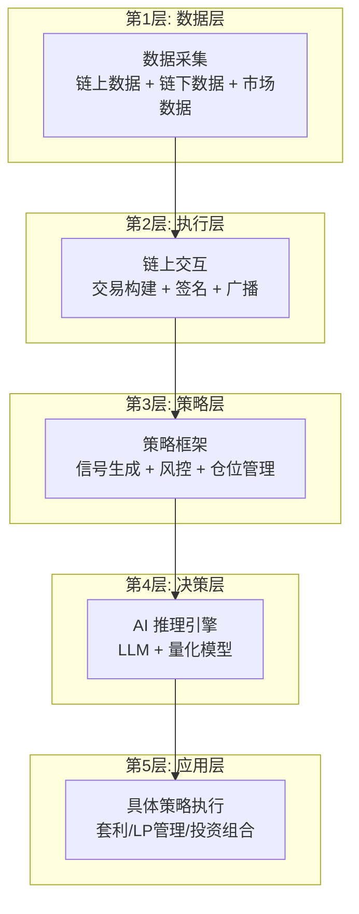

### 2.1 第 1 层：数据采集层（Agent 的眼睛和耳朵）

这是整个系统的地基。AI Agent 的决策质量直接取决于它能看到什么数据。

**链上数据源**：

| 数据类型 | 来源 | 用途 | 获取方式 |
|---------|------|------|---------|
| 代币价格 | Chainlink / Pyth Network | 实时价格喂价 | 智能合约直接调用 |
| DEX 价格 | Uniswap / SushiSwap 池子 | 发现价差/套利机会 | 读取合约 `getReserves()` |
| 交易历史 | The Graph / Dune Analytics | 分析市场趋势 | GraphQL 查询 |
| Mempool | 自建节点 / bloXroute | 抢跑/MEV 保护 | WebSocket 订阅 pending tx |
| 巨鲸动向 | Etherscan / Arkham | 追踪大户行为 | API 查询大额转账 |
| 协议状态 | DeFiLlama / DefiSafety | TVL/收益率/APY | REST API |

**链下数据源**：

| 数据类型 | 来源 | 用途 |
|---------|------|------|
| 社交情绪 | Twitter/X API、Telegram 群组 | 判断市场情绪 |
| 新闻 | CryptoPanic、CoinDesk | 捕捉重大事件 |
| GitHub | 项目代码更新 | 判断项目活跃度 |
| 治理提案 | Snapshot、Tally | 预判协议变化 |

**实际代码示例 — 获取 Uniswap V3 池子价格**：

```python
from web3 import Web3

# 连接以太坊节点
w3 = Web3(Web3.HTTPProvider('https://eth-mainnet.g.alchemy.com/v2/YOUR_KEY'))

# Uniswap V3 USDC/WETH 池子地址
POOL_ADDRESS = "0x88e6a0c2ddd26feeb64f039a2c41296fcb3f5640"

# 池子合约 ABI（只需要 slot0 函数）
POOL_ABI = [{"inputs":[],"name":"slot0","outputs":[
    {"internalType":"uint160","name":"sqrtPriceX96","type":"uint160"},
    {"internalType":"int24","name":"tick","type":"int24"},
    {"internalType":"uint16","name":"observationIndex","type":"uint16"},
    {"internalType":"uint16","name":"observationCardinality","type":"uint16"},
    {"internalType":"uint16","name":"observationCardinalityNext","type":"uint16"},
    {"internalType":"uint8","name":"feeProtocol","type":"uint8"},
    {"internalType":"bool","name":"unlocked","type":"bool"}
],"stateMutability":"view","type":"function"}]

pool = w3.eth.contract(address=POOL_ADDRESS, abi=POOL_ABI)

# 获取当前价格
slot0 = pool.functions.slot0().call()
sqrt_price_x96 = slot0[0]

# 将 sqrtPriceX96 转换为人类可读价格
# USDC 是 6 decimals，WETH 是 18 decimals
# price = (sqrtPriceX96 / 2^96)^2 * 10^(decimals0 - decimals1)
price = (sqrt_price_x96 / (2**96))**2 * (10**6 / 10**18)
# 这会得到 1 WETH = X USDC 的价格
print(f"WETH/USDC 价格: ${1/price:.2f}")  # 例如: $3,842.50
```

**关键概念：sqrtPriceX96**
- Uniswap V3 用 `sqrtPriceX96` 存储价格，是一个 Q64.96 定点数
- 选择平方根是为了精度：直接存价格会因为精度损失导致套利
- 转换公式：`price = (sqrtPriceX96 / 2^96)^2`

### 2.2 第 2 层：执行层（Agent 的手）

Agent 做出决策后，需要通过执行层与区块链交互。这里的技术细节直接影响交易的成败。

**交易构建流程**：

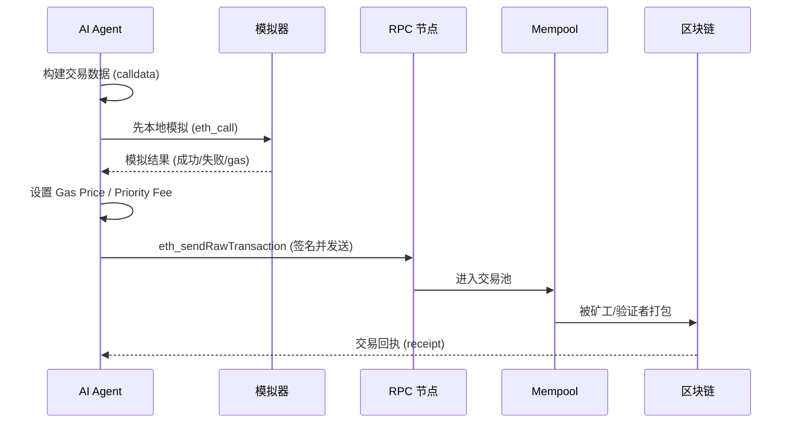

**为什么必须先模拟？**

在 DeFi 中，交易失败仍然消耗 Gas。一笔 swap 如果滑点设置不当，可能白白浪费 $50+ 的 Gas。所以 Agent 必须在发送前用 `eth_call` 模拟执行：

```python
def simulate_swap(w3, tx_params):
    """模拟交易执行，检查是否会成功"""
    try:
        result = w3.eth.call(tx_params)
        # 解码返回值，确认输出代币数量
        return {"success": True, "result": result}
    except Exception as e:
        return {"success": False, "error": str(e)}

def estimate_profit(output_amount, input_value, gas_cost):
    """计算净利润"""
    profit = output_amount - input_value - gas_cost
    return profit

# 只有模拟成功且利润 > 0 才真正发送
sim = simulate_swap(w3, tx_params)
if sim["success"] and estimate_profit(...) > 0:
    tx_hash = w3.eth.send_raw_transaction(signed_tx)
```

**Gas 策略——AI 的优势所在**：

Gas 费用是链上交易的主要成本。传统机器人用固定的 `maxFeePerGas`，但 AI Agent 可以：

1. **预测 Gas 价格走势**：基于历史数据训练模型，预测未来 N 个区块的 Gas 价格
2. **动态 Priority Fee**：套利竞争激烈时提高 priority fee 抢先，空闲时降低节省成本
3. **Gas 代币优化**：在 Gas 便宜时铸造 GST2/Chi，在贵时销毁抵扣

```python
def estimate_optimal_gas(w3, urgency="medium"):
    """
    AI 优化的 Gas 策略
    urgency: low / medium / high / critical
    """
    base_fee = w3.eth.get_block('latest')['baseFeePerGas']

    # 基于紧急程度的 priority fee 策略
    priority_fees = {
        "low": 0.1 * 10**9,      # 0.1 Gwei — 不急，等便宜时执行
        "medium": 1.0 * 10**9,    # 1 Gwei — 正常速度
        "high": 3.0 * 10**9,      # 3 Gwei — 快速执行
        "critical": 10.0 * 10**9, # 10 Gwei — MEV 级别竞争
    }

    priority = priority_fees[urgency]
    max_fee = base_fee * 2 + priority  # 预留 buffer 防止 base fee 上涨

    return {
        "maxFeePerGas": max_fee,
        "maxPriorityFeePerGas": priority,
        "estimated_cost_eth": (max_fee * 200000) / 10**18  # 假设 200k gas
    }
```

**交易签名和发送**：

```python
from eth_account import Account

def build_and_send_swap(w3, private_key, swap_params):
    """完整的交易构建、签名、发送流程"""
    account = Account.from_key(private_key)

    # 1. 构建交易
    tx = {
        'type': 2,  # EIP-1559 交易
        'chainId': 1,
        'from': account.address,
        'to': swap_params['router_address'],
        'data': swap_params['calldata'],
        'value': swap_params['eth_value'],
        'nonce': w3.eth.get_transaction_count(account.address),
        **estimate_optimal_gas(w3, urgency="high")
    }

    # 2. 估算 Gas Limit（加 20% buffer）
    try:
        gas_estimate = w3.eth.estimate_gas(tx)
        tx['gas'] = int(gas_estimate * 1.2)
    except:
        tx['gas'] = 300000  # fallback

    # 3. 模拟执行
    sim = simulate_swap(w3, tx)
    if not sim['success']:
        return {"error": f"模拟失败: {sim['error']}"}

    # 4. 签名
    signed = w3.eth.account.sign_transaction(tx, private_key)

    # 5. 发送
    tx_hash = w3.eth.send_raw_transaction(signed.raw_transaction)

    # 6. 等待确认
    receipt = w3.eth.wait_for_transaction_receipt(tx_hash, timeout=120)

    return {
        "tx_hash": tx_hash.hex(),
        "status": receipt['status'],  # 1 = 成功, 0 = 失败
        "gas_used": receipt['gasUsed'],
        "effective_gas_price": receipt['effectiveGasPrice']
    }
```

### 2.3 第 3 层：策略层（Agent 的逻辑核心）

策略层是 Agent 的大脑，决定「做什么」和「什么时候做」。

**策略的基本结构**：

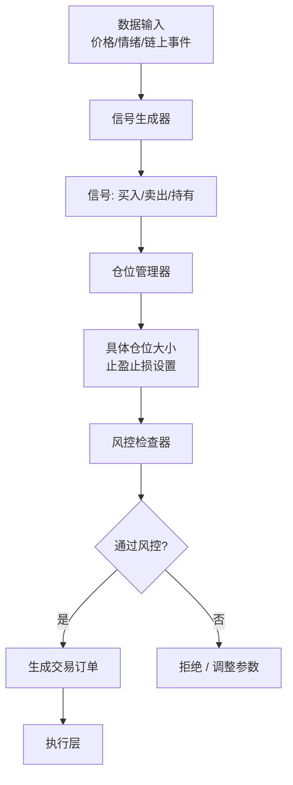

**以「情绪驱动 DCA」策略为例的完整实现**：

```python
class SentimentDCA:
    """
    情绪感知的定投策略
    - 市场恐慌时加大投入（别人恐惧我贪婪）
    - 市场贪婪时减少投入
    - 极端贪婪时暂停甚至卖出
    """

    def __init__(self, config):
        self.base_amount = config['base_amount']  # 基础定投金额, 如 100 USDC
        self.asset = config['asset']  # 目标资产, 如 ETH
        self.max_multiplier = config.get('max_multiplier', 3.0)
        self.min_multiplier = config.get('min_multiplier', 0.2)
        self.sentiment_analyzer = SentimentAnalyzer()

    def get_market_sentiment(self) -> float:
        """
        获取综合市场情绪分数
        范围: -1.0 (极度恐慌) 到 +1.0 (极度贪婪)
        """
        # 来源 1: Fear & Greed Index (0-100 → -1 到 1)
        fng = self.fetch_fear_greed_index()
        fng_score = (fng - 50) / 50  # 归一化到 -1 到 1

        # 来源 2: Twitter 情绪分析 (用 LLM)
        tweets = self.fetch_recent_tweets(self.asset, count=50)
        tweet_sentiment = self.sentiment_analyzer.analyze(tweets)

        # 来源 3: 链上信号
        # - 巨鲸是否在买入？
        # - DEX 交易量是否异常？
        # - 稳定币流入/流出交易所？
        onchain_signal = self.analyze_onchain_signals()

        # 加权综合
        composite = (
            fng_score * 0.3 +
            tweet_sentiment * 0.4 +
            onchain_signal * 0.3
        )
        return max(-1.0, min(1.0, composite))

    def calculate_amount(self, sentiment: float) -> float:
        """
        根据情绪分数计算实际投入金额

        情绪 → 倍率映射:
        -1.0 (极度恐慌) → max_multiplier (3x)    最大化抄底
        -0.5 (恐慌)     → 2x                      积极买入
         0.0 (中性)      → 1x                      正常定投
        +0.5 (贪婪)     → 0.5x                     减少投入
        +1.0 (极度贪婪) → min_multiplier (0.2x)    几乎停止
        """
        # 线性映射: 情绪越高，倍率越低
        multiplier = self.max_multiplier - (
            (sentiment + 1) / 2
        ) * (self.max_multiplier - self.min_multiplier)

        amount = self.base_amount * multiplier
        return round(amount, 2)

    def generate_signal(self) -> dict:
        """生成交易信号"""
        sentiment = self.get_market_sentiment()
        amount = self.calculate_amount(sentiment)

        signal = {
            "action": "buy" if amount > 0 else "hold",
            "asset": self.asset,
            "amount_usd": amount,
            "sentiment": sentiment,
            "reasoning": self._explain_decision(sentiment, amount)
        }

        # 风控检查
        if self._risk_check(signal):
            return signal
        else:
            return {"action": "hold", "reason": "风控拦截"}

    def _explain_decision(self, sentiment, amount) -> str:
        """LLM 生成决策解释（可选，用于日志和透明度）"""
        prompt = f"""
        当前市场情绪: {sentiment:.2f} (-1=极度恐慌, +1=极度贪婪)
        计划投入金额: ${amount} (基础: ${self.base_amount})
        请用一句话解释为什么做出这个决策。
        """
        return llm_call(prompt)
```

**情绪分析模块的 LLM 实现**：

```python
class SentimentAnalyzer:
    """使用 LLM 分析加密市场情绪"""

    SYSTEM_PROMPT = """你是一个加密货币市场情绪分析专家。
    分析以下推文/消息，输出一个 -1 到 +1 的情绪分数。
    - -1 = 极度恐慌/看跌
    - 0 = 中性
    - +1 = 极度贪婪/看涨

    注意:
    - "rekt" = 极度看跌
    - "moon/lambo/WAGMI" = 极度看涨
    - "buy the dip" = 看涨但有抄底心态
    - "this is fine" (着火表情) = 讽刺性看跌

    输出格式: {"score": 0.0, "reason": "一句话解释"}"""

    def analyze(self, texts: list[str]) -> float:
        """分析一组文本的综合情绪"""
        # 将文本合并，截取前 4000 token
        combined = "\n---\n".join(texts[:20])

        response = openai.chat.completions.create(
            model="gpt-4o",
            messages=[
                {"role": "system", "content": self.SYSTEM_PROMPT},
                {"role": "user", "content": combined}
            ],
            response_format={"type": "json_object"}
        )

        result = json.loads(response.choices[0].message.content)
        return result['score']
```

### 2.4 第 4 层：决策层（AI 推理引擎）

这里是如何让 AI「思考」交易决策的核心。

**LLM 在交易中的三种用法**：

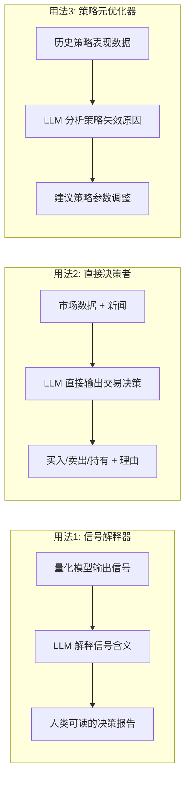

**关键设计：LLM 太慢做不了实时交易，所以需要分层架构**：

```python
class TradingBrain:
    """
    分层决策架构
    - 热路径: 规则引擎 (毫秒级) — 处理紧急情况
    - 温路径: 量化模型 (秒级) — 生成交易信号
    - 冷路径: LLM 推理 (分钟级) — 策略优化和异常处理
    """

    def __init__(self):
        self.rule_engine = RuleEngine()      # 热路径
        self.quant_model = QuantModel()      # 温路径
        self.llm = LLMEngine()               # 冷路径

    def decide(self, market_data):
        # 热路径: 先检查是否需要紧急操作
        emergency = self.rule_engine.check(market_data)
        if emergency:
            return emergency  # 例如: 价格暴跌 20% → 立即止损

        # 温路径: 量化模型生成常规信号
        signal = self.quant_model.predict(market_data)

        # 如果信号不够强，不做交易
        if abs(signal.confidence) < 0.6:
            return {"action": "hold", "reason": "信号不够强"}

        # 冷路径: LLM 验证信号是否合理
        # (只在信号强度足够时才调用 LLM，节省 API 成本)
        if signal.strength > 0.8:
            validation = self.llm.validate_signal(signal, market_data)
            if not validation.approved:
                return {"action": "hold", "reason": f"LLM 驳回: {validation.reason}"}

        return signal
```

**ZK-ML：让链上合约信任链下 AI 推理**

这是一个前沿技术方向。问题：AI 模型在链下运行，链上合约怎么相信它的推理结果是正确的？

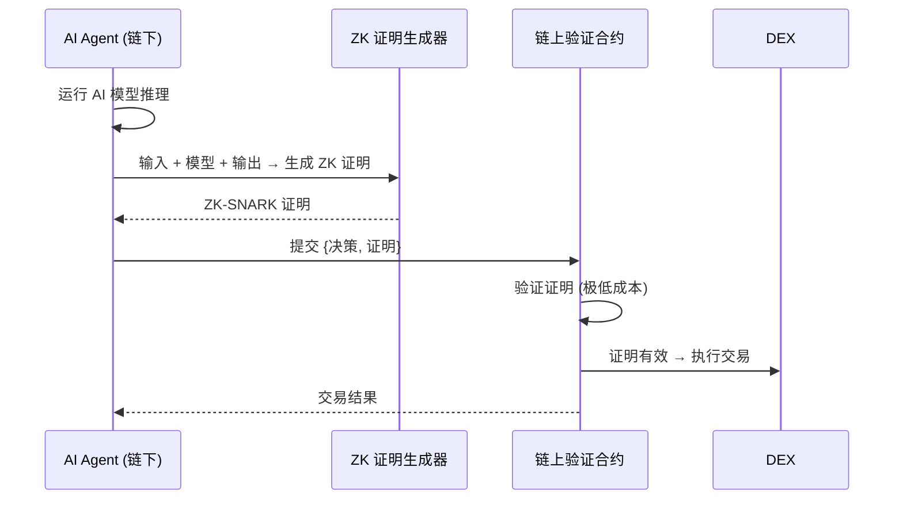

**为什么这很重要？**
- 没有 ZK-ML：用户必须信任 Agent 运营者不会恶意操作
- 有了 ZK-ML：数学保证 Agent 按照声称的策略执行，运营者无法作弊
- Giza Protocol 就是基于这个理念构建的

### 2.5 第 5 层：应用层（具体策略实现）

下面讲 3 个最重要的实战策略，每个都带完整的技术分析。

---

## 三、策略深度解析 1：DEX 套利

### 3.1 套利的基本原理

最简单的套利：同一代币在两个 DEX 上价格不同。

```
Uniswap:  1 ETH = 3,800 USDC
SushiSwap: 1 ETH = 3,820 USDC

套利路径: 在 Uniswap 用 3,800 USDC 买 1 ETH → 在 SushiSwap 卖出得到 3,820 USDC
净利润: 20 USDC - Gas 费 - 滑点
```

但现实中，这种简单套利机会极少见且利润极薄。**AI Agent 的价值在于发现复杂的多跳套利路径**。

### 3.2 多跳套利——AI 的核心优势

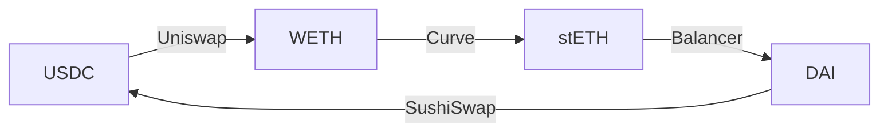

这种多跳路径的利润计算非常复杂：
- 每一步都有滑点影响后续步骤
- 每个池子的流动性深度不同
- 需要优化「每一步投入多少」以最大化总利润
- 总共可能有数千条路径需要评估

**传统方法**：穷举所有路径 → 计算利润 → 选最高
**AI 方法**：用图神经网络学习池子间的关系，预测高利润路径，再精确计算验证

```python
import heapq
from dataclasses import dataclass

@dataclass
class Pool:
    address: str
    token0: str
    token1: str
    reserve0: float
    reserve1: float
    fee: float  # 0.003 = 0.3%

class ArbitrageFinder:
    """
    基于 Bellman-Ford 算法的多跳套利路径发现
    将 DEX 池子建模为图，节点=代币，边=交换路径
    使用负权重环检测来发现套利机会
    """

    def __init__(self, pools: list[Pool]):
        self.pools = pools
        self.tokens = set()
        self.graph = {}  # token -> [(target_token, pool, rate)]

        for pool in pools:
            self.tokens.add(pool.token0)
            self.tokens.add(pool.token1)

            # 正向: token0 → token1
            rate_0_to_1 = self._get_rate(pool, direction='forward')
            self.graph.setdefault(pool.token0, []).append(
                (pool.token1, pool, rate_0_to_1)
            )

            # 反向: token1 → token0
            rate_1_to_0 = self._get_rate(pool, direction='reverse')
            self.graph.setdefault(pool.token1, []).append(
                (pool.token0, pool, rate_1_to_0)
            )

    def _get_rate(self, pool: Pool, direction: str) -> float:
        """计算交换率（考虑手续费）"""
        if direction == 'forward':
            # 输入 1 单位 token0，能得到多少 token1
            rate = (pool.reserve1 / pool.reserve0) * (1 - pool.fee)
        else:
            rate = (pool.reserve0 / pool.reserve1) * (1 - pool.fee)
        return rate

    def find_arbitrage(self, start_token: str) -> list:
        """
        用 Bellman-Ford 检测负权重环（套利机会）
        思路: 取 -log(rate) 为边权重，
        如果存在负环 → 沿环的 rate 乘积 > 1 → 套利
        """
        import math

        # 构建边列表，权重 = -log(rate)
        edges = []
        for token_a, neighbors in self.graph.items():
            for token_b, pool, rate in neighbors:
                weight = -math.log(rate)
                edges.append((token_a, token_b, weight, pool))

        # Bellman-Ford
        dist = {t: float('inf') for t in self.tokens}
        dist[start_token] = 0
        predecessor = {t: None for t in self.tokens}

        for _ in range(len(self.tokens) - 1):
            for src, dst, weight, pool in edges:
                if dist[src] + weight < dist[dst]:
                    dist[dst] = dist[src] + weight
                    predecessor[dst] = (src, pool)

        # 检测负环
        for src, dst, weight, pool in edges:
            if dist[src] + weight < dist[dst]:
                # 找到套利环！回溯路径
                path = self._trace_cycle(dst, predecessor)
                profit = self._calculate_profit(path)
                return {"path": path, "estimated_profit": profit}

        return None  # 无套利机会

    def _trace_cycle(self, start, predecessor):
        """回溯套利路径"""
        path = []
        visited = set()
        current = start
        while current not in visited:
            visited.add(current)
            if predecessor[current] is None:
                break
            prev_token, pool = predecessor[current]
            path.append((prev_token, current, pool))
            current = prev_token
        path.reverse()
        return path
```

### 3.3 Flash Loan 套利——零资本运作

Flash Loan 是 DeFi 最独特的原语之一：在同一笔交易内，你可以借入任意数量的资金，只要在交易结束前还回去（+ 手续费）。如果还不回去，整笔交易回滚，你只损失 Gas。

```python
# Flash Loan 套利的 Solidity 合约结构（简化版）

FLASH_LOAN_CONTRACT = """
// SPDX-License-Identifier: MIT
pragma solidity ^0.8.0;

import "@aave/v3-core/contracts/flashloan/base/FlashLoanSimpleReceiverBase.sol";

contract ArbitrageBot is FlashLoanSimpleReceiverBase {
    address public owner;

    constructor(IPoolAddressesProvider provider)
        FlashLoanSimpleReceiverBase(provider)
    {
        owner = msg.sender;
    }

    // 1. 发起闪电贷
    function executeArbitrage(
        address token,
        uint256 amount,
        bytes calldata arbitrageData
    ) external onlyOwner {
        // 向 Aave 借入 token
        POOL.flashLoanSimple(
            address(this),  // 接收者
            token,          // 借什么
            amount,         // 借多少
            arbitrageData,  // 自定义数据
            0               // referralCode
        );
    }

    // 2. Aave 回调：在这里执行套利逻辑
    function executeOperation(
        address asset,
        uint256 amount,
        uint256 premium,      // 手续费 (0.09%)
        address initiator,
        bytes calldata params
    ) external override returns (bool) {
        // === 此时已经拿到了借入的资金 ===

        // 3. 解码套利参数
        (address dexA, address dexB, bytes memory swapDataA, bytes memory swapDataB)
            = abi.decode(params, (address, address, bytes, bytes));

        // 4. 在 DEX A 买入
        IERC20(asset).approve(dexA, amount);
        uint256 intermediate = IDexRouter(dexA).swap(asset, amount, swapDataA);

        // 5. 在 DEX B 卖出
        address otherToken = getOtherToken(dexB, asset);
        IERC20(otherToken).approve(dexB, intermediate);
        uint256 finalAmount = IDexRouter(dexB).swap(otherToken, intermediate, swapDataB);

        // 6. 还款 = 借入金额 + 手续费
        uint256 amountOwed = amount + premium;
        IERC20(asset).approve(address(POOL), amountOwed);

        // 7. 必须保证 finalAmount > amountOwed，否则交易回滚
        require(finalAmount > amountOwed, "套利不盈利，回滚!");

        // 利润留在合约中，可以提取
        return true;
    }
}
""";
```

**Flash Loan 套利的完整流程**：

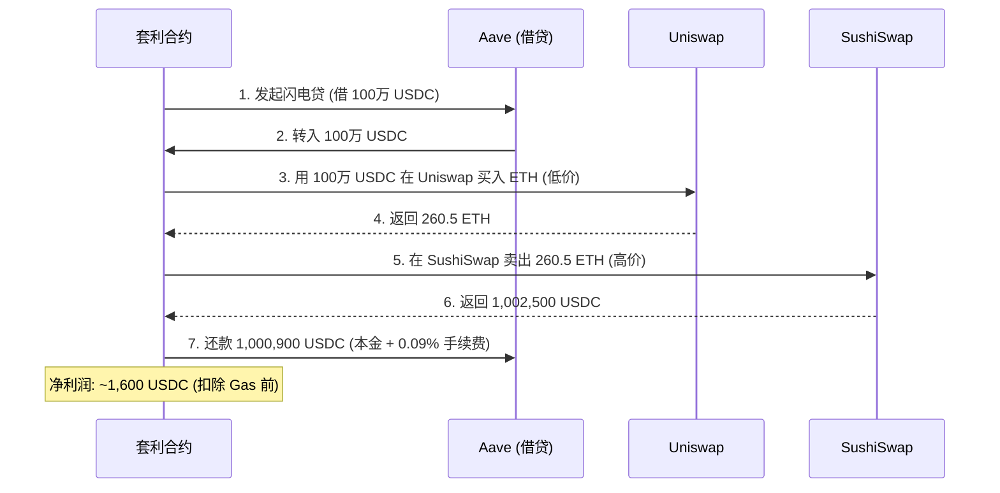

---

## 四、策略深度解析 2：MEV 捕获与防护

### 4.1 理解 MEV（最大可提取价值）

MEV 是理解链上 AI Agent 交易策略的关键概念。

**什么是 MEV？**
当用户在 DEX 提交一笔大额 swap 交易时，这笔交易先进入 mempool（交易等待区），所有人都能看到。MEV 就是指通过操控这些待执行交易的顺序所能提取的利润。

**最常见的 MEV 攻击——三明治攻击（Sandwich Attack）**：

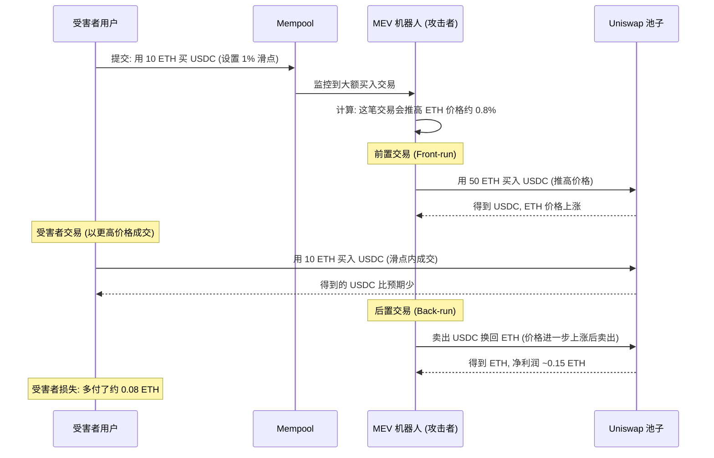

**AI Agent 如何应对？**

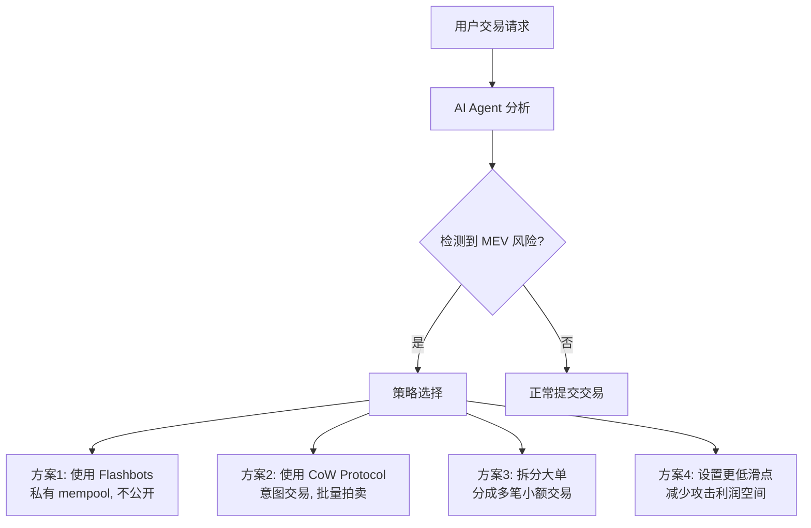

### 4.2 Flashbots：MEV 的基础设施

Flashbots 是理解 MEV 生态的关键。

**核心概念**：
- **Searcher**：搜索 MEV 机会的人（或 AI Agent）
- **Builder**：将多笔交易打包成区块的实体
- **Proposer**：以太坊验证者，提议新区块
- **Bundle**：一组有序交易，原子性执行（要么全成功，要么全回滚）

```python
from web3 import Web3

def create_flashbots_bundle(w3, target_tx, frontrun_tx, backrun_tx):
    """
    创建 Flashbots Bundle
    Bundle 内的交易按顺序执行，具有原子性
    """
    block_number = w3.eth.block_number

    bundle = [
        # 第1步: 前置交易（我们的套利买入）
        {
            "signed_transaction": frontrun_tx,
        },
        # 第2步: 目标交易（受害者的 swap）
        {
            "signed_transaction": target_tx,
        },
        # 第3步: 后置交易（我们的套利卖出）
        {
            "signed_transaction": backrun_tx,
        }
    ]

    # 通过 Flashbots 中继发送（不进入公共 mempool）
    # 只有 Builder 能看到这个 Bundle
    result = flashbots.send_bundle(
        bundle,
        target_block_number=block_number + 1
    )

    return result
```

**为什么 AI Agent 特别适合 MEV？**
1. 实时处理能力：需要在毫秒级发现、评估、执行
2. 复杂路径计算：需要在多个池子间计算最优套利路径
3. 竞争博弈：需要预测其他 Searcher 的行为来调整竞价策略
4. 模型训练：从历史 MEV 数据中学习最优策略

---

## 五、策略深度解析 3：意图驱动交易

### 5.1 为什么 Intent 是范式转变？

**传统交易 vs 意图交易**：

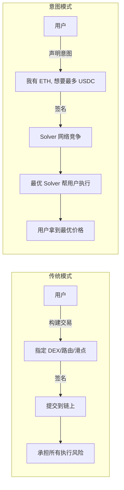

**意图交易的核心优势**：
1. **MEV 保护**：用户不直接提交交易，三明治攻击无从下手
2. **Gasless**：Solver 代付 Gas，用户无需持有 ETH
3. **最优执行**：多个 Solver 竞争，保证用户拿到市场最优价
4. **跨链友好**：意图可以跨链表达，Solver 负责桥接

### 5.2 AI Solver 的实现

```python
class IntentSolver:
    """
    AI 驱动的 Intent Solver
    接收用户意图，计算并提交最优执行方案
    """

    def __init__(self, w3, dex_routers):
        self.w3 = w3
        self.routers = dex_routers  # {name: router_contract}
        self.price_feeds = PriceFeedManager()

    def solve(self, intent: dict) -> dict:
        """
        解析并执行用户意图

        intent 示例:
        {
            "type": "swap",
            "sell_token": "0xC02aaA39b223FE8D0A0e5C4F27eAD9083C756Cc2",  # WETH
            "buy_token": "0xA0b86991c6218b36c1d19D4a2e9Eb0cE3606eB48",   # USDC
            "sell_amount": 1000000000000000000,  # 1 ETH (wei)
            "max_slippage": 0.005,  # 0.5%
            "deadline": 1700000000
        }
        """
        # 1. 分析所有可能的执行路径
        paths = self._find_all_paths(
            intent['sell_token'],
            intent['buy_token'],
            intent['sell_amount']
        )

        # 2. 模拟每条路径的输出
        results = []
        for path in paths:
            output = self._simulate_path(path, intent['sell_amount'])
            results.append({
                'path': path,
                'output': output,
                'gas_estimate': self._estimate_gas(path, intent['sell_amount'])
            })

        # 3. 选择最优路径（考虑 Gas 成本后的净利润最大化）
        best = max(results, key=lambda r: r['output'] - r['gas_estimate'] * gas_price)

        # 4. 检查滑点约束
        expected_output = self._get_expected_output(intent)
        slippage = (expected_output - best['output']) / expected_output
        if slippage > intent['max_slippage']:
            return {"error": "最优路径的滑点超出用户约束"}

        # 5. 构建执行交易
        tx = self._build_execution_tx(best['path'], intent)

        return {
            "solution": tx,
            "expected_output": best['output'],
            "gas_cost": best['gas_estimate'],
            "route": self._describe_route(best['path'])
        }

    def _find_all_paths(self, sell_token, buy_token, amount, max_hops=3):
        """
        使用 BFS 找到所有可能的交换路径
        AI 优化: 用历史数据训练的模型先过滤低潜力路径
        """
        paths = []
        queue = [(sell_token, [sell_token], [])]

        while queue:
            current, visited, pools = queue.pop(0)

            if current == buy_token and len(pools) > 0:
                paths.append({'tokens': visited, 'pools': pools})
                continue

            if len(pools) >= max_hops:
                continue

            # 获取当前代币的所有交易对
            pairs = self._get_pairs(current)
            for pair in pairs:
                next_token = pair['token1'] if pair['token0'] == current else pair['token0']
                if next_token not in visited:
                    queue.append((
                        next_token,
                        visited + [next_token],
                        pools + [pair['pool']]
                    ))

        # AI 预过滤: 只保留模型预测利润最高的 top 10 路径
        paths = self._ai_filter_paths(paths, amount, top_k=10)

        return paths
```

---

## 六、安全与风控（最重要的部分）

### 6.1 AI Agent 的安全威胁

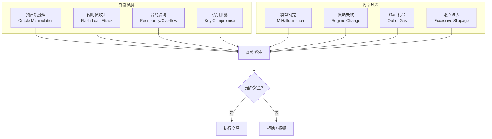

### 6.2 风控模块实现

```python
class RiskManager:
    """
    Agent 的风控守门人
    任何交易在执行前必须通过风控检查
    """

    def __init__(self, config):
        self.max_single_trade_usd = config.get('max_single_trade', 10000)
        self.max_daily_volume_usd = config.get('max_daily_volume', 50000)
        self.max_drawdown_pct = config.get('max_drawdown', 0.10)  # 10%
        self.allowed_tokens = set(config.get('allowed_tokens', []))
        self.daily_volume = 0
        self.peak_portfolio_value = 0

    def check(self, trade: dict, portfolio: dict) -> dict:
        """
        全面风控检查，返回 {"pass": True/False, "reasons": [...]}
        """
        checks = [
            self._check_trade_size(trade),
            self._check_daily_limit(trade),
            self._check_token_whitelist(trade),
            self._check_drawdown(portfolio),
            self._check_contract_safety(trade),
            self._check_price_sanity(trade),
        ]

        failed = [c for c in checks if not c['pass']]

        if failed:
            reasons = [f['reason'] for f in failed]
            return {"pass": False, "reasons": reasons}

        # 更新日交易量
        self.daily_volume += trade['value_usd']
        return {"pass": True}

    def _check_trade_size(self, trade):
        """单笔交易金额不超过限额"""
        if trade['value_usd'] > self.max_single_trade_usd:
            return {"pass": False, "reason": f"单笔交易 ${trade['value_usd']} 超过限额 ${self.max_single_trade_usd}"}
        return {"pass": True}

    def _check_daily_limit(self, trade):
        """日交易量不超过限额"""
        if self.daily_volume + trade['value_usd'] > self.max_daily_volume_usd:
            return {"pass": False, "reason": f"日交易量已达上限 ${self.max_daily_volume_usd}"}
        return {"pass": True}

    def _check_token_whitelist(self, trade):
        """只交易白名单代币（防止交互到恶意合约）"""
        if trade['token'] not in self.allowed_tokens:
            return {"pass": False, "reason": f"代币 {trade['token']} 不在白名单中"}
        return {"pass": True}

    def _check_drawdown(self, portfolio):
        """最大回撤检查"""
        current_value = portfolio['total_value_usd']
        self.peak_portfolio_value = max(self.peak_portfolio_value, current_value)
        drawdown = (self.peak_portfolio_value - current_value) / self.peak_portfolio_value

        if drawdown > self.max_drawdown_pct:
            return {"pass": False, "reason": f"最大回撤 {drawdown:.1%} 超过阈值 {self.max_drawdown_pct:.1%}"}
        return {"pass": True}

    def _check_contract_safety(self, trade):
        """检查目标合约是否安全（基础检查）"""
        code = web3.eth.get_code(trade['to'])
        if code == b'' or code == b'0x':
            return {"pass": False, "reason": "目标地址不是合约"}
        # 更高级: 检查合约是否已验证、是否有已知漏洞
        return {"pass": True}

    def _check_price_sanity(self, trade):
        """价格合理性检查"""
        # 获取多个来源的价格
        prices = [
            get_price_chainlink(trade['token']),
            get_price_coingecko(trade['token']),
            get_price_dex(trade['token'])
        ]
        median_price = sorted(prices)[1]  # 中位数

        # 如果交易价格偏离中位数超过 5%，拒绝
        deviation = abs(trade['price'] - median_price) / median_price
        if deviation > 0.05:
            return {"pass": False, "reason": f"价格偏离 {deviation:.1%}，可能被操纵"}
        return {"pass": True}
```

### 6.3 LLM 的幻觉风险

一个经常被忽视的风险：LLM 可能会产生幻觉（Hallucination），做出不合理的决策。

**防御措施**：
1. **永远不要让 LLM 直接控制资金**：LLM 只做建议，规则引擎做最终决定
2. **数值计算交给代码**：不要让 LLM 计算精确的交易金额
3. **交叉验证**：用多个模型或模型 + 规则做双重确认
4. **严格的输出格式**：强制 JSON schema，验证每个字段

---

## 七、开发框架与工具链

### 7.1 框架选择指南

**Eliza (ai16z)**
- 适合：社交型 AI Agent、Telegram/Discord 交易机器人
- 语言：TypeScript
- 链支持：Solana、EVM
- 优势：插件生态丰富，社区活跃
- 局限：不是专门为 DeFi 策略设计

**Giza Protocol**
- 适合：DeFi 策略自动化、需要 ZK 验证的场景
- 语言：Python (SDK)
- 链支持：Ethereum、StarkNet
- 优势：ZK-ML 验证、DeFi 原生
- 局限：生态较小，学习曲线陡

**LangChain + Web3.py 自建**
- 适合：完全自定义的复杂 Agent
- 语言：Python
- 优势：灵活性最高，可以精确控制每一步
- 局限：需要自己处理所有安全和链上交互细节

### 7.2 推荐技术栈（Hackathon 友好）

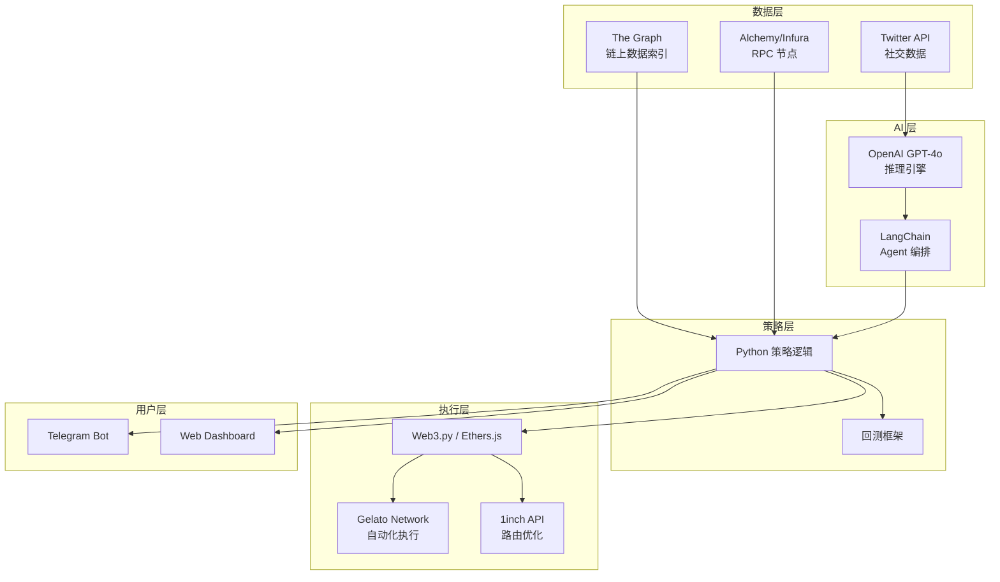

---

## 八、Hackathon 项目灵感 💡

### 灵感 1：情绪感知 DCA 机器人
- **方向**：AI 分析社交情绪 + 链上巨鲸动向，动态调整定投金额
- **难度**：⭐⭐
- **创新性**：⭐⭐⭐⭐
- **技术栈**：OpenAI API + Twitter API + Fear & Greed Index + Gelato + Uniswap SDK
- **MVP 路径**：先做情绪分析 → 再做自动执行 → 最后加 Dashboard

### 灵感 2：多跳套利发现器（纯监控版）
- **方向**：监控多 DEX 的价格差异，发现套利路径，推送 Telegram 通知（不实际执行，降低安全风险）
- **难度**：⭐⭐⭐
- **创新性**：⭐⭐⭐
- **技术栈**：The Graph + Web3.py + Bellman-Ford 算法 + Telegram Bot

### 灵感 3：AI 策略回测 + 模拟盘
- **方向**：用历史数据回测各种 DeFi 策略，AI 自动推荐最优参数，然后在模拟环境验证
- **难度**：⭐⭐⭐
- **创新性**：⭐⭐⭐⭐
- **技术栈**：Python + DeFiLlama API + Dune Analytics + Foundry (fork 模拟)

### 灵感 4：意图驱动的跨链 Swap Bot
- **方向**：用户对 Telegram Bot 说"帮我把 ETH 从以太坊转到 Arbitrum 上的 USDC"，AI 自动规划最优跨链路径
- **难度**：⭐⭐⭐⭐
- **创新性**：⭐⭐⭐⭐⭐
- **技术栈**：LLM (意图解析) + LI.FI/Socket (跨链路由) + Account Abstraction

### 推荐入门项目：灵感 1 — 情绪感知 DCA 机器人
分步实现：
1. **Week 1**：搭建数据管道（Twitter + Fear & Greed + 链上巨鲸追踪）
2. **Week 2**：实现 LLM 情绪分析模块，输出标准化情绪分数
3. **Week 3**：实现 DCA 策略逻辑，连接 Uniswap SDK 执行 swap
4. **Week 4**：接入 Gelato Network 实现自动化，加 Telegram 通知

---

## 九、关键术语速查

- **MEV (最大可提取价值)**：区块生产者通过操控交易顺序可提取的最大利润，包括套利、清算、三明治攻击
- **Flash Loan (闪电贷)**：单笔交易内借入→使用→归还的无抵押贷款，是零资本套利的基础工具
- **Intent (意图)**：用户声明"我想要什么"而非"怎么执行"，由 Solver 网络竞争提供最优执行方案
- **Solver (求解器)**：接收用户意图，计算并提交最优执行方案的竞争参与者，通常是 AI Agent
- **ZK-ML (零知识机器学习)**：用零知识证明验证 AI 模型推理的正确性，让链上合约信任链下 AI 计算
- **Sandwich Attack (三明治攻击)**：在受害者交易前后各插入一笔交易，通过价格操纵获利的 MEV 攻击
- **JIT Liquidity (即时流动性)**：在大额交易前瞬间注入流动性收取手续费，交易后立即撤出
- **Account Abstraction (账户抽象)**：智能合约钱包替代 EOA，支持 Gas 代付、批量交易、社交恢复
- **DCA (定投)**：定期定额投资策略，平滑入场成本，降低择时风险
- **Impermanent Loss (无常损失)**：LP 提供流动性时因价格变动导致的相对持有代币的损失
- **RAG (检索增强生成)**：让 LLM 基于外部知识库回答问题，减少幻觉，提升准确性
- **sqrtPriceX96**：Uniswap V3 用 Q64.96 定点数存储的代币价格平方根，是与 V3 交互的基础数据格式
- **Proposer-Builder Separation (PBS)**：以太坊的区块构建与提议分离机制，改变了 MEV 的分配方式
- **Bundle (交易包)**：Flashbots 中的一组有序交易，原子性执行，要么全部成功要么全部回滚
- **Regime Change (体制变化)**：市场状态的结构性变化（如牛市→熊市），可能导致原有策略失效

---

## 十、今日学习总结

### 📌 核心收获

1. **链上 AI Agent 的架构是分层的**：数据层→执行层→策略层→决策层→应用层，每层都有独立的技术挑战。理解分层是设计可靠 Agent 的前提
2. **LLM 不应该直接控制交易执行**：最佳实践是「规则引擎做热路径（紧急操作）+ 量化模型做温路径（信号生成）+ LLM 做冷路径（策略优化和异常处理）」的混合架构
3. **风控比策略更重要**：一个没有风控的 AI Agent 就像一辆没有刹车的跑车。单笔限额、日交易量、最大回撤、代币白名单、价格合理性检查缺一不可
4. **意图驱动是 DeFi 的未来**：从"用户构建交易"到"用户声明意图，Solver 竞争执行"的转变，会大幅降低普通用户使用 DeFi 的门槛，也为 AI Agent 创造了天然的竞技场

### 🤔 思考题

1. 如果 AI Agent 管理的资金量大到其交易本身会影响市场价格（市场影响模型），策略设计应该如何考虑这种「自我击败」效应？
2. 当多个 AI Agent 使用类似的 LLM 模型和相似的训练数据时，它们可能会做出相同决策，形成「AI 羊群效应」。这对市场稳定性和 Agent 个体利润有什么影响？
3. ZK-ML 目前的计算成本很高（生成证明需要大量计算），在什么场景下这个成本是值得的？什么场景下用信任模型就够了？
4. 意图驱动交易中，Solver 网络会不会被少数强大的 AI Agent 垄断？如何设计机制保持 Solver 网络的去中心化和竞争性？

### 📚 进一步阅读

- **Giza Protocol 文档**: https://docs.gizaprotocol.ai/ — ZK-ML + DeFi Agent 的理论和实践
- **CoW Protocol Docs**: https://docs.cow.fi/ — 意图驱动交易的完整技术栈
- **Flashbots Docs**: https://docs.flashbots.net/ — MEV 基础设施，必须读
- **Eliza Framework**: https://github.com/elizaOS/eliza — 开源 AI Agent 框架
- **MEV & Me (Flashbots)**: https://writings.flashbots.net/mev-tharis-dark-forest — 理解黑暗森林
- **Uniswap V3 白皮书**: https://uniswap.org/whitepaper-v3.pdf — 理解集中流动性
- **a16z AI + Crypto**: https://a16zcrypto.com/posts/article/ai-crypto/ — 趋势分析
- **Intent-Based Architectures (Anoma)**: https://anoma.net/blog/intents-and-their-evolution — 意图架构深度
