# 2025-06-02 学习日志

## 链上 AI Agent 自动交易策略

### 学习路径：推荐路径（从原理到实践，掌握 AI Agent 如何在链上自主执行交易策略）

---

## 一、链上 AI Agent 交易策略全景图

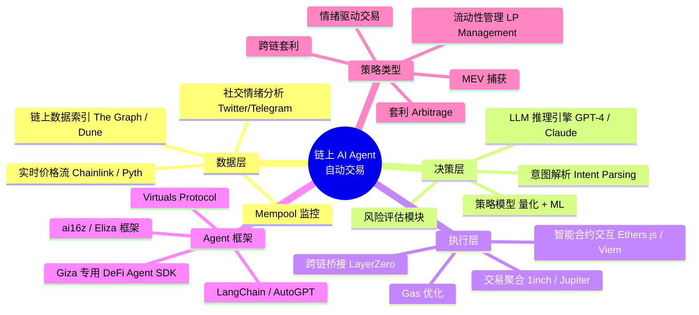

---

## 二、6 大核心模式

### 模式 1：套利猎手机 (Arbitrage Hunter)

**核心思想**：AI Agent 持续监控多个 DEX/协议间的价格差异，自动发现并执行无风险或低风险套利机会。

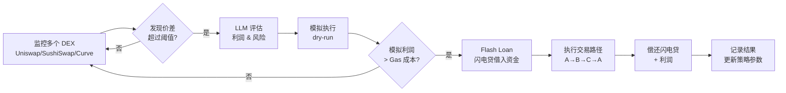

**代表性项目**：
- **1inch Fusion+**：智能路由 + 荷兰拍机制，Solver 网络竞争执行
- **CoW Protocol**：批量拍卖 + 意图驱动，MEV 保护型套利
- **Flashbots Protect**：私有 mempool，防止夹心攻击

**技术关键点**：
- Flash Loan（闪电贷）是零资本套利的核心：在单笔交易内借入→交易→还款
- Gas 估算至关重要：利润必须覆盖 Gas + 滑点 + Flash Loan 手续费
- 需要实时的 gas price 预测模型（AI 可用于动态 gas 策略）
- 竞争极其激烈，延迟在毫秒级，纯 LLM 推理太慢 → 需要混合架构：规则引擎 + LLM 策略决策

---

### 模式 2：情绪感知交易员 (Sentiment-Driven Trader)

**核心思想**：AI Agent 实时分析社交媒体、新闻、链上巨鲸动态，将非结构化信息转化为交易信号。

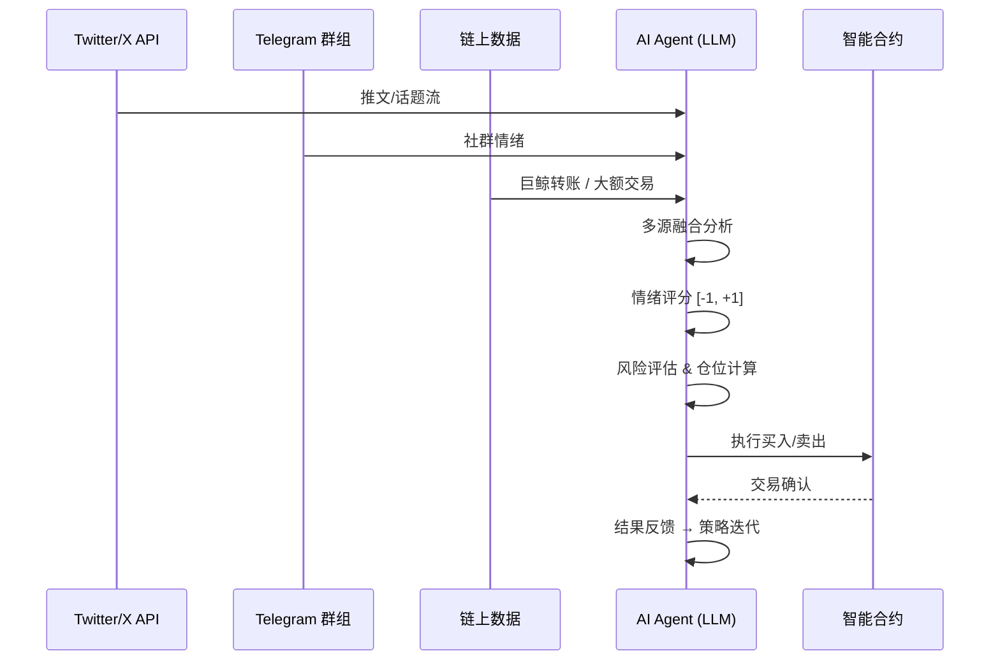

**代表性项目**：
- **Luna by Virtuals**：自主推特 AI Agent，能感知市场情绪并做出反应
- **ai16z / Eliza**：开源 AI Agent 框架，支持多平台社交感知
- **Kaito**：AI 驱动的加密情报平台，提供情绪指标

**技术关键点**：
- 情绪分析需要处理 crypto slang（WAGMI, NGMI, rekt, moon 等）
- 巨鲸监控：追踪前 100 钱包的动向，结合 AI 分析其意图
- 信号过滤是关键：99% 的社交噪音 vs 1% 的 alpha
- 反向指标：极端恐慌可能是买入信号（Fear & Greed Index）

---

### 模式 3：智能流动性管理者 (Intelligent LP Manager)

**核心思想**：AI Agent 自动管理 DEX 流动性头寸，动态调整价格区间、再平衡策略，最大化手续费收益并降低无常损失。

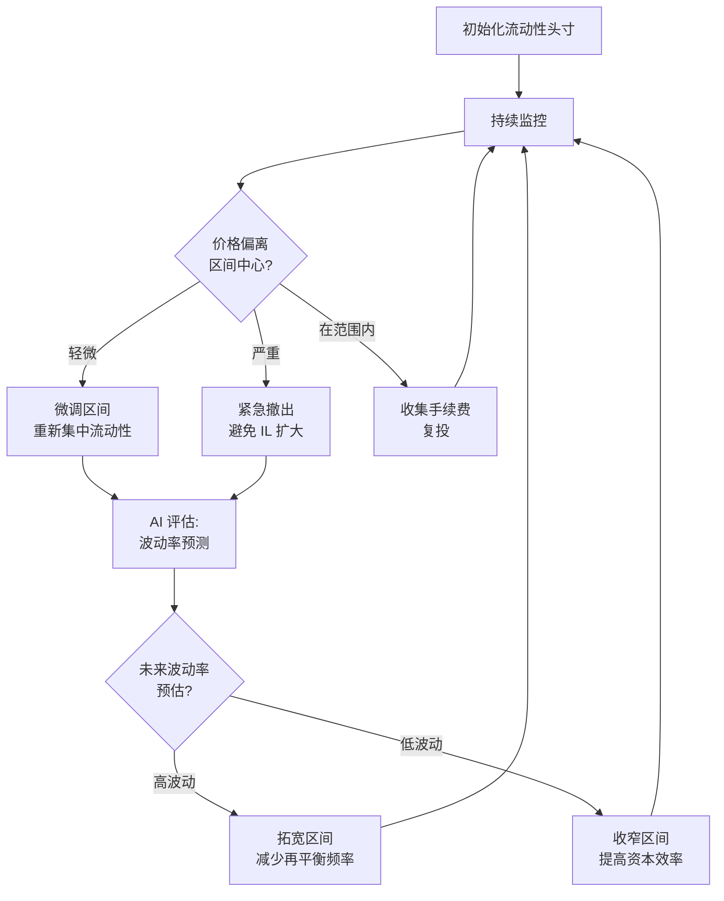

**代表性项目**：
- **Arrakis Finance**：自动化 Uniswap V3 LP 管理
- **Gamma Strategies**：主动管理的流动性协议
- **Mellow Protocol**：可定制的流动性策展

**技术关键点**：
- Uniswap V3 的集中流动性让 LP 管理从「被动」变为「主动」
- 无常损失（Impermanent Loss）是核心风险：AI 需要预测价格走势来最小化 IL
- 再平衡的 Gas 成本 vs 收益权衡：AI 可以优化再平衡时机
- 多池策略：同时管理多个流动性池，对冲风险

---

### 模式 4：MEV 智能猎手 (MEV-Smart Agent)

**核心思想**：AI Agent 理解 DeFi 协议的 MEV（最大可提取价值）机会，通过智能策略捕获价值或保护用户免受 MEV 攻击。

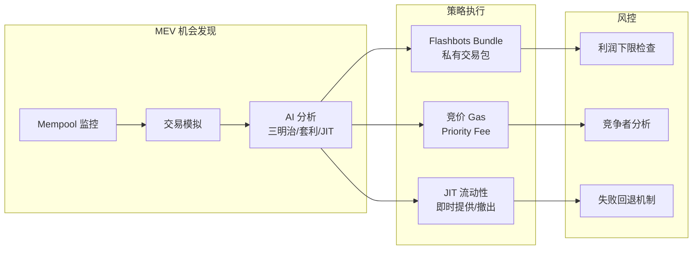

**代表性项目**：
- **Flashbots**：MEV 基础设施，提供私有交易池 + Bundle 竞拍
- **Manifold Finance**：MEV 聚合与再分配
- **BloxRoute**：低延迟区块链网络，MEV 优化

**技术关键点**：
- 三明治攻击（Sandwich Attack）：前后夹击大额交易获取利润
- JIT（Just-In-Time）流动性：在交易前瞬间注入流动性，收取手续费后撤出
- Searcher 竞争：需要极低延迟 + 精确的 Gas 策略 + AI 预测其他 Searcher 行为
- PBS（Proposer-Builder Separation）改变了 MEV 的博弈结构

---

### 模式 5：意图驱动代理 (Intent-Based Agent)

**核心思想**：用户声明交易意图（"我想用最少的滑点换 ETH→USDC"），AI Agent 作为 Solver 网络的一部分，找到最优执行路径。

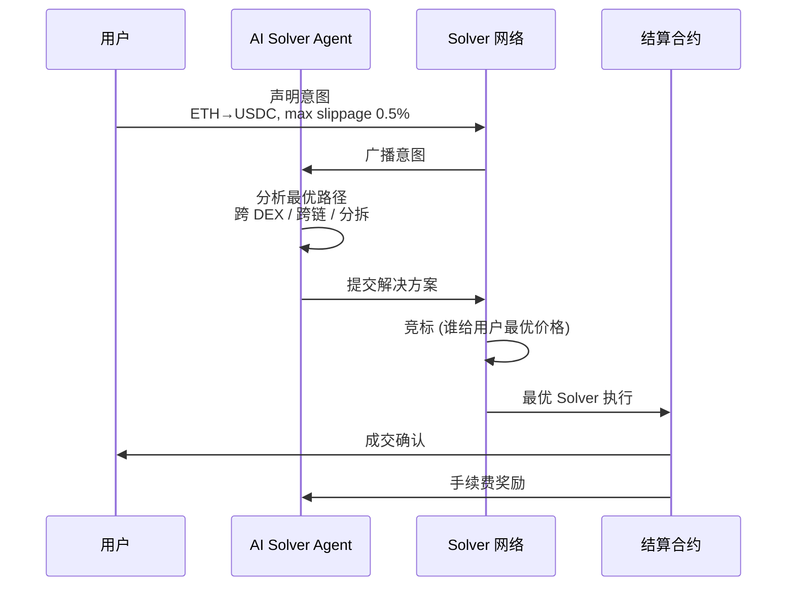

**代表性项目**：
- **CoW Protocol**：意图驱动的 DEX，Solver 竞争提供最优执行
- **1inch Fusion**：用户无需 Gas，Resolver 竞争执行
- **UniswapX**：意图型交易协议
- **Across Protocol**：跨链意图执行
- **Anoma**：通用意图层，支持任意意图表达

**技术关键点**：
- 意图（Intent）vs 交易（Transaction）：意图是"做什么"，交易是"怎么做"
- Solver 网络的经济博弈：竞争压低利润，但 AI 能发现更复杂的路径
- 跨链意图是最前沿：用户在链 A 存入资产，想在链 B 获得结果
- 与 Account Abstraction（AA）结合，实现完全无 Gas 体验

---

### 模式 6：自主投资组合经理 (Autonomous Portfolio Manager)

**核心思想**：AI Agent 全权管理一个链上投资组合，根据市场条件动态调整资产配置，类似去中心化的「robo-advisor」。

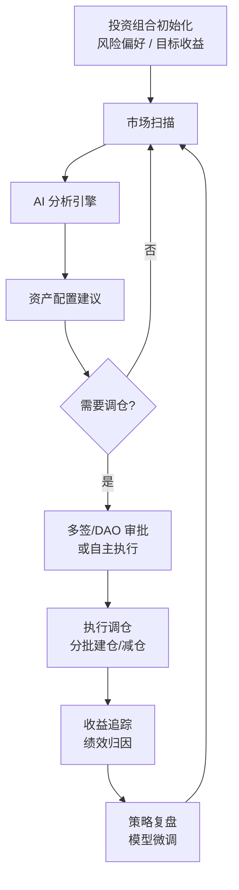

**代表性项目**：
- **Giza Protocol**：链上 AI Agent 协议，专注于 DeFi 策略自动化
- **Mozaic Finance**：AI 驱动的收益优化协议
- **dHEDGE**：去中心化资产管理平台，支持 AI 策略
- **Numerai**：众包量化对冲基金，AI 驱动
- **Almanak**：AI 量化 DeFi 策略平台

**技术关键点**：
- 需要链上可验证的 AI 决策：模型推理结果需上链存证
- 策略分层：宏观（资产配置）+ 中观（协议选择）+ 微观（执行优化）
- 安全性最关键：Agent 持有资金权限 → 需要完善的风控模块
- 可组合性：策略应该像乐高一样组合（策略 A 的输出 = 策略 B 的输入）

---

## 三、重点项目深度解析

### 🔥 1. Giza Protocol — 链上 AI Agent 基础设施

**核心架构**：

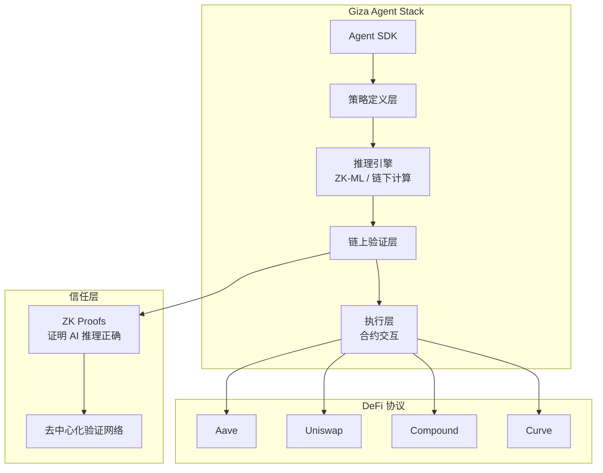

**核心机制**：
- 使用 ZK-ML（零知识机器学习）让链上合约能验证 AI 模型推理的正确性
- Agent SDK 让开发者可以用 Python 定义策略，编译后在链上执行
- 去信任化：用户不需要信任 Agent 运营者，ZK 证明确保策略按预期执行
- 专注于 DeFi 收益优化场景

**为什么重要**：
- 解决了链上 AI 的核心矛盾：AI 需要链下计算，但 DeFi 需要链上信任
- ZK-ML 是将 AI 带入 DeFi 的桥梁技术
- 为 AI Agent 建立了可验证的信任基础

---

### 🔥 2. ai16z / Eliza — 开源 AI Agent 框架

**核心架构**：

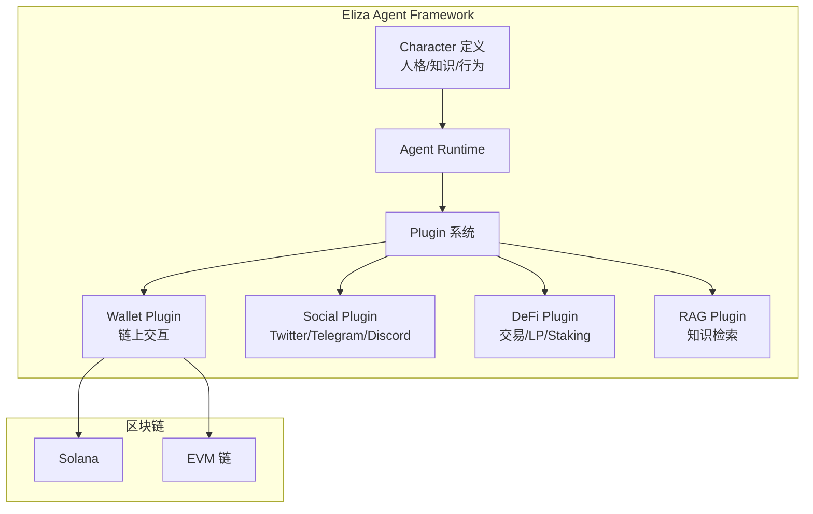

**核心机制**：
- 开源框架，任何人可以创建自主运行的 AI Agent
- 插件化架构：社交能力、链上交易能力、知识库都可以插件化
- Character 文件定义 Agent 的人格、知识和行为边界
- 已经催生了一个完整的 Agent 生态（数百个 Agent 项目）

**为什么重要**：
- 降低了构建链上 AI Agent 的门槛
- 展示了 AI Agent 如何同时具备社交能力和链上操作能力
- $ai16z 代币模型开创了 AI Agent DAO 的先例

---

### 🔥 3. CoW Protocol — 意图驱动的 MEV 保护交易

**核心架构**：

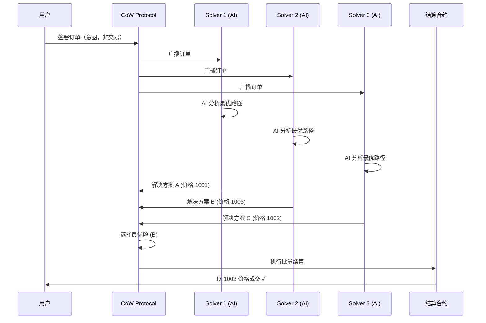

**核心机制**：
- 用户签署意图（签名订单），不直接提交交易
- Solver 网络竞争为用户找到最优执行路径
- 批量拍卖（Batch Auction）机制消除 MEV：所有同一批次的订单同时结算
- CoW（Coincidence of Wants）：如果两个用户正好想交换相反的资产，直接匹配

**为什么重要**：
- 真正的意图驱动交易范式，比传统 DEX 更保护用户
- Solver 网络是 AI Agent 的天然竞技场
- 证明了意图驱动 + 批量拍卖可以有效对抗 MEV

---

## 四、技术架构对比

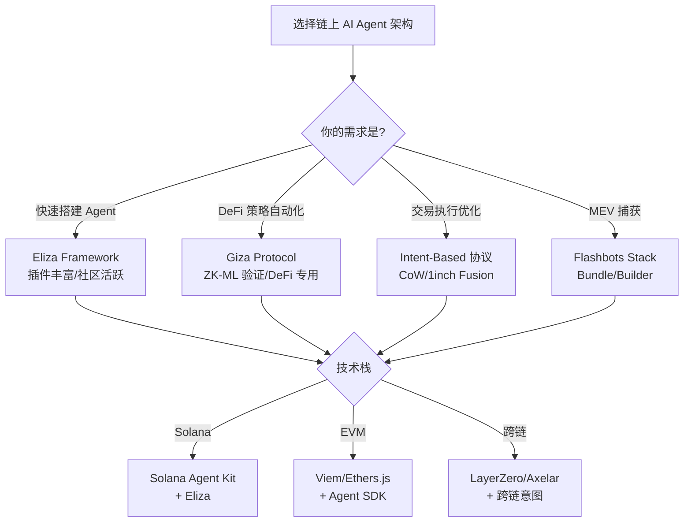

**架构选择关键因素**：

- **延迟敏感**（MEV/套利）→ 不用 LLM 做实时决策，用规则引擎 + LLM 做策略优化
- **非结构化信息**（情绪交易）→ LLM 是核心，需要 RAG + 实时数据流
- **策略自动化**（LP/投资组合）→ AI 做决策，智能合约做执行，需要 ZK 验证
- **意图执行**（Solver）→ AI 做路径优化，Solver 网络做竞争，协议做结算

---

## 五、Hackathon 项目灵感 💡

### 灵感 1：AI Agent 套利监控面板
- **方向**：构建一个 AI Agent，监控多个 DEX 的价格差异，自动发现套利机会并通过 Telegram/Discord 推送
- **难度**：⭐⭐⭐
- **创新性**：⭐⭐⭐
- **技术栈**：The Graph（链上数据索引）+ Python（AI 模型）+ Web3.py/Viem（链上交互）+ Telegram Bot

### 灵感 2：情绪驱动的 DCA 机器人
- **方向**：AI 分析社交情绪 + 链上数据，在市场恐慌时加大定投金额，在贪婪时减少
- **难度**：⭐⭐
- **创新性**：⭐⭐⭐⭐
- **技术栈**：OpenAI API（情绪分析）+ Twitter API + Gelato Network（自动化执行）+ Uniswap SDK

### 灵感 3：意图驱动的跨链 Swap Agent
- **方向**：用户对 AI Agent 说"帮我把 ETH 换成 SOL，选最便宜的方式"，Agent 自动规划跨链路径
- **难度**：⭐⭐⭐⭐
- **创新性**：⭐⭐⭐⭐⭐
- **技术栈**：LLM（意图解析）+ LI.FI/Socket（跨链路由）+ Account Abstraction（无 Gas 体验）

### 灵感 4：AI 策略回测平台
- **方向**：让 AI Agent 能在历史数据上回测 DeFi 策略，评估风险收益比，然后一键部署到链上
- **难度**：⭐⭐⭐
- **创新性**：⭐⭐⭐⭐
- **技术栈**：Python（回测引擎）+ DeFiLlama API（历史数据）+ Foundry（合约部署）+ Giza SDK

### 推荐入门项目：情绪驱动的 DCA 机器人
技术栈分解：
1. **数据层**：Twitter API + Fear & Greed Index API + Dune Analytics
2. **AI 层**：OpenAI GPT-4o 分析情绪 → 输出 [-1, 1] 情绪分数
3. **策略层**：情绪 < -0.5 → 定投金额 × 2；情绪 > 0.5 → 定投金额 × 0.5
4. **执行层**：Gelato Network 自动化 + Uniswap V3 Swap
5. **通知层**：Telegram Bot 推送交易执行结果

---

## 六、关键术语速查

- **MEV (最大可提取价值)**：区块生产者通过交易排序可提取的最大价值，包括套利、清算、三明治攻击
- **Flash Loan (闪电贷)**：在同一交易内借入并归还的无抵押贷款，用于零资本套利
- **Intent (意图)**：用户声明"想要什么结果"而非"怎么执行"，由 Solver 网络负责找到最优执行路径
- **Solver (求解器)**：接收用户意图，计算并提交最优执行方案的竞争者，通常是 AI Agent
- **ZK-ML (零知识机器学习)**：用零知识证明验证 AI 模型推理的正确性，让链上合约信任链下 AI 计算
- **Sandwich Attack (三明治攻击)**：在用户交易前后各插入一笔交易，通过操纵价格获利
- **JIT Liquidity (即时流动性)**：在大额交易前瞬间提供流动性，收取手续费后立即撤出
- **Account Abstraction (账户抽象)**：让智能合约钱包替代 EOA，支持 Gas 代付、批量交易、社交恢复等
- **DCA (Dollar Cost Averaging)**：定期定额投资策略，平滑入场成本
- **Impermanent Loss (无常损失)**：LP 提供流动性时因价格变动导致的相对于持有代币的损失
- **RAG (检索增强生成)**：让 LLM 基于外部知识库生成更准确的回答
- **Agent Framework**：AI Agent 的开发框架，提供记忆、工具调用、多步推理等能力

---

## 七、今日学习总结

### 📌 核心收获

1. **链上 AI Agent 的核心矛盾是「计算 vs 信任」**：AI 需要链下计算能力，但 DeFi 需要链上可验证性。ZK-ML 和意图驱动是两条解决路径
2. **意图驱动是最重要的范式转变**：从"用户写交易"到"用户声明意图，AI Solver 竞争执行"，这正在重塑 DeFi 的交易体验
3. **混合架构是工程实践的关键**：纯 LLM 太慢做不了实时交易，纯规则不够灵活——最佳实践是规则引擎做执行 + LLM 做策略决策

### 🤔 思考题

- 如果 AI Agent 管理的资金量足够大，它的交易行为本身就会成为市场信号，如何避免"自我实现的预言"或"自我击败的策略"？
- 当多个 AI Agent 使用相似的策略在同一市场交易时，会不会出现"AI vs AI"的军备竞赛？这对普通用户是好是坏？
- 意图驱动交易中，Solver 网络会不会最终被少数强大的 AI Agent 垄断？如何保持去中心化？

### 📚 进一步阅读

- Giza Protocol 文档: https://docs.gizaprotocol.ai/
- CoW Protocol Docs: https://docs.cow.fi/
- Flashbots Docs: https://docs.flashbots.net/
- Eliza Framework (ai16z): https://github.com/elizaOS/eliza
- Intent-Based Trading (UniswapX): https://uniswap.org/blog/uniswapx
- MEV Wiki: https://writings.flashbots.net/mev-tharis-dark-forest
- a]16z AI + Crypto 视点: https://a16zcrypto.com/posts/article/ai-crypto/
