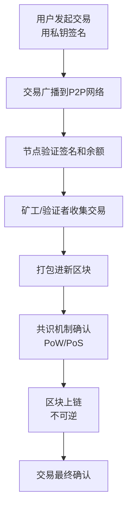
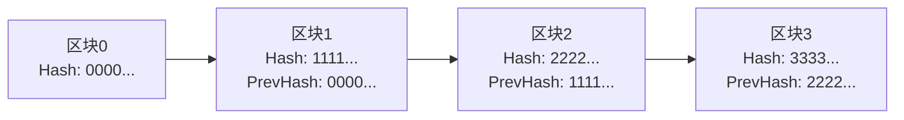
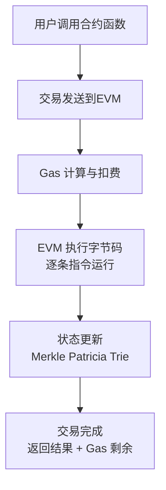
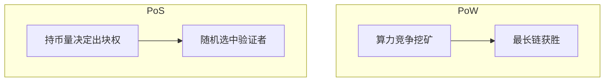

# 2026-05-21 学习日志

## Web3 运行原理 · 核心总结（Mermaid 流程图版）

### 1. 交易完整生命周期流程图

### 2. 区块链结构与链式连接

### 3. 智能合约 + EVM 执行流程

### 4. 共识机制简单对比

---

### 核心文字总结

- **交易流程**：签名 → 广播 → 验证 → 打包 → 共识 → 上链
- **区块链防篡改**：每个区块哈希包含前一个区块哈希 + Merkle Root
- **EVM 运行**：智能合约代码在 EVM 中执行，每步消耗 Gas，状态用 Merkle Trie 存储
- **去中心化关键**：P2P 网络 + 共识机制（PoW/PoS）

---

**一句话总结**：  
Web3 通过「区块链 + P2P 网络 + 共识机制 + 智能合约」实现去中心化运行，交易从签名到上链需经过广播、验证、打包、共识确认的全流程，EVM 则负责安全地执行合约代码。

---

**今日学习时长**：__ 分钟  
**今日收获**：  
**遇到的问题**：  
**明日计划**：  
