# AI Agent + 链上执行：深度学习笔记

## 学习目标
- 理解 AI Agent 如何通过 Function Calling 与智能合约交互
- 掌握完整的 Agent 交易执行流程
- 了解关键技术栈和实现方案
- 能够设计一个简单的 AI Agent DeFi 项目

---

## 一、核心概念：什么是 AI Agent？

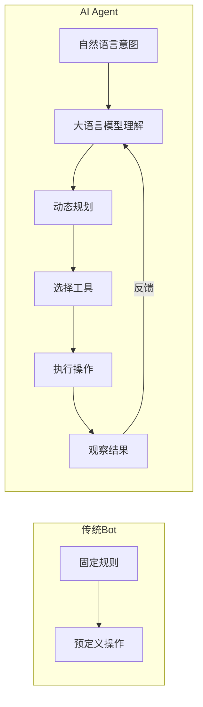

**关键区别**：
- 传统 Bot：if-else 规则，只能做预编程的操作
- AI Agent：理解自然语言意图，能动态规划和选择工具

---

## 二、Function Calling 原理

### 2.1 什么是 Function Calling？

Function Calling 是让 LLM 与外部世界交互的桥梁：

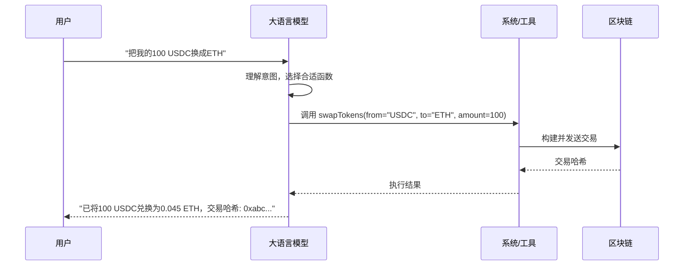

### 2.2 Function Calling 的工作原理

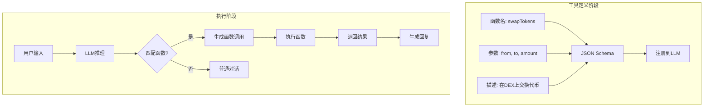

### 2.3 代码示例：定义工具函数

```typescript
// 定义 AI Agent 可用的工具
const tools = [
  {
    type: "function",
    function: {
      name: "swapTokens",
      description: "在去中心化交易所交换两种代币",
      parameters: {
        type: "object",
        properties: {
          fromToken: {
            type: "string",
            description: "源代币地址",
          },
          toToken: {
            type: "string",
            description: "目标代币地址",
          },
          amount: {
            type: "number",
            description: "交换数量",
          },
          slippage: {
            type: "number",
            description: "滑点容忍度（百分比）",
          },
        },
        required: ["fromToken", "toToken", "amount"],
      },
    },
  },
  {
    type: "function",
    function: {
      name: "getBalance",
      description: "查询钱包代币余额",
      parameters: {
        type: "object",
        properties: {
          tokenAddress: {
            type: "string",
            description: "代币合约地址",
          },
        },
        required: ["tokenAddress"],
      },
    },
  },
];
```

---

## 三、完整架构：AI Agent 执行链上交易

### 3.1 系统架构图

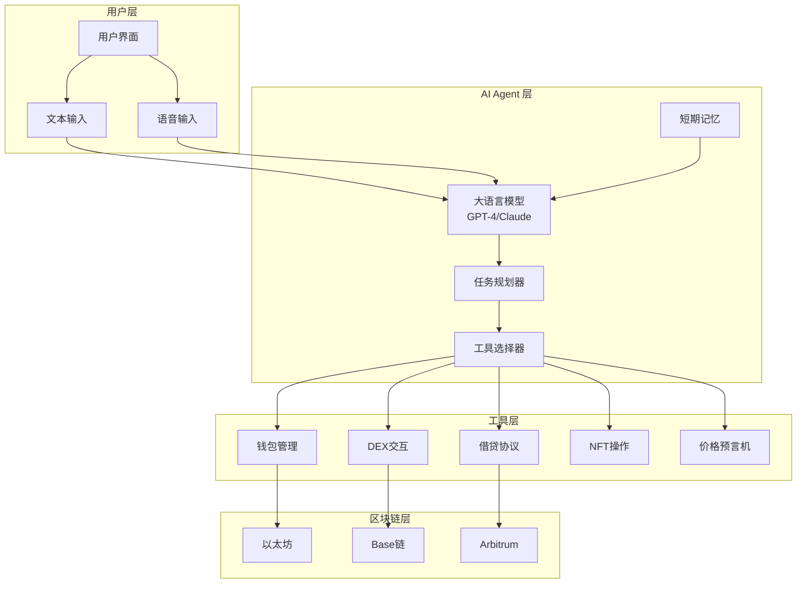

### 3.2 执行流程详解

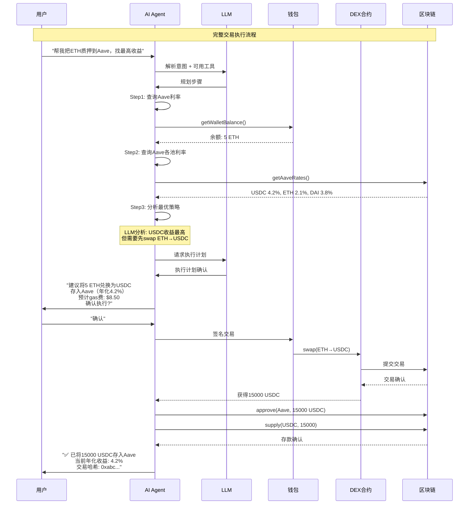

---

## 四、关键技术实现

### 4.1 钱包管理

```typescript
// 核心钱包类
class AgentWallet {
  private privateKey: string;
  private provider: ethers.JsonRpcProvider;
  
  constructor(privateKey: string, rpcUrl: string) {
    this.privateKey = privateKey;
    this.provider = new ethers.JsonRpcProvider(rpcUrl);
  }
  
  // 获取余额
  async getBalance(tokenAddress?: string): Promise<string> {
    if (!tokenAddress) {
      // 获取原生代币余额
      const balance = await this.provider.getBalance(this.getAddress());
      return ethers.formatEther(balance);
    }
    
    // 获取ERC20代币余额
    const contract = new ethers.Contract(tokenAddress, ERC20_ABI, this.provider);
    const balance = await contract.balanceOf(this.getAddress());
    const decimals = await contract.decimals();
    return ethers.formatUnits(balance, decimals);
  }
  
  // 发送交易
  async sendTransaction(to: string, value: string, data: string): Promise<string> {
    const wallet = new ethers.Wallet(this.privateKey, this.provider);
    const tx = await wallet.sendTransaction({
      to,
      value: ethers.parseEther(value),
      data,
      gasLimit: 200000,
    });
    return tx.hash;
  }
  
  // 签名消息
  async signMessage(message: string): Promise<string> {
    const wallet = new ethers.Wallet(this.privateKey);
    return await wallet.signMessage(message);
  }
}
```

### 4.2 DEX 交互工具

```typescript
// Uniswap V3 交互
const uniswapTools = [
  {
    name: "uniswap_swap",
    description: "在Uniswap V3上交换代币",
    parameters: {
      tokenIn: { type: "string", required: true },
      tokenOut: { type: "string", required: true },
      amountIn: { type: "string", required: true },
      fee: { type: "number", default: 3000 }, // 0.3%
      slippage: { type: "number", default: 0.5 }, // 0.5%
    },
    execute: async (params) => {
      const router = new ethers.Contract(UNISWAP_ROUTER, ROUTER_ABI, wallet);
      
      // 1. 获取报价
      const quote = await getQuote(params);
      
      // 2. 设置滑点保护
      const minAmountOut = quote.amountOut * (1 - params.slippage / 100);
      
      // 3. 执行交换
      const tx = await router.exactInputSingle({
        tokenIn: params.tokenIn,
        tokenOut: params.tokenOut,
        fee: params.fee,
        recipient: wallet.address,
        amountIn: ethers.parseUnits(params.amountIn, 18),
        amountOutMinimum: minAmountOut,
        sqrtPriceLimitX96: 0,
      });
      
      return {
        txHash: tx.hash,
        amountOut: quote.amountOut,
        gasUsed: tx.gasLimit.toString(),
      };
    },
  },
];
```

### 4.3 AI Agent 核心循环

```typescript
class OnChainAgent {
  private llm: OpenAI;
  private wallet: AgentWallet;
  private tools: Tool[];
  
  constructor(config: AgentConfig) {
    this.llm = new OpenAI({ apiKey: config.openaiKey });
    this.wallet = new AgentWallet(config.privateKey, config.rpcUrl);
    this.tools = this.loadTools();
  }
  
  // 主执行循环
  async run(userInput: string): Promise<AgentResponse> {
    // 1. 构建消息历史
    const messages = [
      { role: "system", content: SYSTEM_PROMPT },
      { role: "user", content: userInput },
    ];
    
    // 2. LLM推理循环
    while (true) {
      const response = await this.llm.chat.completions.create({
        model: "gpt-4",
        messages,
        tools: this.tools,
        tool_choice: "auto",
      });
      
      const choice = response.choices[0];
      
      // 3. 如果LLM决定调用工具
      if (choice.finish_reason === "tool_calls") {
        const toolCalls = choice.message.tool_calls;
        
        for (const call of toolCalls) {
          // 4. 执行工具调用
          const result = await this.executeTool(
            call.function.name,
            JSON.parse(call.function.arguments)
          );
          
          // 5. 将结果返回给LLM
          messages.push(choice.message);
          messages.push({
            role: "tool",
            tool_call_id: call.id,
            content: JSON.stringify(result),
          });
        }
        
        // 继续循环，让LLM处理结果
        continue;
      }
      
      // 6. LLM生成最终回复
      return {
        message: choice.message.content,
        status: "completed",
      };
    }
  }
  
  // 执行单个工具
  private async executeTool(name: string, args: any): Promise<any> {
    const tool = this.tools.find((t) => t.name === name);
    if (!tool) throw new Error(`Tool not found: ${name}`);
    
    console.log(`Executing tool: ${name}`, args);
    
    // 安全检查
    await this.validateTransaction(args);
    
    // 执行
    return await tool.execute(args, this.wallet);
  }
  
  // 安全验证
  private async validateTransaction(args: any): Promise<void> {
    // 检查交易金额是否超过限制
    if (args.amount && parseFloat(args.amount) > MAX_TRANSACTION_AMOUNT) {
      throw new Error("Transaction amount exceeds limit");
    }
    
    // 检查是否需要用户确认
    if (args.requiresConfirmation) {
      // 这里可以添加用户确认逻辑
    }
  }
}
```

---

## 五、安全设计（非常重要！）

### 5.1 安全风险矩阵

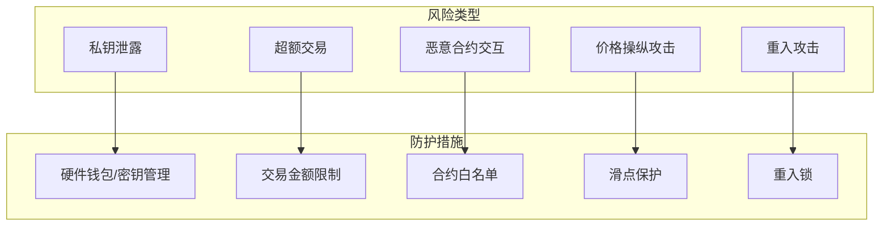

### 5.2 关键安全机制

```typescript
class SecurityManager {
  // 1. 交易金额限制
  private async checkAmountLimit(amount: number): Promise<boolean> {
    const limit = await this.getTransactionLimit();
    if (amount > limit) {
      throw new Error(`Amount ${amount} exceeds daily limit ${limit}`);
    }
    return true;
  }
  
  // 2. 合约白名单
  private async validateContract(address: string): Promise<boolean> {
    const whitelist = await this.getWhitelist();
    if (!whitelist.includes(address.toLowerCase())) {
      throw new Error(`Contract ${address} is not whitelisted`);
    }
    return true;
  }
  
  // 3. 价格保护
  private async checkPriceManipulation(
    tokenIn: string,
    tokenOut: string,
    expectedPrice: number
  ): Promise<boolean> {
    const actualPrice = await this.getPrice(tokenIn, tokenOut);
    const priceImpact = Math.abs(actualPrice - expectedPrice) / expectedPrice;
    
    if (priceImpact > MAX_PRICE_IMPACT) {
      throw new Error(`Price impact ${priceImpact} exceeds maximum`);
    }
    return true;
  }
  
  // 4. 用户确认（重要操作）
  private async requireUserConfirmation(
    action: string,
    details: any
  ): Promise<boolean> {
    // 发送确认请求给用户
    const confirmed = await this.sendConfirmationRequest({
      action,
      details,
      timeout: 30000, // 30秒超时
    });
    
    if (!confirmed) {
      throw new Error("User rejected the transaction");
    }
    return true;
  }
}
```

### 5.3 权限分级

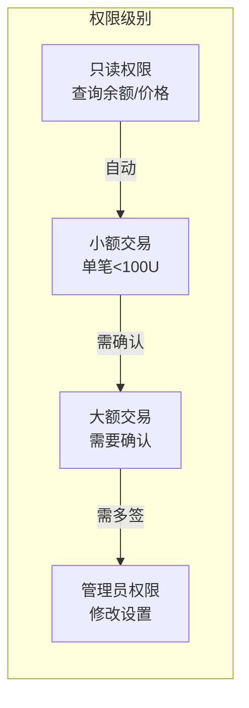

---

## 六、实际案例分析

### 案例1：Fetch.ai 的 Agent 网络

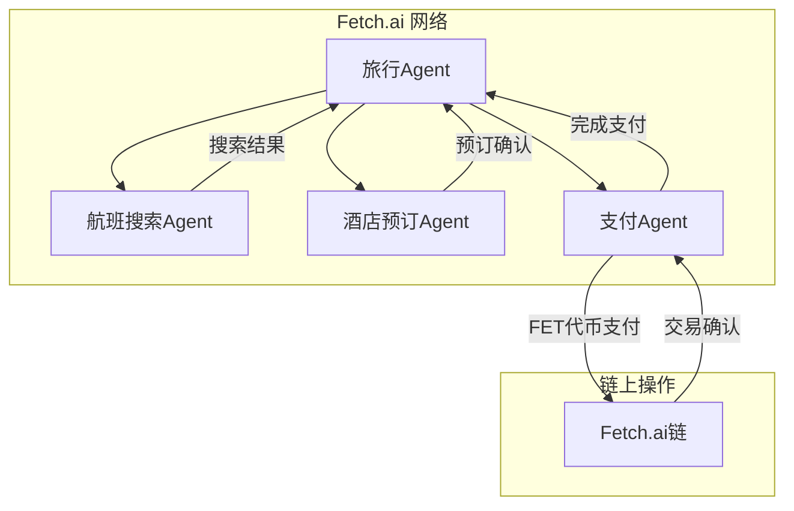

**特点**：
- Agent 可以发现和协商服务
- 自动化多方协调
- 使用原生代币 FET 进行支付

### 案例2：Autonolas 的 DeFi 策略 Agent

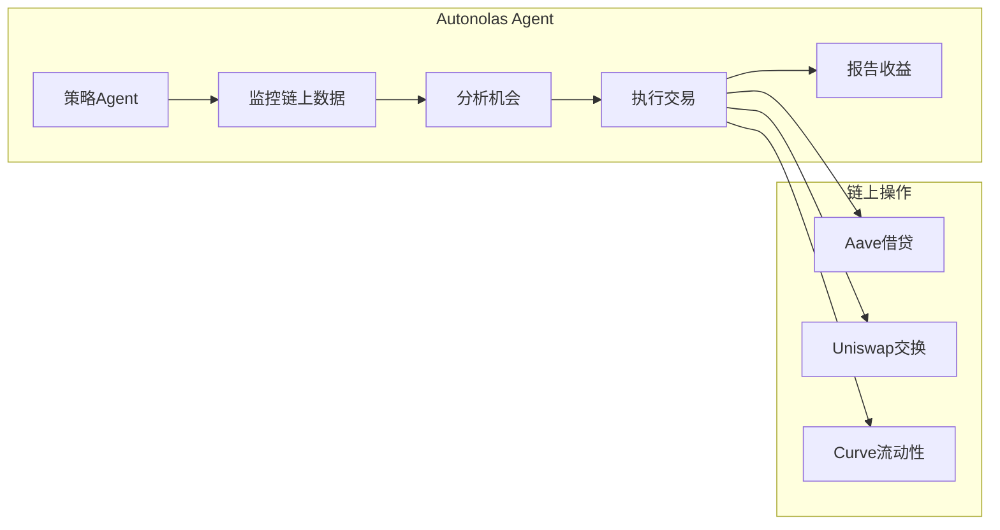

**特点**：
- 7x24 小时自动运行
- 多协议策略优化
- 收益自动复投

---

## 七、动手实践：构建你的第一个 AI Agent

### 7.1 最小可行项目

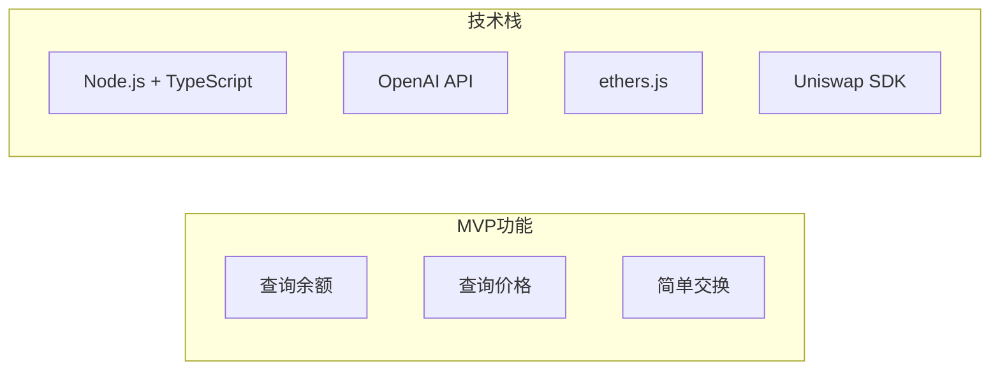

### 7.2 项目结构

```
ai-defi-agent/
├── src/
│   ├── agent/
│   │   ├── index.ts          # Agent 主类
│   │   ├── tools.ts          # 工具定义
│   │   └── safety.ts         # 安全模块
│   ├── blockchain/
│   │   ├── wallet.ts         # 钱包管理
│   │   ├── dex.ts            # DEX交互
│   │   └── contracts.ts      # 合约ABI
│   └── config/
│       └── index.ts          # 配置管理
├── package.json
└── README.md
```

### 7.3 核心代码示例

```typescript
// index.ts - AI Agent 主入口
import { OpenAI } from "openai";
import { AgentWallet } from "./blockchain/wallet";
import { getTools, executeTool } from "./agent/tools";

const openai = new OpenAI({ apiKey: process.env.OPENAI_API_KEY });
const wallet = new AgentWallet(process.env.PRIVATE_KEY!, process.env.RPC_URL!);

async function runAgent(userInput: string) {
  const tools = getTools(wallet);
  
  const messages = [
    {
      role: "system",
      content: `你是一个DeFi助手Agent。你可以帮用户查询余额、查看价格、执行交换。
        始终确认用户的意图，并在执行交易前获得确认。
        当前网络: ${process.env.CHAIN_NAME}`,
    },
    { role: "user", content: userInput },
  ];
  
  // Agent循环
  while (true) {
    const response = await openai.chat.completions.create({
      model: "gpt-4",
      messages,
      tools,
      tool_choice: "auto",
    });
    
    const choice = response.choices[0];
    
    if (choice.finish_reason === "tool_calls") {
      const toolCalls = choice.message.tool_calls!;
      
      for (const call of toolCalls) {
        const result = await executeTool(call.function.name, 
          JSON.parse(call.function.arguments), wallet);
        
        messages.push(choice.message);
        messages.push({
          role: "tool",
          tool_call_id: call.id,
          content: JSON.stringify(result),
        });
      }
      continue;
    }
    
    return choice.message.content;
  }
}

// 运行示例
async function main() {
  const result = await runAgent("查看我的USDC余额，然后告诉我ETH的当前价格");
  console.log(result);
}

main().catch(console.error);
```

---

## 八、进阶话题

### 8.1 多链支持

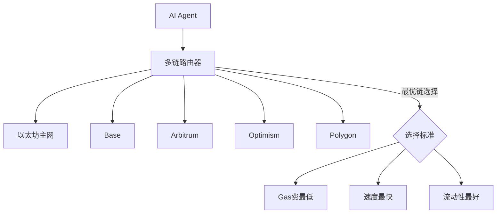

### 8.2 MEV 防护

```typescript
// 使用 Flashbots 保护交易
async function sendProtectedTransaction(tx: Transaction) {
  // 1. 构建交易包
  const bundle = [
    {
      signer: wallet,
      transaction: tx,
    },
  ];
  
  // 2. 通过 Flashbots 发送
  const result = await flashbots.sendBundle(bundle, targetBlock);
  
  // 3. 检查是否被包含
  const receipts = await result.receipts();
  
  return {
    included: receipts.length > 0,
    blockNumber: receipts[0]?.blockNumber,
  };
}
```

### 8.3 Agent 协作网络

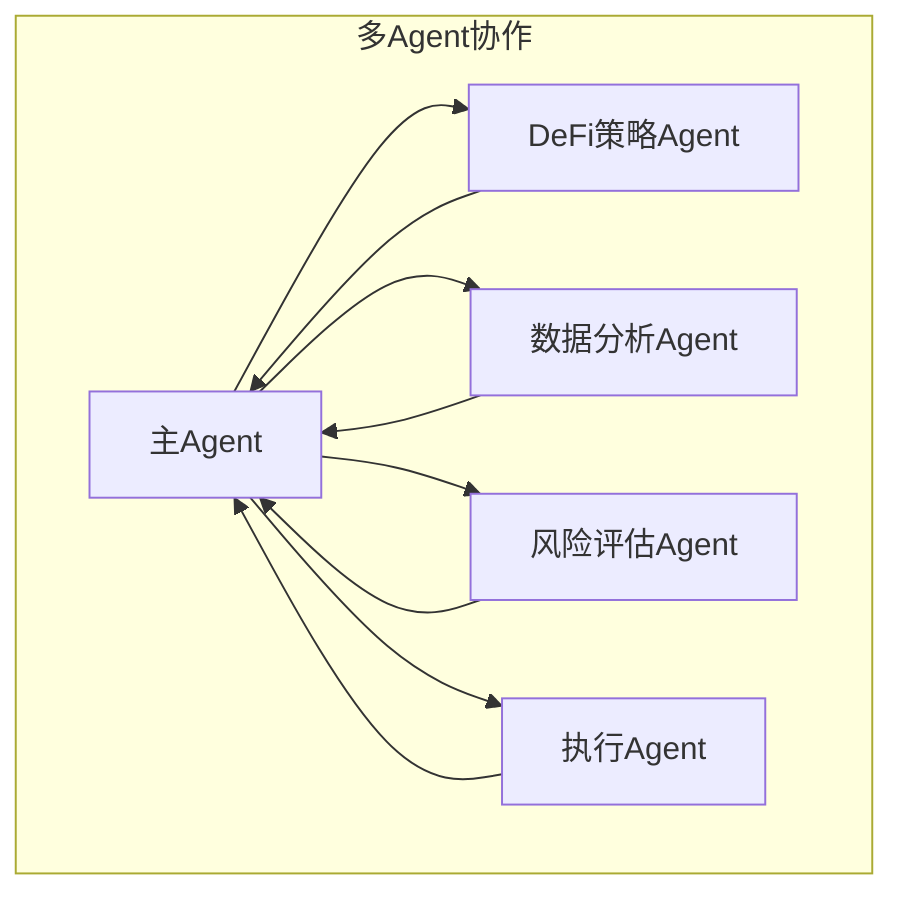

---

## 九、学习资源

### 必读文档
1. **OpenAI Function Calling**: https://platform.openai.com/docs/guides/function-calling
2. **ethers.js 文档**: https://docs.ethers.org/v6/
3. **Uniswap V3 SDK**: https://docs.uniswap.org/

### 开源项目参考
1. **ElizaOS**: https://github.com/elizaOS/eliza
2. **Fetch.ai uAgents**: https://github.com/fetchai/uAgents
3. **Autonolas**: https://github.com/valory-xyz/autonolas

### 工具推荐
- **Hardhat**: 本地开发和测试
- **The Graph**: 链上数据查询
- **Tenderly**: 交易模拟和调试

---

## 十、总结与思考

### 关键要点

1. **Function Calling 是桥梁**：让 LLM 能够理解和执行链上操作
2. **安全第一**：私钥管理、金额限制、滑点保护缺一不可
3. **Agent 循环**：LLM推理 → 工具选择 → 执行 → 反馈 → 继续推理
4. **多链思维**：现代DeFi需要跨链能力

### 思考题

1. 如果 AI Agent 执行了一个错误的交易，应该如何设计回滚机制？
2. 如何防止 LLM 被提示注入攻击，执行恶意交易？
3. AI Agent 的"自主权"边界应该在哪里？

### 项目练习

尝试构建一个最小的 AI Agent：
- 能够查询钱包余额
- 能够获取代币价格
- （可选）能够执行简单的交换

---

*学习日期: 2026-05-22*
*学习主题: AI Agent + 链上执行*
