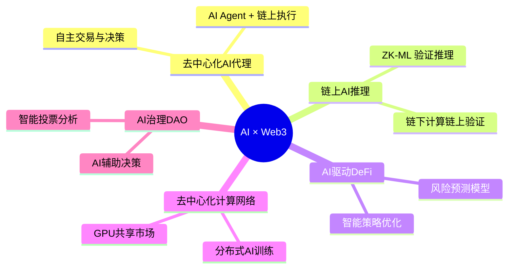
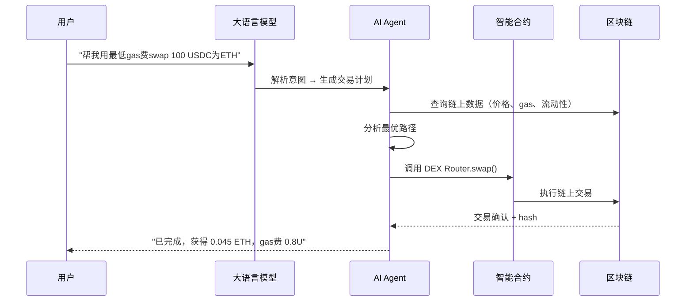
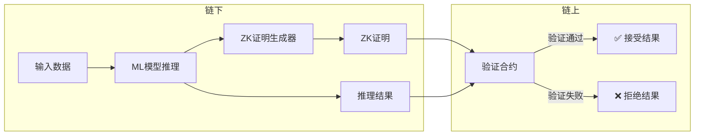
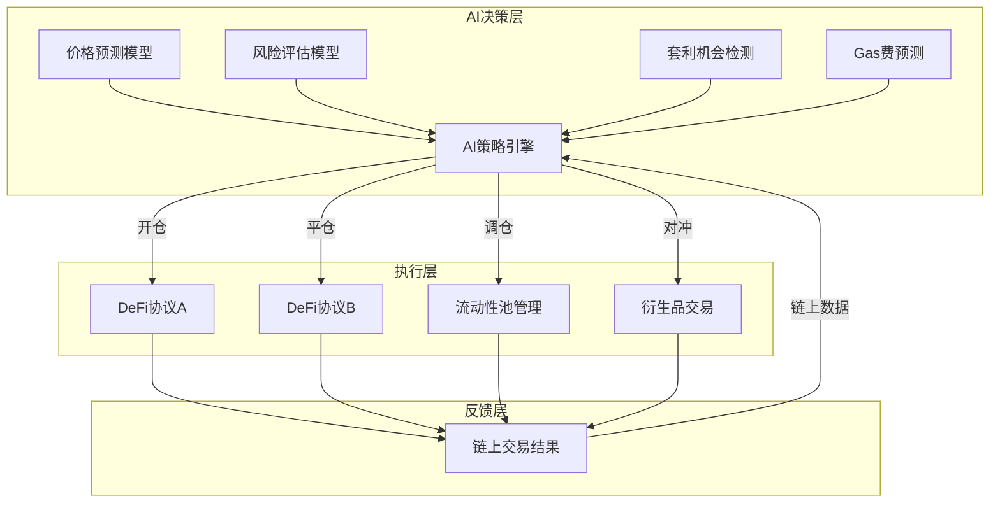
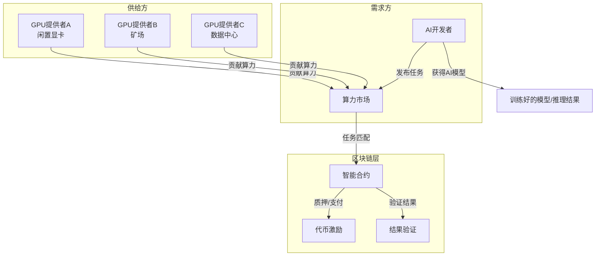
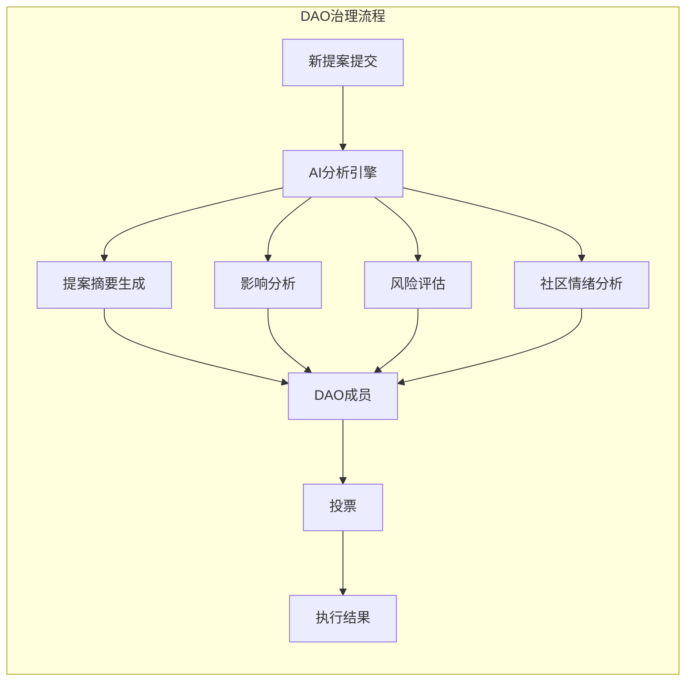
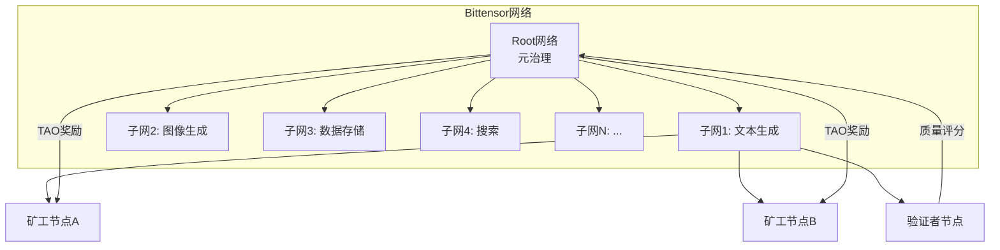
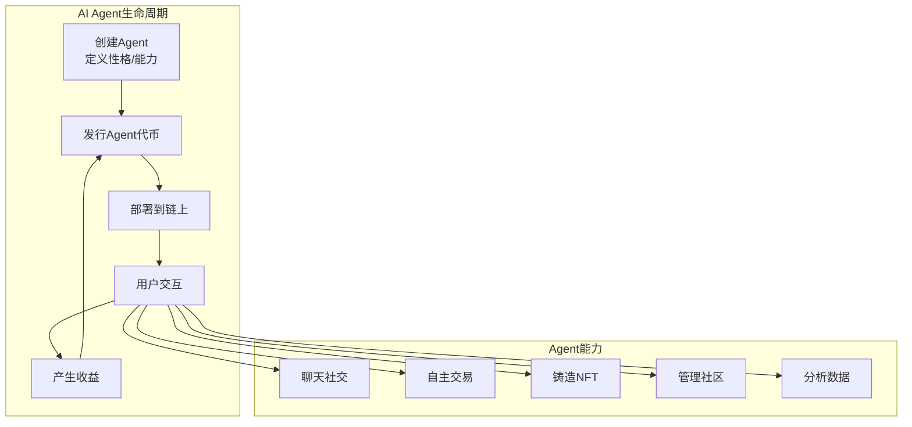
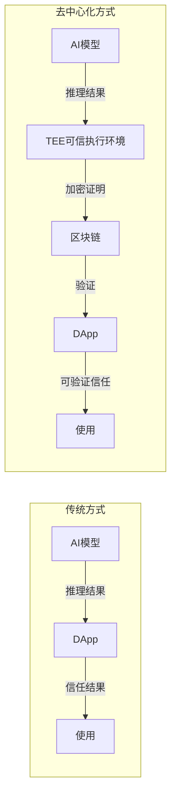
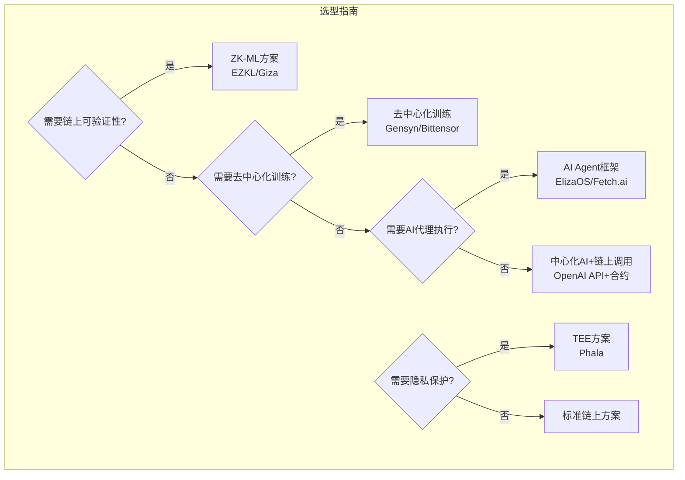

# 2026-05-22 学习日志

## 深入 AI × Web3 融合案例

### 学习路径：推荐路径（深入AI × Web3融合案例）

---

## 一、AI × Web3 融合全景图

---

## 二、核心融合模式（5大模式）

### 模式1：AI Agent + 链上执行

**核心思想**：AI 作为"代理人"，通过智能合约在链上自主执行操作。

**代表性项目**：
- **Fetch.ai (ASI)**：自主AI代理网络，代理可以发现、协商、执行链上服务
- **Autonolas (Olas)**：去中心化AI代理，用于DeFi策略自动化
- **AI16Z / Virtuals Protocol**：AI代理可以在链上创建代币、管理金库

**技术关键点**：
- LLM 通过 Function Calling / Tool Use 与智能合约交互
- Agent 需要处理链上状态的不可逆性（交易不可撤销）
- 钱包管理、私钥安全、Gas 估算

---

### 模式2：ZK-ML（零知识机器学习）

**核心思想**：在链下运行AI推理，通过零知识证明确保推理结果的正确性，链上验证。

**为什么重要**：
- 链上运行AI模型计算成本极高（gas费爆炸）
- ZK-ML 让计算在链下完成，只在链上验证证明
- 保证了**可验证性** + **隐私性** + **低成本**

**代表性项目**：
- **EZKL**：将 ML 模型转为 ZK 电路，链上验证推理
- **Giza**：ZK-ML 框架，用于链上可验证AI策略
- **Modulus Labs**：ZK 验证的链上AI推理
- **RISC Zero**：通用 ZK 虚拟机，可运行任意计算的ZK证明

**实际应用场景**：
- DeFi 信用评分（链下AI评估，链上验证结果）
- 链上推荐系统（AI推荐 → ZK证明 → 链上使用）
- 预测市场（AI模型预测 → ZK验证 → 自动结算）

---

### 模式3：AI驱动的 DeFi 策略

**核心思想**：用AI模型优化DeFi操作——套利、流动性管理、风险控制。

**代表性项目**：
- **Numerai**：AI对冲基金，用众包ML模型做股票交易
- **Dopex / GMX + AI**：AI策略自动管理期权和永续合约仓位
- **Morpho / Aave + AI**：AI优化借贷协议的利率和清算策略

**关键能力**：
- 实时链上数据分析（TVL变化、巨鲸追踪、清算预警）
- 多协议套利路径规划
- MEV（最大可提取价值）防护与利用

---

### 模式4：去中心化AI计算网络

**核心思想**：用区块链激励机制构建去中心化的GPU算力市场，为AI训练和推理提供基础设施。

**代表性项目**：
- **io.net**：聚合闲置GPU构建分布式AI计算网络
- **Akash Network**：去中心化云计算市场（含GPU）
- **Render Network (RNDR)**：分布式GPU渲染网络，扩展至AI推理
- **Gensyn**：去中心化深度学习训练协议
- **Bittensor (TAO)**：去中心化AI网络，子网专注于不同AI任务

**核心价值**：
- 比中心化云（AWS/Azure）成本低 50-90%
- 抗审查，无单点故障
- 用代币激励全球闲置算力参与

---

### 模式5：AI增强的 DAO 治理

**核心思想**：用AI辅助DAO的决策、提案分析、投票优化。

**实际应用**：
- **Snapshot + AI**：AI分析历史投票模式，预测提案通过概率
- **Tally + AI**：自动生成治理提案摘要
- **Kleros + AI**：AI辅助争议仲裁

---

## 三、重点项目深度解析

### 🔥 1. Bittensor (TAO) — 去中心化AI网络

**核心机制**：
- 每个子网专注一个AI任务（文本、图像、搜索等）
- 矿工提供AI能力，验证者评估质量
- 按贡献质量分配 TAO 代币奖励
- 竞争机制：差的矿工被淘汰，好的持续升级

**为什么是AI×Web3的标杆**：
- 真正用区块链激励全球AI贡献
- 无需许可，任何人可以加入
- AI模型互相竞争，推动质量提升

---

### 🔥 2. AI Agents 生态 (Virtuals / ai16z / ElizaOS)

**代表性平台**：
- **Virtuals Protocol**：在 Base 链上创建、代币化 AI 代理
- **ElizaOS (ai16z)**：开源AI代理框架，可连接链上和社交
- **GAME by Virtuals**：AI代理游戏化平台

**核心创新**：
- AI Agent 可以拥有自己的钱包和资产
- Agent 发行代币，社区可以投资Agent的"未来价值"
- Agent 可以 24/7 自主运行，无需人类干预

---

### 🔥 3. 去中心化AI推理（链上可验证推理）

**技术路径**：
1. **TEE (可信执行环境)**：Phala Network — 在硬件安全飞地中运行AI
2. **ZK-ML**：零知识证明验证AI推理结果（上面已详述）
3. **乐观验证**：先信任结果，有争议时再挑战

---

## 四、技术架构对比

---

## 五、Hackathon 项目灵感 💡

### 可行的 AI × Web3 项目方向：

| # | 方向 | 难度 | 创新性 |
|---|------|------|--------|
| 1 | **AI Agent 自动管理 DeFi 仓位** | ⭐⭐⭐ | ⭐⭐⭐⭐ |
| 2 | **用 LLM 分析链上数据 + 可视化** | ⭐⭐ | ⭐⭐⭐ |
| 3 | **AI 生成的 NFT 动态变化** | ⭐⭐ | ⭐⭐⭐ |
| 4 | **链上信用评分系统（ZK-ML）** | ⭐⭐⭐⭐ | ⭐⭐⭐⭐⭐ |
| 5 | **AI 辅助 DAO 治理提案分析** | ⭐⭐ | ⭐⭐⭐⭐ |
| 6 | **去中心化 AI 模型市场** | ⭐⭐⭐ | ⭐⭐⭐⭐ |

### 推荐 Hackathon 项目组合：
> **方向2（LLM分析链上数据）** 最适合入门，技术栈清晰：
> - 前端：React + 图表库
> - 后端：LLM API（GPT/Claude）+ Web3.js/ethers.js
> - 数据源：The Graph / Dune Analytics / Etherscan API
> - 亮点：自然语言查询链上数据 + 智能分析报告

---

## 六、关键术语速查

| 术语 | 含义 |
|------|------|
| **ZK-ML** | 零知识机器学习：链下推理+链上验证 |
| **AI Agent** | 能自主决策和执行任务的AI程序 |
| **TEE** | 可信执行环境，硬件级别的安全计算 |
| **DePIN** | 去中心化物理基础设施网络 |
| **Function Calling** | LLM调用外部工具/API的能力 |
| **MEV** | 最大可提取价值，区块生产者可提取的额外利润 |
| **Oracle** | 预言机，将链下数据带给智能合约 |

---

## 七、今日学习总结

### 📌 核心收获
1. **AI × Web3 不是简单的"AI+区块链"**，而是用区块链特性（去中心化、不可篡改、代币激励）增强AI能力
2. **5大融合模式**：AI Agent链上执行、ZK-ML可验证推理、AI驱动DeFi、去中心化计算网络、AI增强DAO治理
3. **ZK-ML 是最有技术深度的方向**，解决了"链上AI推理成本过高"的核心问题
4. **AI Agent 是当前最热的方向**，Virtuals/ElizaOS 生态正在爆发

### 🤔 思考题
- 如果你要做一个Hackathon项目，你会选择哪个方向？为什么？
- AI Agent 的"自主权"边界应该在哪里？（能自己花钱吗？能自己投票吗？）
- 去中心化AI计算网络能否真正挑战 AWS/Azure？

### 📚 进一步阅读
- Bittensor 白皮书：https://bittensor.com/whitepaper
- EZKL 文档：https://docs.ezkl.xyz
- Virtuals Protocol：https://www.virtuals.io
- ElizaOS GitHub：https://github.com/elizaOS/eliza
