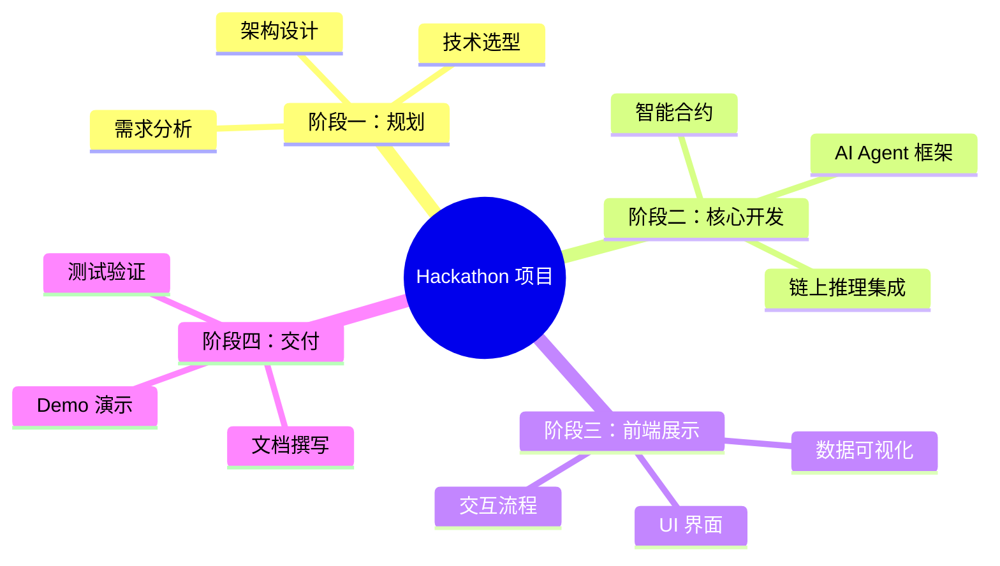
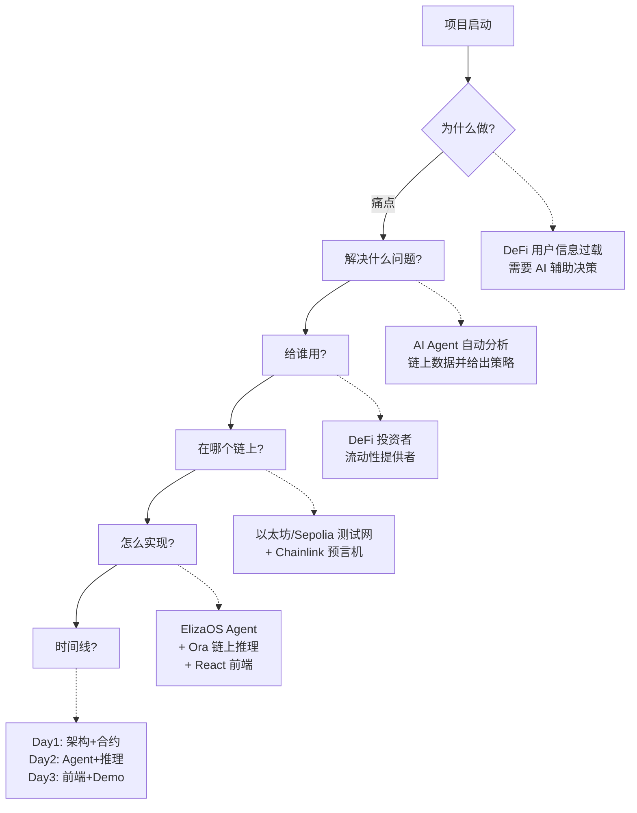
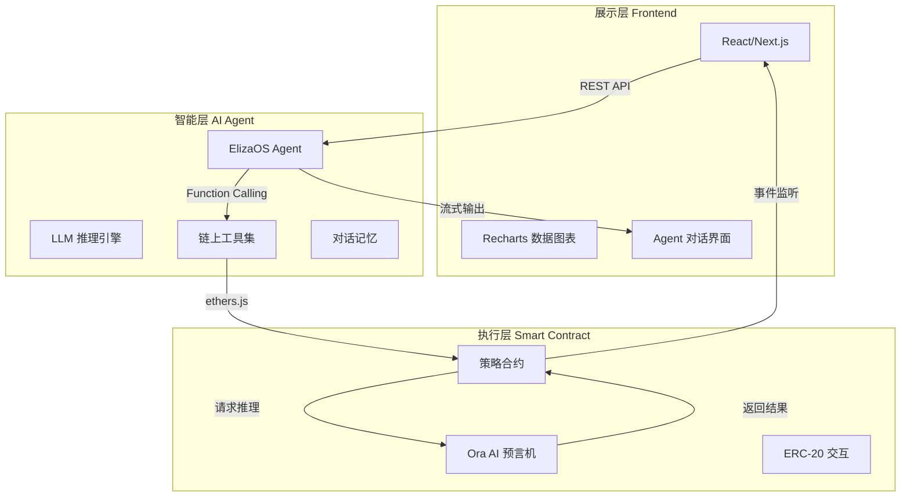
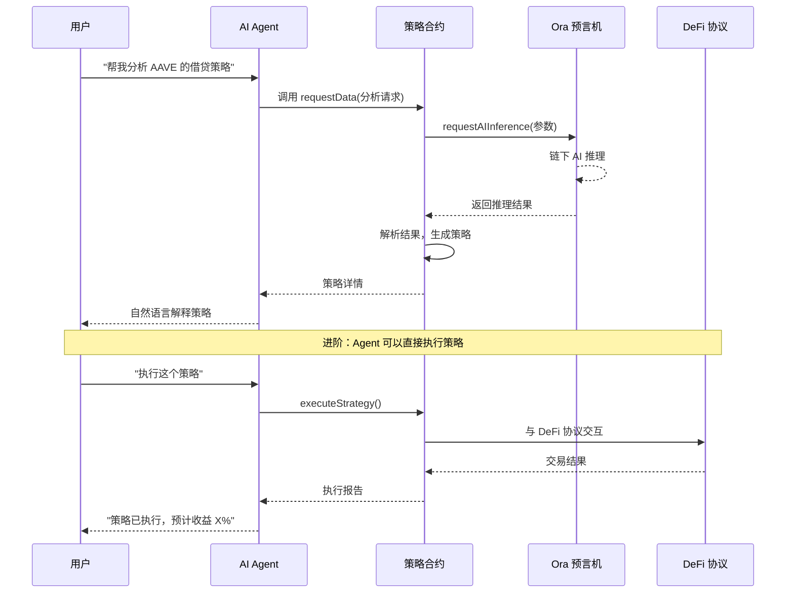
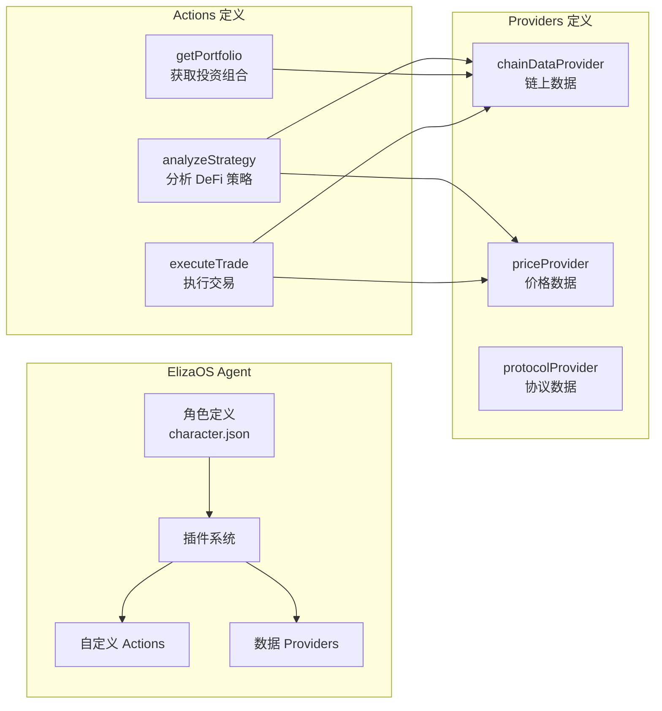
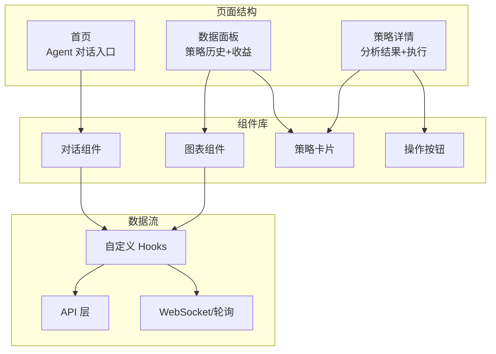
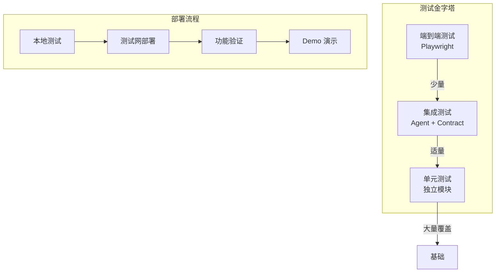
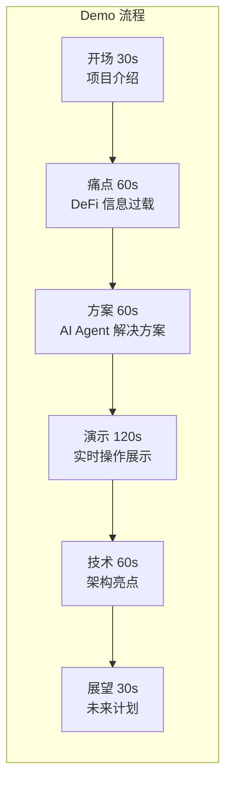

# 2026-05-25 学习日志 Part B：Hackathon 项目开发全指南

## AI Agent × DeFi 策略师 — 从零到 MVP

### 学习路径：挑战路径（完整 Hackathon 项目开发流程）

---

## 一、Hackathon 项目开发全景图



**核心原则**：Hackathon 时间有限，必须做减法。先跑通最小闭环，再考虑扩展。

---

## 二、项目规划：5W1H 分析法

### 模式1：需求定义框架



**关键决策点**：
- **目标链**：选你最熟悉的（Ethereum/Polygon/Base/Solana）
- **AI 方案**：选最简单的先跑通（直接调 API → 后面再加链上验证）
- **功能范围**：砍到只剩核心功能（1 个 Agent + 1 个策略 + 1 个前端）

---

## 三、技术架构设计

### 模式2：三层架构分离



**设计要点**：
- 三层解耦，每层可以独立开发和测试
- Agent 是中间层，负责连接用户意图和链上执行
- 前端只是展示，核心逻辑在 Agent + 合约

---

## 四、智能合约设计

### 模式3：AI 增强型 DeFi 合约



### 核心合约代码结构

```solidity
// SPDX-License-Identifier: MIT
pragma solidity ^0.8.19;

import "@ora-io/contracts/src/AIOracle.sol";

/**
 * @title DeFiStrategyAdvisor
 * @notice AI Agent 驱动的 DeFi 策略顾问合约
 */
contract DeFiStrategyAdvisor is AIOracle {

    struct Strategy {
        address user;
        string request;        // 用户的策略请求
        string aiResult;       // AI 推理结果
        uint256 confidence;    // 置信度 (0-100)
        uint256 timestamp;
        bool executed;
    }

    mapping(uint256 => Strategy) public strategies;
    uint256 public strategyCount;

    // 事件：前端监听用
    event StrategyRequested(uint256 indexed id, address user, string request);
    event StrategyAnalyzed(uint256 indexed id, string result, uint256 confidence);
    event StrategyExecuted(uint256 indexed id, bool success);

    /**
     * @notice 请求 AI 策略分析
     * @param request 自然语言描述的策略需求
     */
    function requestStrategy(string memory request) external returns (uint256) {
        uint256 id = strategyCount++;
        strategies[id] = Strategy({
            user: msg.sender,
            request: request,
            aiResult: "",
            confidence: 0,
            timestamp: block.timestamp,
            executed: false
        });

        // 向 Ora 预言机请求 AI 推理
        string[] memory prompts = new string[](1);
        prompts[0] = string(abi.encodePacked(
            "Analyze this DeFi strategy request and provide recommendations: ",
            request
        ));

        requestAIOracle(id, prompts);  // Ora 继承的方法

        emit StrategyRequested(id, msg.sender, request);
        return id;
    }

    /**
     * @notice Ora 回调：接收 AI 推理结果
     */
    function aiOracleCallback(
        uint256 requestId,
        string memory result,
        bytes memory proof
    ) internal override {
        strategies[requestId].aiResult = result;
        strategies[requestId].confidence = 85;  // 简化处理

        emit StrategyAnalyzed(requestId, result, 85);
    }

    /**
     * @notice 获取策略详情
     */
    function getStrategy(uint256 id) external view returns (
        string memory request,
        string memory result,
        uint256 confidence,
        uint256 timestamp
    ) {
        Strategy storage s = strategies[id];
        return (s.request, s.aiResult, s.confidence, s.timestamp);
    }
}
```

**合约设计要点**：
- 继承 Ora 的 `AIOracle`，直接获得链上 AI 推理能力
- 用 `mapping` 存储策略历史，前端可以查询
- 事件驱动：前端监听事件更新 UI
- 先做只读分析，进阶再加执行功能（安全第一）

---

## 五、AI Agent 框架搭建

### 模式4：ElizaOS Agent 开发流程



### Agent 角色定义示例

```json
{
  "name": "DeFi Advisor",
  "modelProvider": "openai",
  "bio": "你是一个专业的 DeFi 策略顾问 AI Agent。",
  "lore": [
    "你精通各大 DeFi 协议的机制和收益策略",
    "你能分析链上数据并给出投资建议",
    "你会用通俗易懂的语言解释复杂的 DeFi 概念"
  ],
  "messageExamples": [
    [
      {
        "user": "{{user1}}",
        "content": "现在 AAVE 和 Compound 哪个借贷利率更好？"
      },
      {
        "user": "DeFi Advisor",
        "content": "让我帮你查一下当前的利率数据...\n\n📊 当前借贷利率对比：\n- AAVE USDC 存款利率：3.2%\n- Compound USDC 存款利率：2.8%\n\nAAVE 目前利率更高，但建议你也考虑协议的 TVL 和安全性。需要我帮你分析具体的存入策略吗？"
      }
    ]
  ],
  "topics": ["DeFi", "借贷", "流动性挖矿", "收益优化", "风险管理"],
  "style": {
    "all": ["专业但通俗", "数据驱动", "先分析后建议"]
  }
}
```

### 自定义 Action 示例：策略分析

```typescript
// src/actions/analyzeStrategy.ts

import { Action, IAgentRuntime, Memory, State } from "@ai16z/eliza";

export const analyzeStrategyAction: Action = {
  name: "ANALYZE_STRATEGY",
  similes: ["分析策略", "策略建议", "投资建议"],
  description: "分析 DeFi 策略并给出建议",

  validate: async (runtime: IAgentRuntime, message: Memory) => {
    const text = message.content.text.toLowerCase();
    return (
      text.includes("策略") ||
      text.includes("投资") ||
      text.includes("收益") ||
      text.includes("建议")
    );
  },

  handler: async (
    runtime: IAgentRuntime,
    message: Memory,
    state: State,
    options: any,
    callback: any
  ) => {
    // 1. 解析用户意图
    const userRequest = message.content.text;

    // 2. 获取链上数据（通过 Provider）
    const chainData = await runtime.providers
      .find(p => p.name === "chainDataProvider")
      .get(runtime, message, state);

    // 3. 构造推理请求
    const prompt = `
      你是 DeFi 策略分析师。基于以下数据回答用户问题：

      链上数据：${JSON.stringify(chainData)}
      用户问题：${userRequest}

      请给出：
      1. 数据分析
      2. 策略建议
      3. 风险提示
      4. 预期收益范围
    `;

    // 4. 调用 LLM 推理
    const result = await runtime.completion(prompt);

    // 5. 返回结果
    await callback({
      text: result,
      action: "ANALYZE_STRATEGY",
    });

    return true;
  },

  examples: [
    [
      { user: "{{user1}}", content: { text: "帮我分析一下稳定币挖矿策略" } },
      { user: "DeFi Advisor", content: { text: "好的，让我分析一下当前的稳定币挖矿机会...", action: "ANALYZE_STRATEGY" } }
    ]
  ],
};
```

---

## 六、前端开发

### 模式5：数据驱动的前端架构



### 前端技术栈选择

- **框架**：Next.js 14（App Router）
- **UI 库**：Tailwind CSS + shadcn/ui
- **图表**：Recharts（策略收益可视化）
- **Web3**：wagmi + viem（链上交互）
- **状态管理**：React Query（数据获取+缓存）

### 关键组件代码示例

```tsx
// components/StrategyChat.tsx

import { useState } from "react";
import { useAccount, useWriteContract } from "wagmi";
import { CONTRACT_ABI, CONTRACT_ADDRESS } from "@/lib/contracts";

export function StrategyChat() {
  const [input, setInput] = useState("");
  const [messages, setMessages] = useState<Message[]>([]);
  const { address } = useAccount();

  const { writeContract } = useWriteContract();

  const handleSend = async () => {
    if (!input.trim()) return;

    // 添加用户消息
    setMessages(prev => [...prev, { role: "user", content: input }]);

    // 调用 Agent API
    const response = await fetch("/api/agent/chat", {
      method: "POST",
      body: JSON.stringify({ message: input, user: address }),
    });

    const data = await response.json();

    // 添加 Agent 回复
    setMessages(prev => [...prev, { role: "agent", content: data.reply }]);

    // 如果 Agent 返回了策略，调用合约记录
    if (data.strategyId !== undefined) {
      setMessages(prev => [
        ...prev,
        {
          role: "system",
          content: `策略已记录到链上，ID: ${data.strategyId}`,
        },
      ]);
    }

    setInput("");
  };

  return (
    <div className="flex flex-col h-[600px] border rounded-lg">
      {/* 消息区域 */}
      <div className="flex-1 overflow-y-auto p-4 space-y-4">
        {messages.map((msg, i) => (
          <div
            key={i}
            className={`flex ${msg.role === "user" ? "justify-end" : "justify-start"}`}
          >
            <div
              className={`max-w-[70%] p-3 rounded-lg ${
                msg.role === "user"
                  ? "bg-blue-500 text-white"
                  : "bg-gray-100 text-gray-900"
              }`}
            >
              {msg.content}
            </div>
          </div>
        ))}
      </div>

      {/* 输入区域 */}
      <div className="border-t p-4 flex gap-2">
        <input
          value={input}
          onChange={e => setInput(e.target.value)}
          onKeyDown={e => e.key === "Enter" && handleSend()}
          placeholder="询问 DeFi 策略，例如：现在最好的稳定币挖矿方案是什么？"
          className="flex-1 border rounded-lg px-4 py-2"
        />
        <button
          onClick={handleSend}
          className="bg-blue-500 text-white px-6 py-2 rounded-lg"
        >
          发送
        </button>
      </div>
    </div>
  );
}
```

---

## 七、测试与部署

### 模式6：分层测试策略



### 测试清单

**智能合约测试**：
```bash
# 使用 Hardhat 测试
npx hardhat test test/StrategyAdvisor.test.js
```

```javascript
// test/StrategyAdvisor.test.js
const { expect } = require("chai");
const { ethers } = require("hardhat");

describe("DeFiStrategyAdvisor", function () {
  let advisor;

  beforeEach(async function () {
    const Advisor = await ethers.getContractFactory("DeFiStrategyAdvisor");
    advisor = await Advisor.deploy();
    await advisor.deployed();
  });

  it("应该能请求策略分析", async function () {
    const tx = await advisor.requestStrategy("分析稳定币挖矿策略");
    const receipt = await tx.wait();

    // 验证事件
    const event = receipt.events.find(e => e.event === "StrategyRequested");
    expect(event).to.not.be.undefined;
    expect(event.args.user).to.equal(await advisor.signer.getAddress());
  });

  it("应该能获取策略详情", async function () {
    await advisor.requestStrategy("测试策略");
    const strategy = await advisor.getStrategy(0);

    expect(strategy.request).to.equal("测试策略");
    expect(strategy.timestamp).to.be.gt(0);
  });
});
```

**Agent 测试**：
```bash
# 单元测试 Actions
npm run test:actions

# 集成测试（Agent + 链上交互）
npm run test:integration
```

**前端测试**：
```bash
# 组件测试
npm run test:components

# E2E 测试
npx playwright test
```

### 部署命令速查

```bash
# 1. 部署合约到测试网
npx hardhat run scripts/deploy.js --network sepolia

# 2. 验证合约（可选，但推荐）
npx hardhat verify --network sepolia <CONTRACT_ADDRESS>

# 3. 启动 Agent
cd agent && npm run start

# 4. 启动前端
cd frontend && npm run dev
```

---

## 八、Demo 演示准备

### 模式7：Demo 脚本设计



### Demo 脚本模板

**开场（30秒）**：
> "大家好，我是 [名字]。今天给大家展示的是 [项目名]，一个 AI Agent 驱动的 DeFi 策略顾问。"

**痛点（60秒）**：
> "DeFi 用户面临一个核心问题：信息过载。AAVE、Compound、Uniswap...每个协议都有不同的利率、风险和机制。普通用户很难做出最优决策。"

**演示（120秒）**：
1. 打开前端，连接钱包
2. 输入问题："现在最好的稳定币挖矿方案是什么？"
3. Agent 实时分析链上数据
4. 展示分析结果和策略建议
5. 点击"记录到链上"，展示交易确认

**技术亮点（60秒）**：
> "我们的技术架构有三个亮点：
> 1. 使用 ElizaOS 框架构建 AI Agent，支持自然语言交互
> 2. 集成 Ora Protocol 实现链上 AI 推理，结果可验证
> 3. 策略记录在链上，形成可追溯的投资历史"

**未来展望（30秒）**：
> "接下来我们计划加入自动执行策略、多链支持、以及基于历史数据的策略优化。谢谢大家！"

---

## 九、关键术语速查

- **MVP**：Minimum Viable Product，最小可行产品，先跑通核心功能
- **TVL**：Total Value Locked，锁仓总量，衡量 DeFi 协议规模的指标
- **APY**：Annual Percentage Yield，年化收益率
- **Liquidation**：清算，当抵押物价值不足时被强制卖出
- **Impermanent Loss**：无常损失，流动性提供者因价格变动导致的损失
- **Oracle**：预言机，将链下数据带到链上的服务
- **Function Calling**：LLM 调用外部工具/API 的能力
- **Streaming**：流式输出，逐字显示 Agent 回复

---

## 十、今日学习总结

### 📌 核心收获

1. **Hackathon 项目的关键是做减法**：不要贪多，一个 Agent + 一个策略 + 一个前端就够了。先跑通闭环，再考虑扩展
2. **三层架构（前端 + Agent + 合约）是最佳实践**：每层独立开发和测试，Agent 作为中间层连接用户意图和链上执行
3. **Demo 质量决定成败**：花 30% 时间写代码，30% 时间准备 Demo。好的 Demo 讲故事，不是讲技术

### 🤔 思考题

- 如果只有 24 小时，你会砍掉哪些功能？保留哪些？
- AI Agent 的"幻觉"问题如何在 DeFi 场景中被控制？
- 如何让用户信任 AI Agent 给出的投资建议？

### 📚 进一步阅读

- [ElizaOS 文档](https://ai16z.github.io/eliza/)：Agent 框架官方文档
- [Ora Protocol SDK](https://docs.ora.io/)：链上 AI 推理集成
- [wagmi 文档](https://wagmi.sh/)：React Hooks for Ethereum
- [Hardhat 教程](https://hardhat.org/tutorial)：智能合约开发入门

---

## 十一、项目启动 Checklist ✅

### 第一步：环境准备
- [ ] Node.js 18+ 安装
- [ ] Hardhat 项目初始化
- [ ] ElizaOS Agent 项目初始化
- [ ] Next.js 前端项目初始化
- [ ] 测试网 ETH 获取（Sepolia Faucet）

### 第二步：合约开发
- [ ] 编写 StrategyAdvisor 合约
- [ ] 本地测试通过
- [ ] 部署到 Sepolia 测试网
- [ ] 验证合约代码

### 第三步：Agent 开发
- [ ] 定义角色（character.json）
- [ ] 编写 analyzeStrategy Action
- [ ] 编写 chainDataProvider Provider
- [ ] 本地测试 Agent 对话

### 第四步：前端开发
- [ ] 搭建页面结构
- [ ] 实现对话组件
- [ ] 集成 wagmi 钱包连接
- [ ] 对接 Agent API

### 第五步：联调 & Demo
- [ ] 端到端流程跑通
- [ ] 准备 Demo 脚本
- [ ] 录制演示视频（可选）
- [ ] 撰写项目 README

---

> 💡 *记住：Hackathon 不是做出完美产品，而是展示你的想法和技术能力。先让东西跑起来，再优化细节。祝你好运！*
