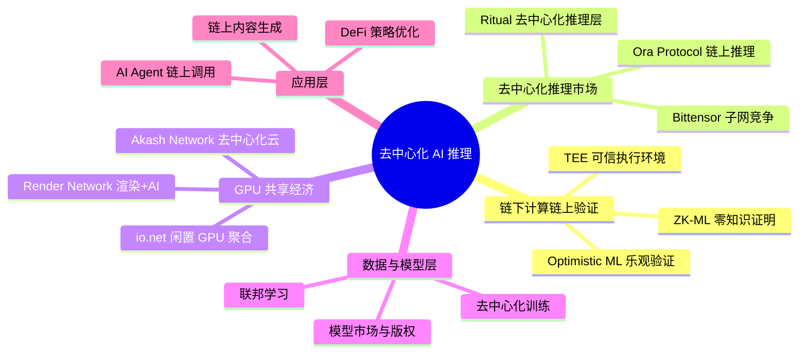
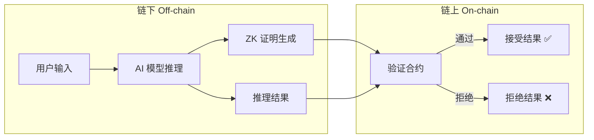
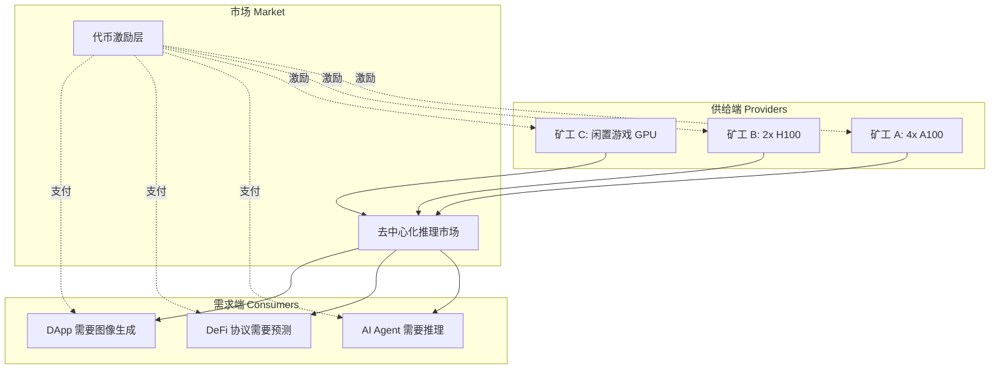
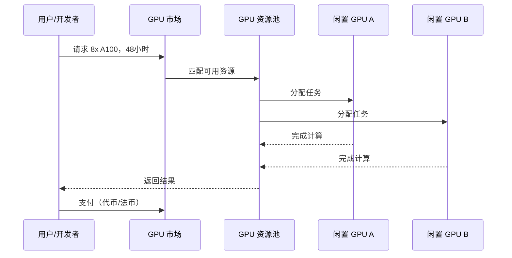
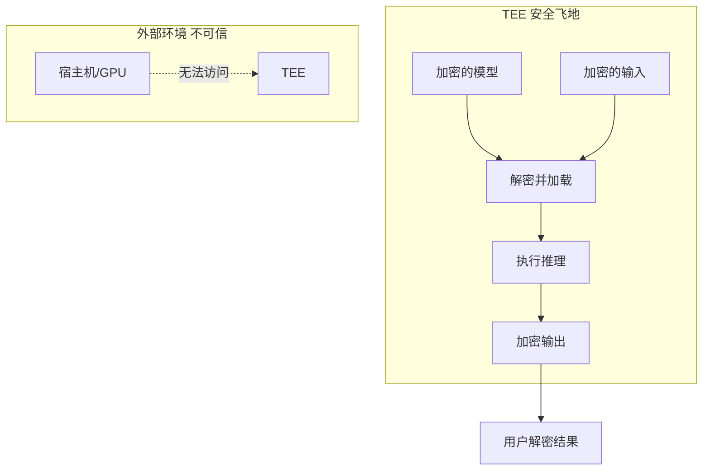
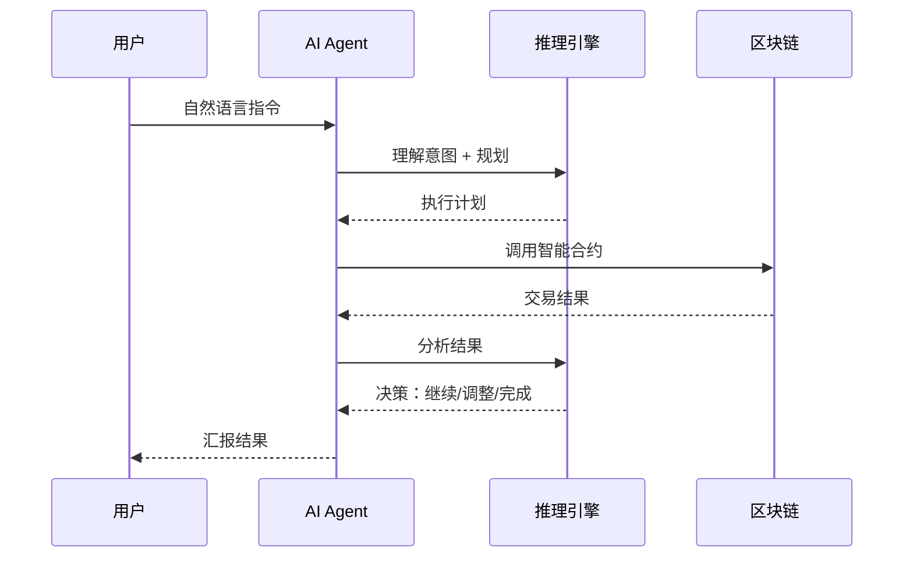
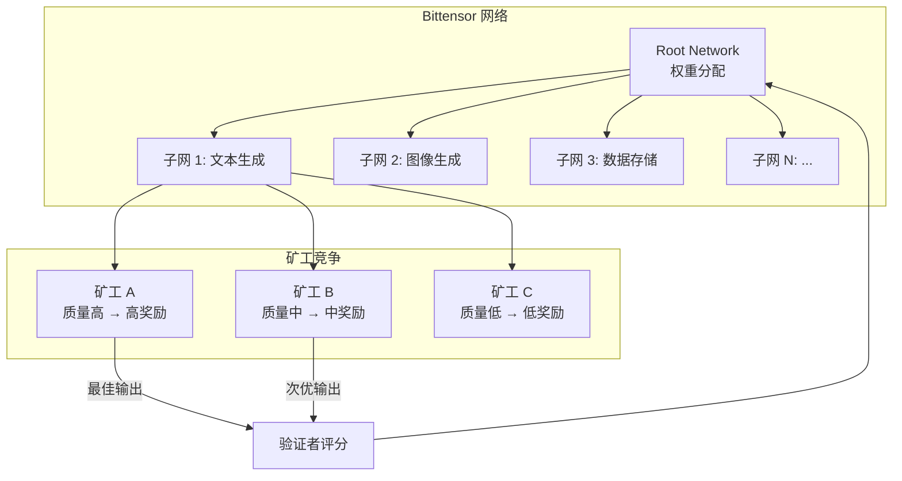
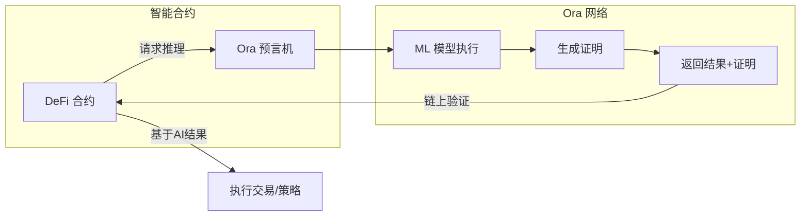
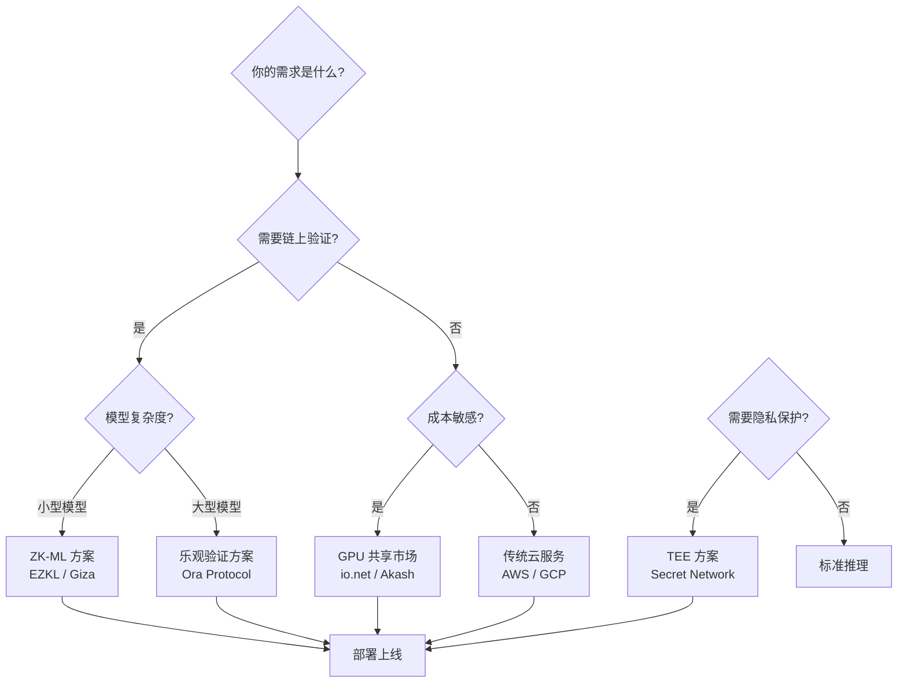

# 2026-05-25 学习日志

## 去中心化 AI 推理网络 + Hackathon 项目启动

### 学习路径：推荐路径（从理论到实践，先理解再动手）

---

## 一、去中心化 AI 推理网络 全景图

---

## 二、核心模式 / 五大要点

### 模式 1：ZK-ML（零知识机器学习）

**核心思想**：在链下运行 AI 模型推理，生成零知识证明，链上只验证证明的正确性——既保证了计算效率，又实现了可验证性。

**代表性项目**：
- **EZKL**：将 ML 模型转换为 ZK 电路，支持链上验证推理结果。已被多个 DeFi 项目集成
- **Modulus Labs**：专注于 ZK 证明的 AI 推理，目标是让链上 AI 决策可验证
- **Giza**：在 StarkNet 上实现链上 ML 推理，主打 DeFi 策略优化

**技术关键点**：
- ZK 证明生成是瓶颈——生成一个 MNIST 推理证明可能需要几分钟
- 电路大小与模型复杂度成正比，目前只适合小型模型
- 未来方向：递归证明、硬件加速（GPU/FPGA）、专用 ZK 芯片

---

### 模式 2：去中心化推理市场

**核心思想**：将 AI 推理能力商品化，任何人可以提供 GPU 算力，任何人可以购买推理服务，通过代币经济激励供需平衡。

**代表性项目**：
- **Bittensor (TAO)**：去中心化 AI 网络，通过子网竞争机制让不同 AI 服务（文本、图像、推理）相互竞争，优胜劣汰。当前市值最大的去中心化 AI 项目之一
- **Ora Protocol**：提供链上 AI 推理预言机，智能合约可以直接调用 AI 模型。创新点是将 AI 推理作为区块链原语
- **Ritual**：去中心化推理层，为 DeFi、DAO 等场景提供可验证的 AI 推理服务

**技术关键点**：
- 验证问题是核心难题——如何确保矿工返回的是真实推理结果而非随机数？
- 常见方案：多矿工冗余计算 + 挑战机制、ZK 证明、TEE 硬件证明
- 代币经济设计：质押-惩罚机制确保服务质量

---

### 模式 3：GPU 共享经济（DePIN + AI）

**核心思想**：聚合全球闲置 GPU 资源（数据中心、矿工、个人电脑），形成分布式计算网络，成本比传统云服务低 50-90%。

**代表性项目**：
- **io.net**：聚合来自数据中心、矿工、闲置设备的 GPU，构建分布式 AI 计算网络。支持 PyTorch/TensorFlow 直接部署。成本比 AWS 低 50-90%
- **Render Network (RENDER)**：最初聚焦 3D 渲染，现扩展到 AI 训练和推理。与 Apple、HBO 等有合作关系
- **Akash Network (AKT)**：去中心化云市场，支持 GPU 租赁和 AI 工作负载。采用反向拍卖定价

**技术关键点**：
- 网络延迟和带宽是实际瓶颈——分布式训练需要高速互联
- 数据隐私：敏感数据在他人 GPU 上运行，需要加密或 TEE
- 容错机制：节点随时可能离线，需要任务重分配和检查点

---

### 模式 4：TEE 可信执行环境

**核心思想**：利用硬件级安全飞地（如 Intel SGX、AMD SEV），在不可信的远程 GPU 上安全运行 AI 模型，保证数据和模型的机密性。

**代表性项目**：
- **Flashbots SUAVE**：使用 TEE 保护 MEV 策略的隐私性
- **Marlin Protocol**：TEE + 去中心化计算网络，支持机密 AI 推理
- **Secret Network**：基于 TEE 的隐私智能合约平台，可运行隐私保护的 AI 模型

**技术关键点**：
- TEE 并非万能——侧信道攻击（如 Spectre/Meltdown）仍可能泄露信息
- 性能开销：TEE 内的计算比普通环境慢 10-30%
- 硬件依赖：需要特定 CPU/GPU 支持，限制了去中心化程度

---

### 模式 5：链上 AI Agent 闭环

**核心思想**：AI Agent 不仅调用链上合约，还能自主进行推理、决策、执行的完整闭环——从"工具"进化为"自主参与者"。

**代表性项目**：
- **AI16Z / ElizaOS**：开源 AI Agent 框架，支持 Agent 自主管理加密资产、社交互动
- **Virtuals Protocol**：AI Agent 代币化平台，Agent 可以拥有自己的代币和资产
- **MyShell**：AI Agent 创建平台，支持 Agent 与区块链交互

**技术关键点**：
- Function Calling 是核心——LLM 如何准确选择和调用链上工具
- 安全性：Agent 有资金操作权限时，需要多签、限额等保护机制
- 成本控制：每次推理都有成本，需要优化调用频率和模型选择

---

## 三、重点项目深度解析

### 🔥 1. Bittensor — 去中心化 AI 竞争网络

**核心机制**：
- 每个子网专注一种 AI 服务（文本、图像、推理、搜索等）
- 矿工在子网中竞争，提供最佳 AI 输出
- 验证者评估矿工质量，分配 TAO 代币奖励
- Root Network 动态调整各子网的奖励权重

**为什么重要**：
- 这是目前最大的去中心化 AI 网络，市值一度超过 100 亿美元
- 子网机制创造了 AI 服务的自由市场
- 任何开发者都可以创建新子网，定义新的 AI 服务类型

**Hackathon 可借鉴点**：
- 可以在 Bittensor 子网上构建应用，直接调用去中心化 AI 服务
- 子网创建机制可以启发自己的项目设计

---

### 🔥 2. Ora Protocol — 链上 AI 预言机

**核心机制**：
- 将 AI 推理作为区块链原语——智能合约可以直接 `requestAIInference()`
- 使用乐观验证 + 挑战期机制降低成本
- 支持多种 ML 模型（分类、回归、NLP 等）

**为什么重要**：
- 解决了"智能合约不够智能"的问题——DeFi 协议终于可以用 AI 做决策
- 降低了 AI × Web3 的集成门槛
- 已在多个 DeFi 协议中实际应用

---

## 四、技术方案对比与选择指南

**选择建议**：
- **DeFi 策略优化** → Ora Protocol（链上推理 + 乐观验证）
- **AI Agent + 资产管理** → ElizaOS 框架 + Bittensor 推理
- **数据隐私优先** → TEE 方案（Secret Network / Marlin）
- **低成本大规模推理** → io.net / Akash（GPU 共享）

---

## 五、Hackathon 项目灵感 💡

基于今天学习的去中心化 AI 推理，以下是一些可行的 Hackathon 方向：

**方向 1：AI Agent DeFi 策略师** ⭐⭐⭐ 难度 / ⭐⭐⭐⭐ 创新性
- AI Agent 自动分析 DeFi 协议数据，生成投资策略
- 使用 Ora Protocol 做链上推理，ElizaOS 做 Agent 框架
- 技术栈：Solidity + ElizaOS + Ora SDK + React

**方向 2：去中心化 AI 模型市场** ⭐⭐⭐⭐ 难度 / ⭐⭐⭐⭐⭐ 创新性
- 模型提供者上传模型，用户付费调用
- 使用 ZK 证明验证模型质量
- 技术栈：Solidity + EZKL + IPFS + Next.js

**方向 3：链上 AI 内容审核 DAO** ⭐⭐ 难度 / ⭐⭐⭐ 创新性
- DAO 提交内容，AI Agent 自动审核并投票
- 使用 Bittensor 子网做内容分析
- 技术栈：Solidity + Bittensor SDK + Snapshot + React

**推荐入门方向**：方向 1（AI Agent DeFi 策略师）
- 难度适中，工具链成熟
- 可以先做一个 MVP：Agent 读取链上数据 → 推理 → 给出建议
- 后续可以扩展为自动执行

---

## 六、关键术语速查

- **ZK-ML**：Zero-Knowledge Machine Learning，用零知识证明验证 ML 推理结果的正确性
- **DePIN**：Decentralized Physical Infrastructure Networks，去中心化物理基础设施网络
- **TEE**：Trusted Execution Environment，可信执行环境，硬件级安全飞地
- **Optimistic ML**：乐观机器学习，默认接受结果，设有挑战期供质疑
- **子网 (Subnet)**：Bittensor 网络中专注于特定 AI 服务的独立竞争市场
- **推理 (Inference)**：使用训练好的模型对新输入进行预测/生成的过程
- **Function Calling**：LLM 根据用户意图选择并调用预定义工具/API 的能力

---

## 七、今日学习总结

### 📌 核心收获

1. **去中心化 AI 推理有三条主要技术路线**：ZK-ML（可验证但慢）、乐观验证（快但有挑战期）、TEE（安全但依赖硬件）。没有银弹，需要根据场景选择
2. **Bittensor 和 Ora 是当前最值得关注的两个项目**：前者构建了 AI 服务的自由市场，后者让智能合约真正"智能"
3. **GPU 共享经济正在改变 AI 计算的成本结构**：io.net 等项目将闲置 GPU 聚合，成本比 AWS 低 50-90%，这对 Hackathon 项目非常友好

### 🤔 思考题

- 如果你要做一个 AI Agent DeFi 项目，你会选择哪种推理验证方案？为什么？
- 去中心化推理市场如何防止矿工"作弊"（返回假结果）？
- ZK-ML 的性能瓶颈什么时候能被突破？这对 AI × Web3 意味着什么？

### 📚 进一步阅读

- [EZKL 文档](https://docs.ezkl.xyz/)：ZK-ML 的实际操作指南
- [Bittensor 子网文档](https://docs.bittensor.com/)：了解子网机制和开发
- [Ora Protocol 文档](https://docs.ora.io/)：链上 AI 推理的集成方法
- [io.net 文档](https://docs.io.net/)：GPU 共享网络的使用方式

---

## 八、下一步行动

### 今日剩余时间建议

1. ✅ 选择一个 Hackathon 方向（推荐：AI Agent DeFi 策略师）
2. ✅ 画出项目架构图（用 Mermaid）
3. ✅ 确定技术栈并搭建项目骨架
4. ✅ 提交今日学习日志到 GitHub

### 本周目标

- 完成 Hackathon 项目的最小可行原型（MVP）
- 核心功能：Agent 读取链上数据 → AI 推理 → 给出策略建议
- 技术栈确定 + 基础代码框架搭建完成

---

> 💡 *今天学的内容比较硬核，但这些是 AI × Web3 的核心基础设施。理解了这些，你就知道自己的 Hackathon 项目该站在哪个"肩膀"上了。加油！*
