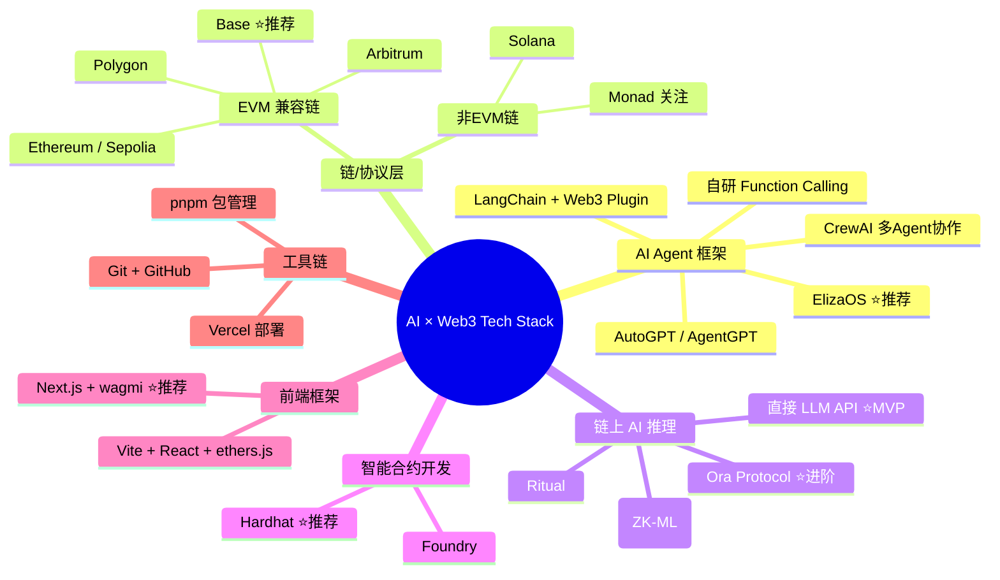
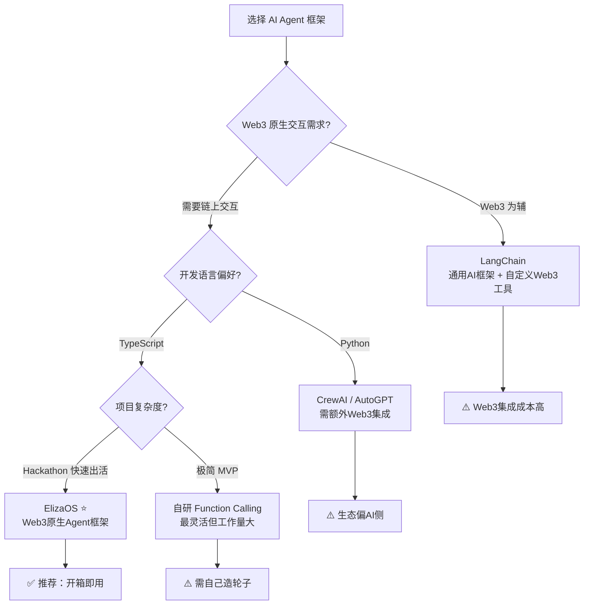
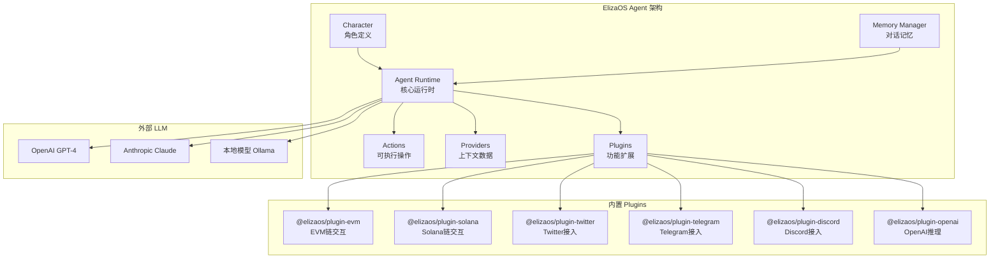
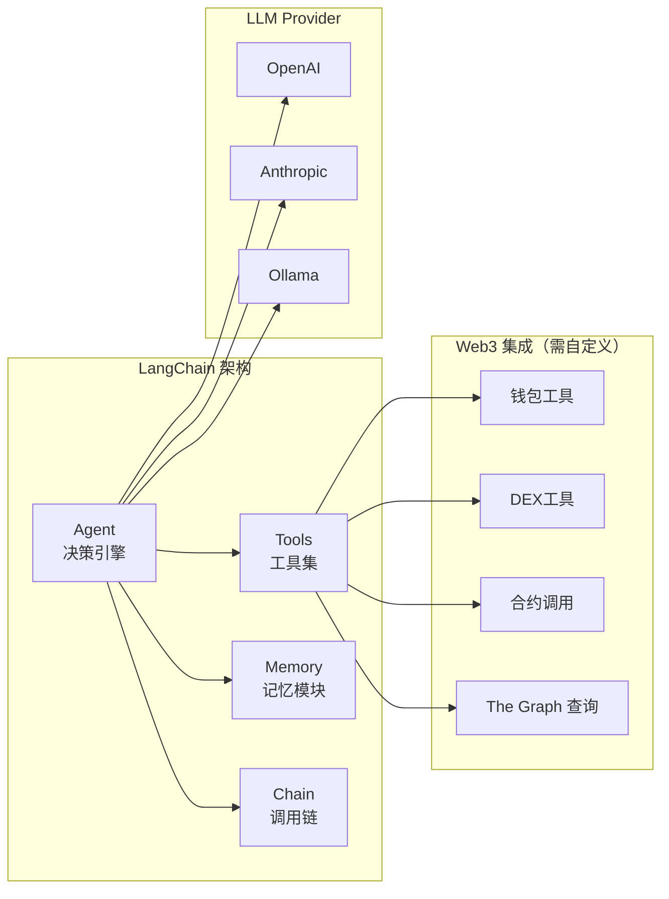
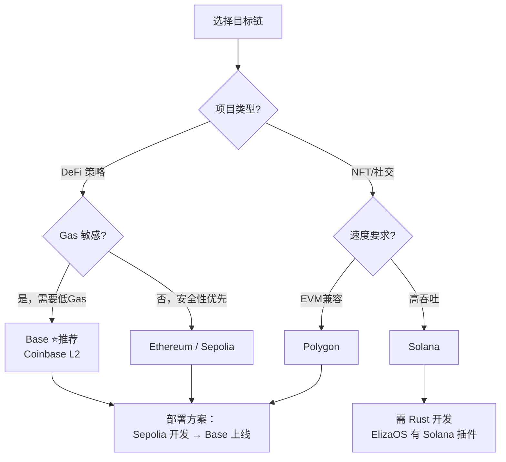
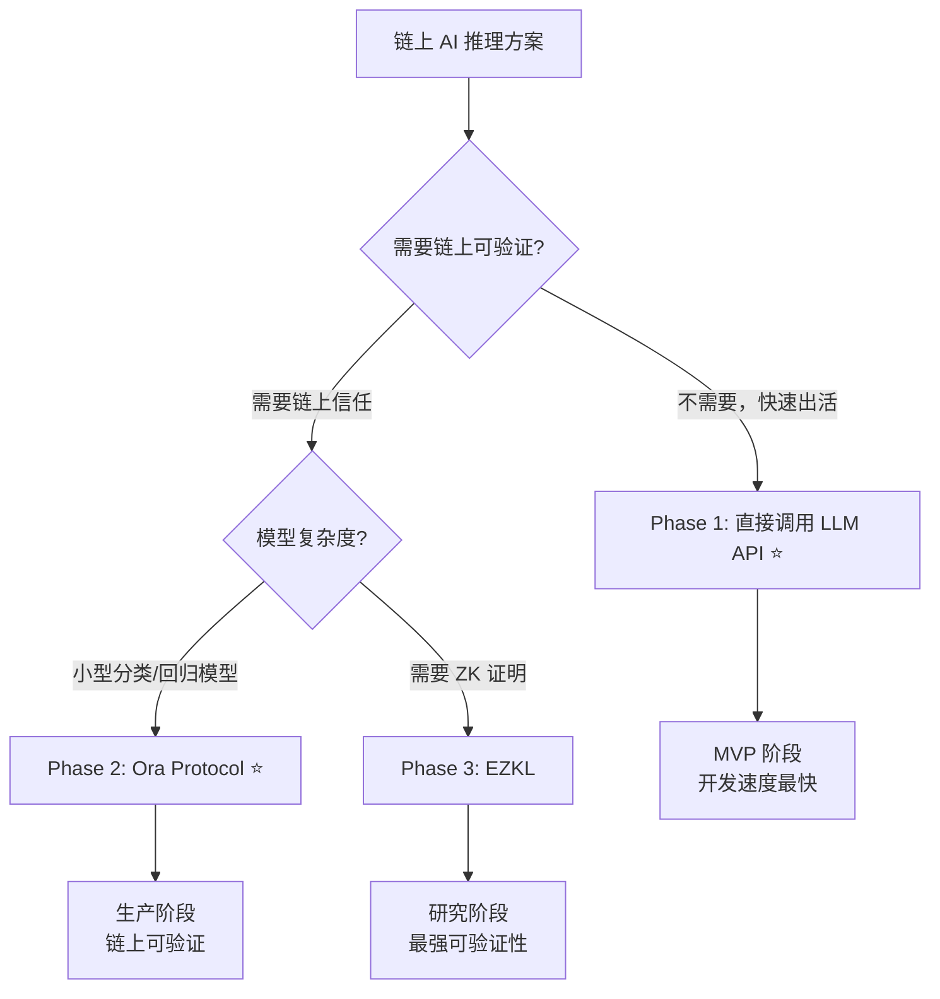
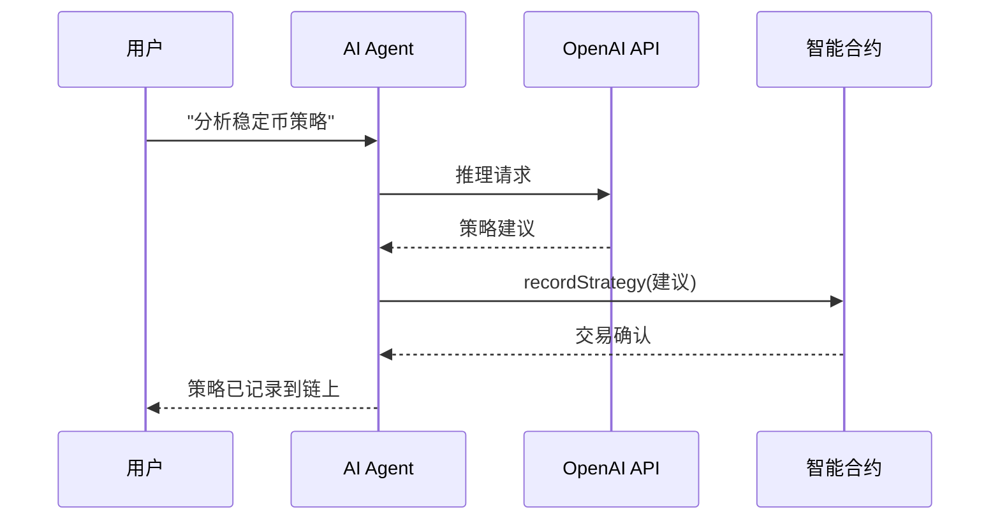
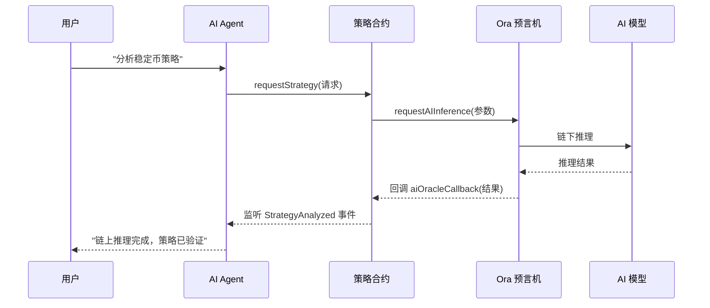

# 2026-05-31 学习日志

## 确定核心 Tech Stack：AI 框架 + 链/协议（详细参考手册）

### 学习路径：挑战路径（从全景对比到最终决策，附完整代码示例）

---

## 一、Tech Stack 决策全景图



---

## 二、AI Agent 框架深度选型

### 选型决策树



---

### 方案 A：ElizaOS（⭐ 强烈推荐）

**一句话定位**：专为 Web3 设计的开源 AI Agent 框架，前身是 ai16z/eliza，现已成为 AI × Web3 Agent 的事实标准。

**核心架构**



**技术细节**

- **语言**：TypeScript（Node.js 运行时）
- **包管理**：pnpm
- **许可证**：MIT
- **GitHub Stars**：20k+（增长极快）
- **Web3 原生支持**：✅ 原生设计
- **文档质量**：⭐⭐⭐⭐（持续更新中）
- **社区活跃度**：⭐⭐⭐⭐⭐（Discord 活跃，每日大量 PR）
- **Hackathon 友好度**：⭐⭐⭐⭐⭐

**核心代码示例 — Agent 初始化**

```typescript
// src/index.ts — ElizaOS Agent 入口
import { AgentRuntime, elizaLogger } from "@ai16z/eliza";
import { bootstrapPlugin } from "@ai16z/plugin-bootstrap";
import { evmPlugin } from "@ai16z/plugin-evm";
import { openaiPlugin } from "@ai16z/plugin-openai";
import character from "./character.json";

async function main() {
  const runtime = new AgentRuntime({
    character,                    // 角色定义
    plugins: [
      bootstrapPlugin(),         // 核心插件
      openaiPlugin(),            // LLM 推理
      evmPlugin(),               // EVM 链交互
    ],
    databaseAdapter: null,       // 可选：SQLite/PostgreSQL
    token: process.env.OPENAI_API_KEY,
  });

  await runtime.initialize();
  elizaLogger.info("Agent started successfully!");
}

main().catch(console.error);
```

**核心代码示例 — character.json**

```json
{
  "name": "DeFi Advisor",
  "modelProvider": "openai",
  "bio": "你是一个专业的 DeFi 策略顾问 AI Agent。",
  "lore": [
    "你精通各大 DeFi 协议的机制和收益策略",
    "你能分析链上数据并给出投资建议",
    "你会用通俗易懂的语言解释复杂的 DeFi 概念",
    "你在给出建议时总是先分析风险再谈收益"
  ],
  "messageExamples": [
    [
      { "user": "{{user1}}", "content": { "text": "AAVE 和 Compound 哪个借贷利率更好？" } },
      { "user": "DeFi Advisor", "content": { "text": "让我查一下当前利率数据...\n\n📊 当前对比：\n- AAVE USDC 存款：3.2% APY\n- Compound USDC 存款：2.8% APY\n\nAAVE 目前更高。需要我帮你分析具体的存入策略吗？" } }
    ]
  ],
  "topics": ["DeFi", "借贷", "流动性挖矿", "收益优化", "风险管理"],
  "style": {
    "all": ["专业但通俗", "数据驱动", "先分析后建议", "风险提示优先"]
  },
  "settings": {
    "secrets": {
      "OPENAI_API_KEY": "env:OPENAI_API_KEY"
    }
  }
}
```

**核心代码示例 — 自定义 Action（策略分析）**

```typescript
// src/actions/analyzeStrategy.ts
import {
  Action,
  IAgentRuntime,
  Memory,
  State,
  HandlerCallback,
  elizaLogger,
} from "@ai16z/eliza";

export const analyzeStrategyAction: Action = {
  name: "ANALYZE_STRATEGY",
  similes: ["分析策略", "策略建议", "投资建议", "收益分析"],
  description: "分析 DeFi 策略并给出投资建议",

  validate: async (runtime: IAgentRuntime, message: Memory) => {
    const text = message.content.text.toLowerCase();
    return (
      text.includes("策略") ||
      text.includes("投资") ||
      text.includes("收益") ||
      text.includes("建议") ||
      text.includes("挖矿") ||
      text.includes("借贷")
    );
  },

  handler: async (
    runtime: IAgentRuntime,
    message: Memory,
    state: State,
    options: any,
    callback: HandlerCallback
  ) => {
    try {
      // 1. 获取链上数据
      const chainProvider = runtime.providers.find(
        (p) => p.name === "chainDataProvider"
      );
      const chainData = chainProvider
        ? await chainProvider.get(runtime, message, state)
        : {};

      // 2. 构造推理 prompt
      const prompt = `
你是 DeFi 策略分析师。基于以下数据回答用户问题：

链上数据：${JSON.stringify(chainData)}
用户问题：${message.content.text}

请给出：
1. 数据分析（用具体数字）
2. 策略建议（最多 3 个方案）
3. 风险提示（必须包含）
4. 预期收益范围
`;

      // 3. 调用 LLM
      const result = await runtime.completion(prompt);

      // 4. 返回结果
      await callback({
        text: result,
        action: "ANALYZE_STRATEGY",
      });

      return true;
    } catch (error) {
      elizaLogger.error("Strategy analysis failed:", error);
      await callback({
        text: "抱歉，分析过程中出现了错误。请稍后重试。",
      });
      return false;
    }
  },

  examples: [
    [
      { user: "{{user1}}", content: { text: "帮我分析一下稳定币挖矿策略" } },
      { user: "DeFi Advisor", content: { text: "好的，让我分析当前的稳定币挖矿机会...", action: "ANALYZE_STRATEGY" } },
    ],
  ],
};
```

**核心代码示例 — 自定义 Provider（链上数据源）**

```typescript
// src/providers/chainDataProvider.ts
import {
  Provider,
  IAgentRuntime,
  Memory,
  State,
} from "@ai16z/eliza";
import { ethers } from "ethers";

// AAVE V3 Pool 合约 ABI（简化）
const AAVE_POOL_ABI = [
  "function getReserveData(address asset) view returns (tuple(uint256 currentLiquidityRate, uint256 currentVariableBorrowRate, uint256 currentStableBorrowRate))",
];

const AAVE_POOL_ADDRESS = "0x87870Bca3F3fD6335C3F4ce8392D69350B4fA4E2";
const USDC_ADDRESS = "0xA0b86991c6218b36c1d19D4a2e9Eb0cE3606eB48";

export const chainDataProvider: Provider = {
  name: "chainDataProvider",

  get: async (
    runtime: IAgentRuntime,
    message: Memory,
    state: State
  ) => {
    try {
      const provider = new ethers.JsonRpcProvider(
        process.env.ETHEREUM_RPC_URL || "https://eth.llamarpc.com"
      );

      // 查询 AAVE 利率
      const aavePool = new ethers.Contract(
        AAVE_POOL_ADDRESS,
        AAVE_POOL_ABI,
        provider
      );
      const reserveData = await aavePool.getReserveData(USDC_ADDRESS);
      const liquidityRate = Number(reserveData.currentLiquidityRate) / 1e25;

      return {
        aave: {
          usdc_supply_apy: `${liquidityRate.toFixed(2)}%`,
          timestamp: new Date().toISOString(),
        },
        source: "on-chain query via ethers.js",
      };
    } catch (error) {
      return {
        error: "Failed to fetch chain data",
        fallback: "Using cached data or LLM knowledge",
      };
    }
  },
};
```

**坑点与注意事项**

- ⚠️ **API 变动频繁**：ElizaOS 处于快速迭代期，import 路径和接口可能随版本变化，锁定版本号
- ⚠️ **内存占用**：Agent Runtime 默认加载所有插件，注意按需加载
- ⚠️ **LLM 调用成本**：每次对话都会调用 LLM，注意设置 token 限制
- ⚠️ **数据库可选**：开发阶段可以不用数据库，但生产环境建议用 PostgreSQL
- ✅ **调试技巧**：设置 `DEBUG=eliza:*` 环境变量可看到详细日志

---

### 方案 B：LangChain + Web3 Tools

**一句话定位**：最大的通用 AI 应用框架，生态最成熟，但 Web3 集成需要大量自定义开发。

**核心架构**



**技术细节**

- **语言**：Python（主）/ TypeScript（次）
- **GitHub Stars**：100k+（最大的 AI 框架）
- **Web3 原生支持**：❌ 需要自定义 Tool
- **文档质量**：⭐⭐⭐⭐⭐（极其完善）
- **社区活跃度**：⭐⭐⭐⭐⭐（最大的 AI 社区）
- **Hackathon 友好度**：⭐⭐⭐（Web3 项目集成成本高）

**代码示例 — 自定义 Web3 Tool**

```typescript
// TypeScript 版 LangChain + Web3 Tool
import { DynamicTool } from "@langchain/core/tools";
import { ethers } from "ethers";

const getBalanceTool = new DynamicTool({
  name: "get_wallet_balance",
  description: "查询指定钱包地址的 ETH 余额",
  func: async (address: string) => {
    const provider = new ethers.JsonRpcProvider(process.env.RPC_URL);
    const balance = await provider.getBalance(address);
    return `余额: ${ethers.formatEther(balance)} ETH`;
  },
});

const swapTool = new DynamicTool({
  name: "swap_tokens",
  description: "在 Uniswap 上交换代币。输入格式：tokenIn,tokenOut,amount",
  func: async (input: string) => {
    const [tokenIn, tokenOut, amount] = input.split(",");
    // ... 实现交换逻辑
    return `已将 ${amount} ${tokenIn} 兑换为 ${tokenOut}`;
  },
});
```

**与 ElizaOS 对比**

- **集成成本**：LangChain 需要从零构建所有 Web3 Tool，ElizaOS 开箱即用
- **灵活性**：LangChain 更灵活，适合复杂 AI 工作流
- **学习曲线**：LangChain 文档更完善，但 Web3 部分空白多
- **推荐场景**：如果你的项目以 AI 为主、Web3 为辅助功能，选 LangChain

---

### 方案 C：CrewAI（多 Agent 协作）

**一句话定位**：专注于多 Agent 协作的 Python 框架，适合需要多个 AI 角色协同工作的场景。

- **语言**：Python
- **GitHub Stars**：25k+
- **Web3 原生支持**：❌ 需自定义
- **文档质量**：⭐⭐⭐⭐
- **Hackathon 友好度**：⭐⭐⭐

**适用场景**：需要多个 Agent 协作的复杂系统（如：分析师 Agent + 交易员 Agent + 风控 Agent）

**代码示例**

```python
from crewai import Agent, Task, Crew

analyst = Agent(
    role="DeFi Analyst",
    goal="分析链上数据并找出最佳收益策略",
    backstory="你是一个资深的 DeFi 分析师",
    tools=[get_balance_tool, get_rates_tool],  # 需自定义 Web3 工具
    llm="gpt-4"
)

trader = Agent(
    role="DeFi Trader",
    goal="根据分析师的建议执行最优交易",
    backstory="你是一个经验丰富的链上交易员",
    tools=[swap_tool, deposit_tool],
    llm="gpt-4"
)

analysis_task = Task(
    description="分析当前稳定币挖矿的最佳策略",
    agent=analyst,
    expected_output="详细的策略分析报告"
)

trade_task = Task(
    description="执行分析师推荐的最优策略",
    agent=trader,
    expected_output="交易执行结果和哈希"
)

crew = Crew(agents=[analyst, trader], tasks=[analysis_task, trade_task])
result = crew.kickoff()
```

---

### 方案 D：AutoGPT / AgentGPT

**一句话定位**：自主 Agent 先驱，能自动分解任务并执行，但 Web3 支持需要大量自定义。

- **语言**：Python
- **GitHub Stars**：170k+（最知名的 Agent 项目）
- **Web3 原生支持**：❌
- **Hackathon 友好度**：⭐⭐（配置复杂）

**不推荐原因**：配置复杂、不稳定、Web3 集成成本高。Hackathon 时间宝贵，不建议花时间在环境配置上。

---

### 方案 E：自研 Function Calling

**一句话定位**：直接调用 OpenAI/Anthropic API 的 Function Calling，不依赖任何框架。

**适用场景**：极简 MVP、对框架有洁癖、或有丰富的 Agent 开发经验。

**代码示例**（基于之前 2026-05-22 学习笔记扩展）

```typescript
import OpenAI from "openai";
import { ethers } from "ethers";

const openai = new OpenAI({ apiKey: process.env.OPENAI_API_KEY });

// 定义工具
const tools = [
  {
    type: "function" as const,
    function: {
      name: "getAaveRates",
      description: "查询 AAVE 当前的存款和借款利率",
      parameters: {
        type: "object",
        properties: {
          token: { type: "string", description: "代币符号，如 USDC、ETH" },
        },
        required: ["token"],
      },
    },
  },
  {
    type: "function" as const,
    function: {
      name: "swapTokens",
      description: "在 Uniswap 上交换代币",
      parameters: {
        type: "object",
        properties: {
          fromToken: { type: "string" },
          toToken: { type: "string" },
          amount: { type: "number" },
        },
        required: ["fromToken", "toToken", "amount"],
      },
    },
  },
];

// Agent 主循环
async function agentLoop(userInput: string) {
  const messages: any[] = [
    { role: "system", content: "你是 DeFi 策略顾问。" },
    { role: "user", content: userInput },
  ];

  while (true) {
    const response = await openai.chat.completions.create({
      model: "gpt-4",
      messages,
      tools,
      tool_choice: "auto",
    });

    const choice = response.choices[0];

    if (choice.finish_reason === "tool_calls") {
      for (const call of choice.message.tool_calls!) {
        const result = await executeTool(
          call.function.name,
          JSON.parse(call.function.arguments)
        );
        messages.push(choice.message);
        messages.push({
          role: "tool",
          tool_call_id: call.id,
          content: JSON.stringify(result),
        });
      }
      continue;
    }

    return choice.message.content;
  }
}
```

**与 ElizaOS 对比**

- **自由度**：自研最高，但需要自己实现记忆、工具管理、错误处理
- **开发时间**：自研需要 2-3 天搭建基础框架，ElizaOS 几小时就能跑起来
- **维护成本**：自研所有 bug 自己修，ElizaOS 社区维护

---

### 🏆 框架选型最终决策：ElizaOS

**决策理由**：

1. **Web3 原生设计**：内置 EVM/Solana 插件、钱包管理、链上交互，无需从零构建
2. **社交平台开箱即用**：Telegram/Discord/Twitter 插件，Agent 可以直接在社交平台运营
3. **社区生态最佳**：AI × Web3 领域最活跃的开源社区，大量可参考的 Hackathon 项目
4. **TypeScript 全栈**：前后端同一语言，降低认知负担
5. **Plugin 架构清晰**：Action/Provider/Plugin 分离，易于扩展和测试

---

## 三、链/协议深度选型

### 链选型决策树



---

### 链 1：Ethereum / Sepolia（开发阶段首选）

- **简介**：最安全、流动性最大的 L1 公链，所有 EVM 工具的基准
- **TPS**：~15 TPS（L1）、Gas 费 $1-50（主网波动大）
- **Sepolia 测试网**：✅ 免费、与主网行为一致
- **EVM 兼容**：✅ 完全原生 EVM
- **ElizaOS 支持**：✅ @elizaos/plugin-evm 原生支持
- **DeFi 生态**：AAVE、Uniswap、Compound、MakerDAO、Curve、Lido
- **开发者工具**：Hardhat、Foundry、Remix、Etherscan
- **Faucet**：https://sepoliafaucet.com / Alchemy Faucet / Infura Faucet
- **RPC 节点**：Alchemy、Infura、QuickNode（免费 tier 足够开发）
- **区块浏览器**：https://sepolia.etherscan.io

---

### 链 2：Base（⭐ 部署首选）

- **简介**：Coinbase 推出的 L2，基于 OP Stack，2024-2025 年增长最快的链
- **TPS**：~2000 TPS（理论值）
- **Gas 费**：$0.01-0.10（极低）
- **EVM 兼容**：✅ 完全兼容，Solidity 代码零修改迁移
- **ElizaOS 支持**：✅ 通过 @elizaos/plugin-evm，切换 RPC 即可
- **DeFi 生态**：Aerodrome（原生 DEX）、Uniswap V3、AAVE V3、Compound V3
- **开发者工具**：与 Ethereum 完全相同
- **Faucet**：https://www.alchemy.com/base-faucet / Coinbase Wallet 内置
- **RPC**：https://mainnet.base.org（免费公共 RPC）
- **区块浏览器**：https://basescan.org

**为什么推荐 Base**：
- Coinbase 背书，用户增长快，TVL 已超过 50 亿美元
- Gas 极低，对 DeFi 小额操作友好
- 与 Ethereum 完全兼容，一套代码两网通用
- Coinbase Wallet 原生集成，用户获取成本低

---

### 链 3：Arbitrum

- **简介**：最成熟的 Optimistic L2，DeFi 生态最丰富
- **TPS**：~4000 TPS
- **Gas 费**：$0.01-0.05
- **EVM 兼容**：✅ 完全兼容
- **DeFi 生态**：GMX、Camelot、Radiant、Uniswap V3
- **特点**：DeFi 协议最多、TVL 最高的 L2
- **适用**：如果项目需要深度 DeFi 集成，Arbitrum 是好选择

---

### 链 4：Polygon

- **简介**：老牌 L2/侧链，企业合作多（星巴克、Reddit）
- **TPS**：~7000 TPS
- **Gas 费**：$0.001-0.01（极低）
- **EVM 兼容**：✅ 完全兼容
- **特点**：企业级采用多，但叙事热度下降
- **适用**：需要极低成本的企业级应用

---

### 链 5：Solana

- **简介**：高性能 L1，非 EVM，NFT 和社交生态强
- **TPS**：~65,000 TPS（理论值）
- **Gas 费**：$0.00025（极低）
- **EVM 兼容**：❌ 需要 Rust/Solana 开发
- **ElizaOS 支持**：✅ @elizaos/plugin-solana 原生支持
- **DeFi 生态**：Jupiter、Raydium、Marinade、Orca
- **特点**：速度快、成本低，但开发语言不同，学习曲线陡

---

### 链 6：Monad（关注备选）

- **简介**：新一代高性能 EVM 兼容 L1，2025 年主网上线
- **TPS**：10,000+ TPS
- **EVM 兼容**：✅ 完全兼容
- **特点**：并行执行 EVM，性能大幅提升
- **适用**：关注中，适合提前布局

---

### 🏆 链选型最终决策：Sepolia 开发 + Base 部署

**切换方法**（只需改配置）：

```typescript
// src/config/chains.ts
export const CHAIN_CONFIG = {
  // 开发阶段
  development: {
    chainId: 11155111,
    name: "Sepolia",
    rpcUrl: process.env.SEPOLIA_RPC_URL || "https://rpc.sepolia.org",
    explorerUrl: "https://sepolia.etherscan.io",
    contracts: {
      strategyAdvisor: "0x...",  // Sepolia 合约地址
    },
  },
  // 生产部署
  production: {
    chainId: 8453,
    name: "Base",
    rpcUrl: process.env.BASE_RPC_URL || "https://mainnet.base.org",
    explorerUrl: "https://basescan.org",
    contracts: {
      strategyAdvisor: "0x...",  // Base 合约地址
    },
  },
};

// 环境切换
const env = process.env.NODE_ENV || "development";
export const currentChain = CHAIN_CONFIG[env];
```

---

## 四、链上 AI 推理方案深度对比

### 决策流程



---

### 方案 1：直接调用 LLM API（⭐ MVP 首选）

**原理**：Agent 在链下直接调用 OpenAI/Claude API，推理结果通过 Agent 传递给智能合约。



**优势**：最简单、延迟低（<3s）、成本低（$0.01-0.1/次）、开发最快
**劣势**：推理过程不透明，用户必须信任 Agent
**成本估算**：GPT-4 ~$0.03/1K tokens，一次策略分析约 500 tokens ≈ $0.015

---

### 方案 2：Ora Protocol（⭐ 进阶首选）

**原理**：智能合约直接调用 Ora 预言机发起 AI 推理请求，结果返回链上，可被验证。



**核心合约代码**：

```solidity
// SPDX-License-Identifier: MIT
pragma solidity ^0.8.19;

import "@ora-io/contracts/src/AIOracle.sol";

contract DeFiStrategyAdvisor is AIOracle {

    struct Strategy {
        address user;
        string request;
        string aiResult;
        uint256 confidence;
        uint256 timestamp;
        bool executed;
    }

    mapping(uint256 => Strategy) public strategies;
    uint256 public strategyCount;

    event StrategyRequested(uint256 indexed id, address user, string request);
    event StrategyAnalyzed(uint256 indexed id, string result, uint256 confidence);

    function requestStrategy(string memory request) external returns (uint256) {
        uint256 id = strategyCount++;
        strategies[id] = Strategy({
            user: msg.sender,
            request: request,
            aiResult: "",
            confidence: 0,
            timestamp: block.timestamp,
            executed: false
        });

        // 构造推理 prompt
        string[] memory prompts = new string[](1);
        prompts[0] = string(abi.encodePacked(
            "Analyze this DeFi strategy request: ", request
        ));

        // 向 Ora 请求 AI 推理
        requestAIOracle(id, prompts);

        emit StrategyRequested(id, msg.sender, request);
        return id;
    }

    // Ora 回调
    function aiOracleCallback(
        uint256 requestId,
        string memory result,
        bytes memory proof
    ) internal override {
        strategies[requestId].aiResult = result;
        strategies[requestId].confidence = 85;
        emit StrategyAnalyzed(requestId, result, 85);
    }

    function getStrategy(uint256 id) external view returns (
        string memory request,
        string memory result,
        uint256 confidence,
        uint256 timestamp
    ) {
        Strategy storage s = strategies[id];
        return (s.request, s.aiResult, s.confidence, s.timestamp);
    }
}
```

**优势**：推理结果上链、可验证、支持乐观验证（挑战期）
**劣势**：增加复杂度、需要学习 Ora SDK、有额外 gas 成本
**适用场景**：DeFi 策略执行、DAO 投票决策等需要链上信任的场景

---

### 方案 3：EZKL（ZK-ML）

**原理**：将 ML 模型转换为 ZK 电路，生成零知识证明，链上验证推理结果的正确性。

- **优势**：最强的可验证性（数学证明级别）
- **劣势**：目前只支持小型模型、证明生成慢（分钟级）、集成复杂
- **适用**：研究型项目或对验证有极致要求

---

### 方案 4：Ritual

**简介**：去中心化推理层，为 DeFi/DAO 提供可验证的 AI 推理服务。
- **状态**：早期阶段，文档较少
- **适用**：关注中，暂不推荐 Hackathon 使用

---

### 🏆 推理方案最终决策：分三阶段

- **Phase 1（MVP）**：直接调用 OpenAI API → 2 小时跑通 Agent 循环
- **Phase 2（进阶）**：集成 Ora Protocol → 链上可验证推理，增加项目深度
- **Phase 3（加分项）**：探索 ZK-ML → 展示技术前瞻性

---

## 五、智能合约开发框架对比

### Hardhat vs Foundry

- **Hardhat**
  - **语言**：JavaScript/TypeScript（测试和脚本）
  - **优势**：生态最成熟、插件最多、教程最丰富、调试体验好（stack traces）
  - **劣势**：JS 测试不如 Solidity 原生测试快
  - **命令**：`npx hardhat compile` / `npx hardhat test` / `npx hardhat run scripts/deploy.js`
  - **适合**：初学者、Hackathon、需要丰富插件的项目

- **Foundry**
  - **语言**：Solidity 原生测试 + Rust 工具链
  - **优势**：编译和测试极快、Solidity 原生测试更直观、模糊测试强大
  - **劣势**：学习曲线较陡、插件生态不如 Hardhat
  - **命令**：`forge build` / `forge test` / `forge script`
  - **适合**：有经验的 Solidity 开发者、对性能有要求的项目

### 🏆 推荐：Hardhat

理由：Hackathon 时间有限，Hardhat 教程多、插件丰富、调试友好，遇到问题容易找到解决方案。

### Hardhat 项目完整示例

**初始化**

```bash
mkdir defi-advisor-contracts && cd defi-advisor-contracts
npx hardhat init
# 选择 "Create a JavaScript project"
pnpm add -D @nomicfoundation/hardhat-toolbox
pnpm add -D @openzeppelin/contracts
```

**项目结构**

```
defi-advisor-contracts/
├── contracts/
│   └── DeFiStrategyAdvisor.sol
├── scripts/
│   └── deploy.js
├── test/
│   └── DeFiStrategyAdvisor.test.js
├── hardhat.config.js
└── package.json
```

**hardhat.config.js**

```javascript
require("@nomicfoundation/hardhat-toolbox");

module.exports = {
  solidity: "0.8.19",
  networks: {
    sepolia: {
      url: process.env.SEPOLIA_RPC_URL || "",
      accounts: process.env.PRIVATE_KEY ? [process.env.PRIVATE_KEY] : [],
    },
    base: {
      url: process.env.BASE_RPC_URL || "https://mainnet.base.org",
      accounts: process.env.PRIVATE_KEY ? [process.env.PRIVATE_KEY] : [],
    },
  },
  etherscan: {
    apiKey: {
      sepolia: process.env.ETHERSCAN_API_KEY || "",
      base: process.env.BASESCAN_API_KEY || "",
    },
  },
};
```

**测试代码**

```javascript
// test/DeFiStrategyAdvisor.test.js
const { expect } = require("chai");
const { ethers } = require("hardhat");

describe("DeFiStrategyAdvisor", function () {
  let advisor;

  beforeEach(async function () {
    const Advisor = await ethers.getContractFactory("DeFiStrategyAdvisor");
    advisor = await Advisor.deploy();
    await advisor.waitForDeployment();
  });

  it("应该能请求策略分析", async function () {
    const tx = await advisor.requestStrategy("分析稳定币挖矿策略");
    const receipt = await tx.wait();
    expect(receipt.status).to.equal(1);
  });

  it("应该能获取策略详情", async function () {
    await advisor.requestStrategy("测试策略");
    const strategy = await advisor.getStrategy(0);
    expect(strategy.request).to.equal("测试策略");
    expect(strategy.timestamp).to.be.gt(0);
  });
});
```

**部署脚本**

```javascript
// scripts/deploy.js
const hre = require("hardhat");

async function main() {
  console.log("Deploying DeFiStrategyAdvisor...");

  const Advisor = await hre.ethers.getContractFactory("DeFiStrategyAdvisor");
  const advisor = await Advisor.deploy();
  await advisor.waitForDeployment();

  const address = await advisor.getAddress();
  console.log(`DeFiStrategyAdvisor deployed to: ${address}`);

  // 等待区块确认后验证
  if (hre.network.name === "sepolia" || hre.network.name === "base") {
    console.log("Waiting for block confirmations...");
    await advisor.deploymentTransaction().wait(5);

    try {
      await hre.run("verify:verify", {
        address: address,
        constructorArguments: [],
      });
      console.log("Contract verified!");
    } catch (e) {
      console.log("Verification failed:", e.message);
    }
  }
}

main().catch((error) => {
  console.error(error);
  process.exitCode = 1;
});
```

**部署命令**

```bash
# 部署到 Sepolia
npx hardhat run scripts/deploy.js --network sepolia

# 部署到 Base
npx hardhat run scripts/deploy.js --network base

# 验证合约
npx hardhat verify --network sepolia <CONTRACT_ADDRESS>
```

**坑点**

- ⚠️ **PRIVATE_KEY 安全**：永远不要把私钥写死在代码中，用 .env 文件 + .gitignore
- ⠠**Gas 估算**：测试网 Gas 有时不稳定，手动设置 gasLimit
- ⚠️ **合约验证**：如果用了 Ora 的合约，验证时需要指定正确的编译器版本和优化设置

---

## 六、前端框架对比

### Next.js vs Vite + React

- **Next.js 14**
  - **SSR/SSG**：✅ 原生支持，SEO 友好
  - **路由**：App Router（文件系统路由）
  - **Web3 集成**：wagmi + Next.js 有官方模板
  - **部署**：Vercel 一键部署
  - **劣势**：SSR 与 Web3 的 hydration 问题需处理

- **Vite + React**
  - **SSR/SSG**：❌ 纯客户端
  - **路由**：需手动配置 React Router
  - **Web3 集成**：更简单，无 hydration 问题
  - **部署**：Netlify / Vercel / GitHub Pages
  - **劣势**：无 SSR，SEO 不友好

### 🏆 推荐：Next.js 14

理由：App Router 路由方便、Vercel 部署简单、wagmi 有官方 Next.js 模板。

### Next.js + wagmi 项目初始化

```bash
npx create-next-app@latest defi-advisor-frontend --typescript --tailwind --app
cd defi-advisor-frontend
pnpm add wagmi viem @tanstack/react-query
pnpm add @rainbow-me/rainbowkit  # 钱包连接 UI
pnpm add recharts                 # 图表
```

**wagmi 配置**

```typescript
// lib/wagmi.ts
import { http, createConfig } from "wagmi";
import { mainnet, sepolia, base } from "wagmi/chains";
import { injected, metaMask } from "wagmi/connectors";

export const config = createConfig({
  chains: [sepolia, base, mainnet],
  connectors: [injected(), metaMask()],
  transports: {
    [sepolia.id]: http(process.env.NEXT_PUBLIC_SEPOLIA_RPC),
    [base.id]: http("https://mainnet.base.org"),
    [mainnet.id]: http(),
  },
});
```

**钱包连接组件**

```tsx
// components/WalletConnect.tsx
"use client";
import { useAccount, useConnect, useDisconnect } from "wagmi";

export function WalletConnect() {
  const { address, isConnected } = useAccount();
  const { connect, connectors } = useConnect();
  const { disconnect } = useDisconnect();

  if (isConnected) {
    return (
      <div className="flex items-center gap-2">
        <span className="text-sm text-gray-500">
          {address?.slice(0, 6)}...{address?.slice(-4)}
        </span>
        <button onClick={() => disconnect()} className="btn-secondary">
          断开
        </button>
      </div>
    );
  }

  return (
    <div className="flex gap-2">
      {connectors.map((connector) => (
        <button
          key={connector.uid}
          onClick={() => connect({ connector })}
          className="btn-primary"
        >
          连接 {connector.name}
        </button>
      ))}
    </div>
  );
}
```

**Agent 对话组件**

```tsx
// components/StrategyChat.tsx
"use client";
import { useState } from "react";
import { useAccount, useWriteContract } from "wagmi";

interface Message {
  role: "user" | "agent" | "system";
  content: string;
}

export function StrategyChat() {
  const [input, setInput] = useState("");
  const [messages, setMessages] = useState<Message[]>([]);
  const [loading, setLoading] = useState(false);
  const { address } = useAccount();

  const handleSend = async () => {
    if (!input.trim() || loading) return;

    setMessages((prev) => [...prev, { role: "user", content: input }]);
    setLoading(true);

    try {
      const res = await fetch("/api/agent/chat", {
        method: "POST",
        headers: { "Content-Type": "application/json" },
        body: JSON.stringify({ message: input, user: address }),
      });
      const data = await res.json();

      setMessages((prev) => [
        ...prev,
        { role: "agent", content: data.reply },
      ]);

      if (data.strategyId !== undefined) {
        setMessages((prev) => [
          ...prev,
          { role: "system", content: `策略已记录到链上，ID: ${data.strategyId}` },
        ]);
      }
    } catch (error) {
      setMessages((prev) => [
        ...prev,
        { role: "system", content: "请求失败，请重试" },
      ]);
    }

    setInput("");
    setLoading(false);
  };

  return (
    <div className="flex flex-col h-[600px] border rounded-lg">
      <div className="flex-1 overflow-y-auto p-4 space-y-4">
        {messages.map((msg, i) => (
          <div key={i} className={`flex ${msg.role === "user" ? "justify-end" : "justify-start"}`}>
            <div className={`max-w-[70%] p-3 rounded-lg ${
              msg.role === "user" ? "bg-blue-500 text-white" : "bg-gray-100"
            }`}>
              {msg.content}
            </div>
          </div>
        ))}
        {loading && <div className="text-gray-400">思考中...</div>}
      </div>
      <div className="border-t p-4 flex gap-2">
        <input
          value={input}
          onChange={(e) => setInput(e.target.value)}
          onKeyDown={(e) => e.key === "Enter" && handleSend()}
          placeholder="询问 DeFi 策略..."
          className="flex-1 border rounded-lg px-4 py-2"
          disabled={loading}
        />
        <button onClick={handleSend} className="btn-primary" disabled={loading}>
          发送
        </button>
      </div>
    </div>
  );
}
```

**API 路由（连接 Agent）**

```typescript
// app/api/agent/chat/route.ts
import { NextRequest, NextResponse } from "next/server";

export async function POST(req: NextRequest) {
  const { message, user } = await req.json();

  // 调用 ElizaOS Agent API
  const agentUrl = process.env.AGENT_API_URL || "http://localhost:3000";

  const response = await fetch(`${agentUrl}/api/chat`, {
    method: "POST",
    headers: { "Content-Type": "application/json" },
    body: JSON.stringify({
      message,
      userId: user,
      roomId: `defi-advisor-${user}`,
    }),
  });

  const data = await response.json();

  return NextResponse.json({
    reply: data.text || data.reply || "No response",
    strategyId: data.strategyId,
  });
}
```

---

## 七、最终 Tech Stack 汇总

### 完整技术栈清单

**AI Agent 层**
- **框架**：ElizaOS @ai16z/eliza
- **语言**：TypeScript 5.x
- **LLM**：OpenAI GPT-4（通过 @elizaos/plugin-openai）
- **记忆**：ElizaOS 内置 Memory Manager
- **安装**：`npx elizaos init defi-advisor-agent`

**链/协议层**
- **开发链**：Sepolia 测试网（chainId: 11155111）
- **部署链**：Base 主网（chainId: 8453）
- **标准**：EVM / Solidity ^0.8.19
- **AI 预言机**：Ora Protocol（Phase 2）

**智能合约层**
- **框架**：Hardhat 2.x
- **语言**：Solidity 0.8.19
- **交互库**：ethers.js v6（ElizaOS 内置）
- **OpenZeppelin**：安全合约库
- **安装**：`npx hardhat init`

**前端层**
- **框架**：Next.js 14（App Router）
- **样式**：Tailwind CSS 3.x + shadcn/ui
- **Web3**：wagmi 2.x + viem 2.x
- **钱包**：RainbowKit（可选）
- **图表**：Recharts
- **状态**：@tanstack/react-query
- **安装**：`npx create-next-app@latest`

**开发工具**
- **包管理**：pnpm 9.x
- **版本控制**：Git + GitHub
- **测试**：Hardhat Test + Vitest
- **部署**：Vercel（前端）+ Hardhat（合约）
- **环境变量**：dotenv

### 项目目录结构

```
defi-advisor/
├── agent/                          # ElizaOS Agent
│   ├── src/
│   │   ├── actions/
│   │   │   └── analyzeStrategy.ts
│   │   ├── providers/
│   │   │   └── chainDataProvider.ts
│   │   └── index.ts
│   ├── character.json
│   ├── package.json
│   └── .env
│
├── contracts/                      # Hardhat 智能合约
│   ├── contracts/
│   │   └── DeFiStrategyAdvisor.sol
│   ├── scripts/
│   │   └── deploy.js
│   ├── test/
│   │   └── DeFiStrategyAdvisor.test.js
│   ├── hardhat.config.js
│   └── package.json
│
├── frontend/                       # Next.js 前端
│   ├── app/
│   │   ├── api/
│   │   │   └── agent/chat/route.ts
│   │   ├── layout.tsx
│   │   └── page.tsx
│   ├── components/
│   │   ├── StrategyChat.tsx
│   │   └── WalletConnect.tsx
│   ├── lib/
│   │   └── wagmi.ts
│   ├── tailwind.config.ts
│   └── package.json
│
├── .env.example                    # 环境变量模板
├── README.md
└── pnpm-workspace.yaml            # monorepo 配置（可选）
```

---

## 八、安全设计要点

### Agent 私钥管理

```typescript
// ❌ 错误：私钥硬编码
const wallet = new ethers.Wallet("0xabc123...");

// ✅ 正确：环境变量
const wallet = new ethers.Wallet(process.env.AGENT_PRIVATE_KEY!);

// ✅ 更好：专用 Agent 钱包（只有少量资金）
// 永远不要用主钱包作为 Agent 钱包
```

### 交易限额机制

```typescript
const MAX_SINGLE_TX = ethers.parseEther("0.1");  // 单笔最大 0.1 ETH
const MAX_DAILY_TX = ethers.parseEther("1.0");    // 每日最大 1 ETH

async function validateTransaction(amount: bigint): Promise<boolean> {
  if (amount > MAX_SINGLE_TX) {
    throw new Error(`单笔交易超出限额: ${ethers.formatEther(amount)} ETH`);
  }
  const dailyUsed = await getDailyUsage();
  if (dailyUsed + amount > MAX_DAILY_TX) {
    throw new Error(`每日交易限额已用尽`);
  }
  return true;
}
```

### 用户确认流程

- 所有涉及资金的操作，必须在前端显示确认对话框
- Agent 只提供建议，执行需要用户明确点击"确认"
- 高风险操作（大额交易、新合约交互）需要二次确认

---

## 九、完整 5 天行动计划

### Day 1：环境准备 + Agent 搭建

- [ ] Node.js 18+ 安装
- [ ] pnpm 安装：`npm install -g pnpm`
- [ ] ElizaOS 初始化：`npx elizaos init defi-advisor-agent`
- [ ] 定义 character.json（DeFi 策略顾问）
- [ ] 编写第一个 Action：analyzeStrategy
- [ ] 获取 OpenAI API Key
- [ ] 测试 Agent 对话 ✅

### Day 2：智能合约开发

- [ ] Hardhat 项目初始化
- [ ] 编写 DeFiStrategyAdvisor 合约
- [ ] 本地测试通过：`npx hardhat test`
- [ ] 获取 Sepolia 测试 ETH
- [ ] 部署到 Sepolia：`npx hardhat run scripts/deploy.js --network sepolia`
- [ ] 验证合约：`npx hardhat verify --network sepolia <地址>` ✅

### Day 3：前端开发

- [ ] Next.js 项目初始化
- [ ] 安装 wagmi + viem + rainbowkit
- [ ] 搭建页面结构（首页 + 对话界面）
- [ ] 实现钱包连接组件
- [ ] 实现 Agent 对话组件
- [ ] API 路由对接 Agent ✅

### Day 4：联调 + Ora 集成

- [ ] Agent ↔ 合约联调
- [ ] 前端 ↔ Agent 联调
- [ ] 端到端流程跑通
- [ ] （进阶）集成 Ora Protocol
- [ ] 修复 bug ✅

### Day 5：Demo + 提交

- [ ] 准备 Demo 脚本
- [ ] 录制演示视频
- [ ] 撰写 README
- [ ] 代码整理和清理
- [ ] 提交项目 ✅

---

## 十、关键术语速查

- **Agent Runtime**：ElizaOS 的核心运行时，管理 Agent 的生命周期
- **Action**：Agent 可执行的操作（如分析策略、查询余额）
- **Provider**：为 Agent 提供上下文数据的模块（如链上数据、价格数据）
- **Plugin**：ElizaOS 的功能扩展包（如 EVM 插件、Twitter 插件）
- **Character**：Agent 的人格定义文件（角色、技能、风格）
- **Function Calling**：LLM 根据用户意图选择并调用预定义工具的能力
- **MVP**：Minimum Viable Product，最小可行产品
- **TVL**：Total Value Locked，锁仓总量
- **APY**：Annual Percentage Yield，年化收益率
- **Gas**：区块链交易手续费
- **L2**：Layer 2，以太坊二层扩容方案
- **EVM**：Ethereum Virtual Machine，以太坊虚拟机
- **ABI**：Application Binary Interface，合约的接口定义
- **Oracle**：预言机，将链下数据带到链上
- **ZK-ML**：Zero-Knowledge Machine Learning，零知识机器学习
- **DePIN**：Decentralized Physical Infrastructure Networks
- **TEE**：Trusted Execution Environment，可信执行环境
- **RPC**：Remote Procedure Call，远程过程调用（连接区块链节点）
- **Faucet**：测试网水龙头，免费获取测试代币
- **Slippage**：滑点，交易执行价格与预期价格的差异

---

## 十一、进一步阅读

**AI Agent 框架**
- [ElizaOS 文档](https://ai16z.github.io/eliza/)：官方完整指南
- [ElizaOS GitHub](https://github.com/ai16z/eliza)：源码 + 示例
- [LangChain 文档](https://js.langchain.com/)：通用 AI 框架

**智能合约开发**
- [Hardhat 文档](https://hardhat.org/docs)：合约开发完整教程
- [OpenZeppelin](https://docs.openzeppelin.com/)：安全合约库
- [Solidity by Example](https://solidity-by-example.org/)：Solidity 示例

**前端 Web3**
- [wagmi 文档](https://wagmi.sh/)：React Hooks for Ethereum
- [viem 文档](https://viem.sh/)：TypeScript 以太坊接口
- [RainbowKit](https://rainbowkit.com/)：钱包连接 UI

**链上 AI**
- [Ora Protocol SDK](https://docs.ora.io/)：链上 AI 推理
- [EZKL 文档](https://docs.ezkl.xyz/)：ZK-ML 框架

**链/网络**
- [Base 文档](https://docs.base.org/)：Base L2 开发指南
- [Sepolia Faucet](https://sepoliafaucet.com/)：测试网 ETH
- [Etherscan](https://etherscan.io/)：区块浏览器

---

## 十二、今日学习总结

### 📌 核心收获

1. **ElizaOS 是 AI × Web3 Hackathon 的最佳起点**：原生支持链上交互、社交接入、Agent 循环，节省 60%+ 集成开发时间。相比 LangChain/CrewAI，Web3 集成零成本
2. **Sepolia + Base 是最优链组合**：开发免费（Sepolia）、部署低成本（Base）、完全 EVM 兼容、一套代码两网通用，只需改 RPC URL
3. **分三阶段实施推理方案**：先用直接 API 调用跑通 MVP（最快），再集成 Ora Protocol 获得链上可验证性（加分），最后探索 ZK-ML 展示技术深度（锦上添花）
4. **Hardhat + Next.js 是前端合约最佳拍档**：Hardhat 生态成熟适合快速开发，Next.js + wagmi 有官方模板可一键启动

### 🤔 思考题

- ElizaOS 的 Plugin 系统如何设计才能让 Agent 安全地执行链上交易？
- 如果 Hackathon 只有 24 小时，你会砍掉哪些功能？保留哪些？
- AI Agent 的"幻觉"问题在 DeFi 场景中如何被控制？
- Ora Protocol 的乐观验证机制和 ZK-ML 各自的适用场景是什么？

### 💡 下一步行动

1. 安装 ElizaOS 并初始化 Agent 项目
2. 定义 character.json 并编写第一个 Action
3. 初始化 Hardhat 项目并编写第一个合约
4. 跑通 Agent ↔ 合约的最小闭环

---

> 💡 *Tech Stack 一旦确定就不要轻易更换。接下来的重点是：动手写代码，让东西跑起来。架构可以在 MVP 跑通后再优化。*
