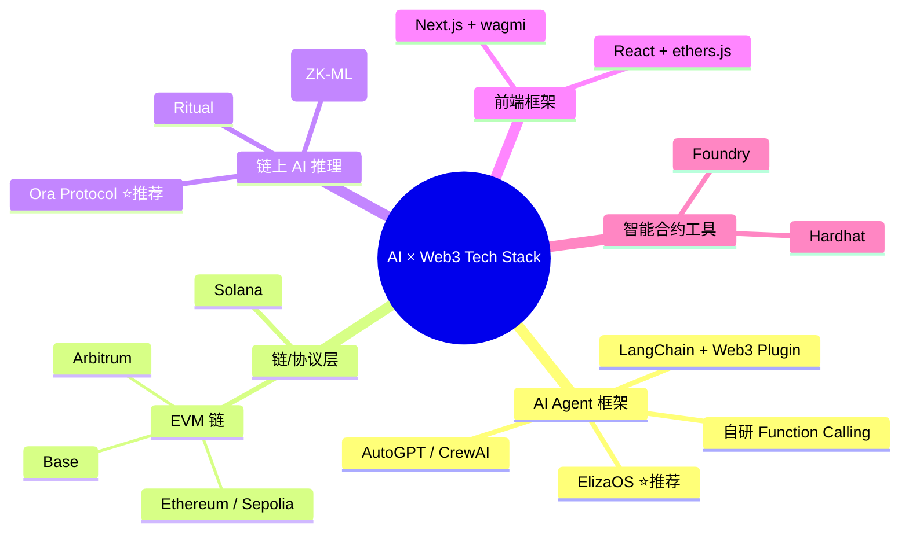
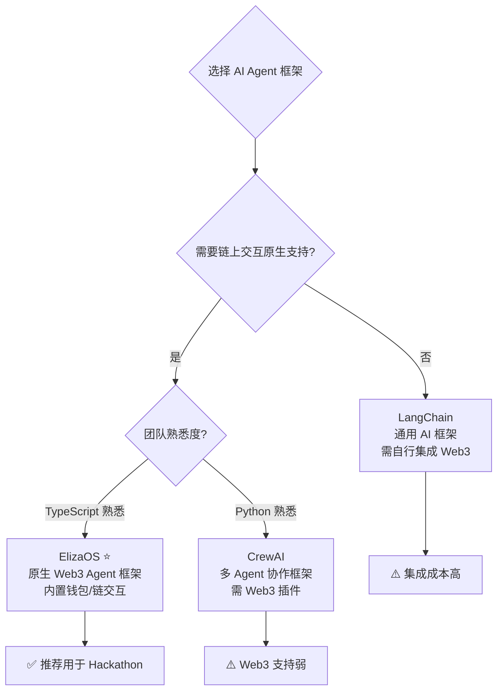
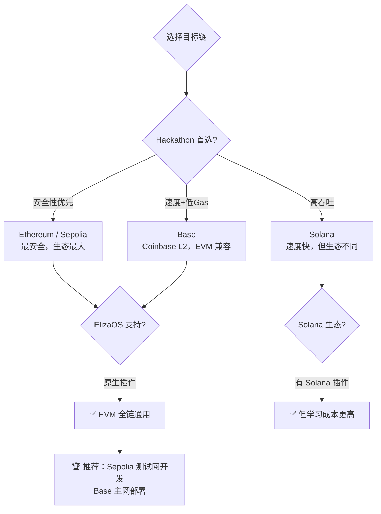
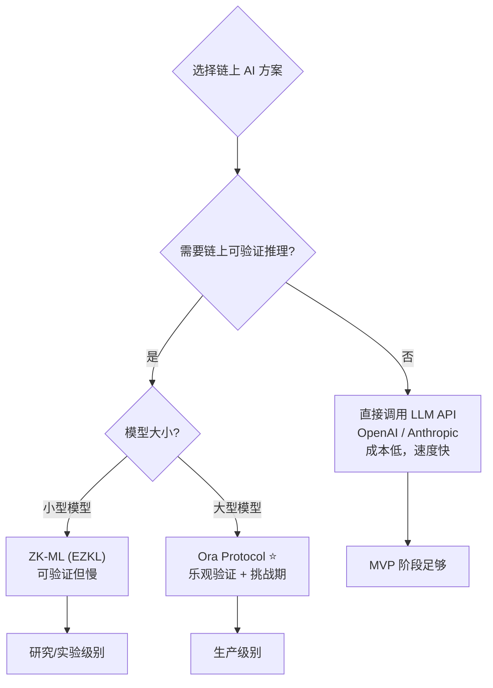
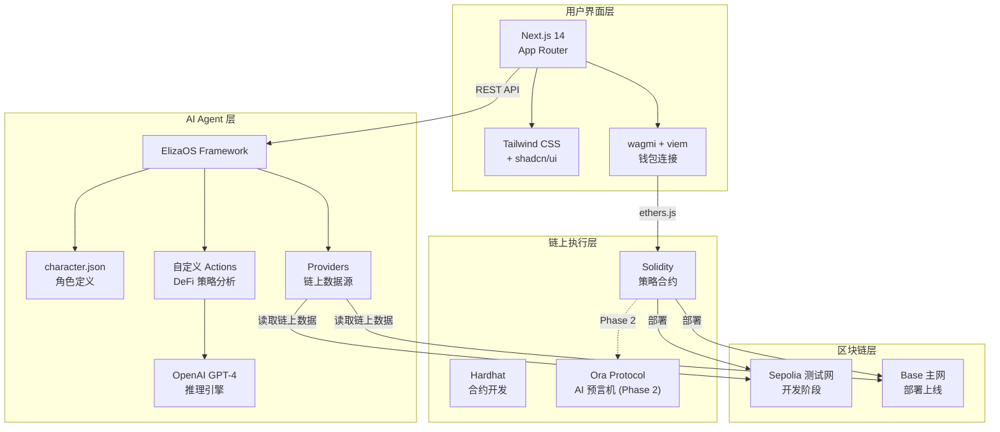

# 2026-05-31 学习日志

## 确定核心 Tech Stack：AI 框架 + 链/协议

### 学习路径：推荐路径（从对比分析到最终决策）

---

## 一、Tech Stack 决策全景图

---

## 二、核心决策：AI Agent 框架选型

### 选型矩阵

### 详细对比

**方案 A：ElizaOS（⭐ 推荐）**

- **定位**：专为 Web3 设计的 AI Agent 框架（原 ai16z/eliza）
- **语言**：TypeScript
- **核心优势**：
  - 内置钱包管理、链上交互插件
  - 支持 Telegram/Discord/Twitter 等社交平台接入
  - Plugin 生态：EVM、Solana、Lens 等链原生支持
  - 社区活跃，Hackathon 项目多
- **劣势**：文档较新，部分 API 可能变动
- **适合**：AI Agent + DeFi / NFT / DAO 场景

**方案 B：LangChain + Web3 Tools**

- **定位**：通用 AI 应用框架，需自行集成 Web3
- **语言**：Python / TypeScript
- **核心优势**：
  - 生态最大，社区最成熟
  - 支持几乎所有 LLM 提供商
  - RAG、Chain、Agent 模式完善
- **劣势**：Web3 集成需要大量自定义工具开发
- **适合**：AI 为主、Web3 为辅的项目

**方案 C：自研 Function Calling**

- **定位**：直接用 OpenAI/Anthropic API 的 Function Calling
- **语言**：任意
- **核心优势**：完全可控，无框架依赖
- **劣势**：需要自己实现 Agent 循环、记忆、工具管理
- **适合**：极简 MVP 或有经验的开发者

### 🏆 决策结论：ElizaOS

**理由**：
1. **Hackathon 时间有限**——ElizaOS 开箱即用的 Web3 集成节省 60%+ 开发时间
2. **AI × Web3 项目的最佳载体**——内置 Agent 循环 + 链上工具 + 社交接入
3. **社区和示例丰富**——有大量 AI Agent DeFi 项目可参考

---

## 三、核心决策：链/协议选型

### 选型矩阵

### 详细对比

**EVM 链（以太坊生态）**

- **Ethereum / Sepolia**
  - 优势：最安全、流动性最大、工具链最成熟
  - 劣势：Gas 费高（主网），测试网免费
  - 用途：开发阶段首选

- **Base（Coinbase L2）**
  - 优势：EVM 完全兼容、Gas 低、用户增长快
  - 劣势：相比以太坊主网流动性较小
  - 用途：部署上线首选

- **Arbitrum**
  - 优势：EVM 兼容、生态成熟、DeFi 协议多
  - 劣势：竞争激烈
  - 用途：备选方案

**Solana**
- 优势：速度极快、Gas 极低、NFT 生态强
- 劣势：开发语言不同（Rust）、ElizaOS 有插件但生态不如 EVM
- 用途：NFT/社交类项目更合适

### 🏆 决策结论：Sepolia 开发 + Base 部署

**理由**：
1. **Sepolia 测试网**：免费 ETH、与主网行为一致、所有工具支持
2. **Base 主网**：Gas 低、用户增长快、Coinbase 支持、完全 EVM 兼容
3. **一套代码两网通用**：只需改 RPC URL 和合约地址

---

## 四、核心决策：链上 AI 推理方案

### 选型矩阵

### 详细对比

**方案 A：直接调用 LLM API（MVP 首选 ⭐）**

- **做法**：Agent 直接调用 OpenAI/Claude API 做推理
- **优势**：最简单、成本低、延迟低、开发最快
- **劣势**：推理过程不透明，无法链上验证
- **适合**：Hackathon MVP、快速验证想法

**方案 B：Ora Protocol（进阶首选 ⭐）**

- **做法**：通过 Ora 预言机在链上发起 AI 推理请求
- **优势**：推理结果上链、可验证、支持乐观验证
- **劣势**：增加复杂度、需要学习 Ora SDK、有额外成本
- **适合**：需要链上信任的场景（DeFi 策略执行）

**方案 C：EZKL (ZK-ML)**

- **做法**：将模型转为 ZK 电路，生成零知识证明
- **优势**：最强的可验证性
- **劣势**：目前只支持小模型、证明生成慢、集成复杂
- **适合**：研究型项目或对验证有极致要求

### 🏆 决策结论：分阶段实施

- **Phase 1（MVP）**：直接调用 OpenAI API → 快速跑通 Agent 循环
- **Phase 2（进阶）**：集成 Ora Protocol → 链上推理 + 可验证性
- **Phase 3（加分项）**：ZK-ML 探索 → 展示技术深度

---

## 五、最终 Tech Stack 确定

### 🏗️ 推荐技术栈

**AI Agent 层**
- **框架**：ElizaOS（@ai16z/eliza）
- **语言**：TypeScript
- **LLM**：OpenAI GPT-4 / Claude（通过 ElizaOS provider）
- **记忆**：ElizaOS 内置 memory 系统

**链/协议层**
- **开发链**：Sepolia 测试网（免费、安全）
- **部署链**：Base 主网（低 Gas、快速增长）
- **标准**：EVM / Solidity ^0.8.19
- **AI 预言机**：Ora Protocol（Phase 2）

**智能合约层**
- **开发框架**：Hardhat（更成熟的生态）
- **语言**：Solidity
- **交互库**：ethers.js v6（ElizaOS 内置）

**前端层**
- **框架**：Next.js 14（App Router）
- **样式**：Tailwind CSS + shadcn/ui
- **Web3 连接**：wagmi + viem
- **状态管理**：React Query

**开发工具**
- **版本控制**：Git + GitHub
- **包管理**：pnpm
- **测试**：Hardhat Test + Vitest
- **部署**：Vercel（前端）+ Hardhat（合约）

### 技术栈架构图

---

## 六、关键技术点速查

### ElizaOS 核心概念

- **Character**：Agent 的人格定义（角色、技能、风格）
- **Action**：Agent 可执行的操作（分析策略、查询余额等）
- **Provider**：为 Agent 提供上下文数据的模块
- **Plugin**：可插拔的功能扩展（EVM、Solana、社交等）

### Hardhat 核心命令

- `npx hardhat init`：初始化项目
- `npx hardhat compile`：编译合约
- `npx hardhat test`：运行测试
- `npx hardhat run scripts/deploy.js --network sepolia`：部署到测试网
- `npx hardhat verify --network sepolia <地址>`：验证合约代码

### wagmi 核心 Hooks

- `useAccount`：获取连接的钱包地址
- `useReadContract`：读取合约数据
- `useWriteContract`：发送交易
- `useBalance`：查询余额

---

## 七、Hackathon 项目启动 Checklist ✅

### 环境准备（Day 1 前半）

- [ ] Node.js 18+ 安装
- [ ] pnpm 安装：`npm install -g pnpm`
- [ ] Hardhat 安装：`pnpm add -D hardhat`
- [ ] ElizaOS CLI 安装
- [ ] 获取 Sepolia 测试 ETH（Faucet）
- [ ] 创建 GitHub 仓库

### Agent 搭建（Day 1 后半）

- [ ] `npx elizaos init` 初始化 Agent 项目
- [ ] 定义 character.json（DeFi 策略顾问角色）
- [ ] 编写第一个 Action：analyzeStrategy
- [ ] 测试 Agent 对话

### 合约开发（Day 2）

- [ ] 创建 Hardhat 项目
- [ ] 编写 DeFiStrategyAdvisor 合约
- [ ] 本地测试通过
- [ ] 部署到 Sepolia 测试网
- [ ] 验证合约代码

### 前端开发（Day 3）

- [ ] Next.js 项目初始化
- [ ] 搭建页面结构（首页 + 策略面板）
- [ ] 实现对话组件
- [ ] 集成 wagmi 钱包连接
- [ ] 对接 Agent API

### 联调 & Demo（Day 3 后半）

- [ ] 端到端流程跑通
- [ ] 准备 Demo 脚本
- [ ] 录制演示视频
- [ ] 撰写 README

---

## 八、今日学习总结

### 📌 核心收获

1. **ElizaOS 是 AI × Web3 Hackathon 的最佳起点**：原生支持链上交互、社交接入、Agent 循环，省去大量集成工作
2. **Sepolia + Base 是最优链选择**：开发免费、部署低成本、EVM 完全兼容、一套代码两网通用
3. **分阶段实施是关键**：先用直接 API 调用跑通 MVP，再集成 Ora Protocol 获得链上可验证性

### 🤔 思考题

- ElizaOS 的 Plugin 系统如何设计才能让 Agent 安全地执行链上交易？
- 如果 Hackathon 只有 24 小时，你会砍掉哪些功能？保留哪些？
- AI Agent 的"幻觉"问题在 DeFi 场景中如何被控制？

### 📚 进一步阅读

- [ElizaOS 官方文档](https://ai16z.github.io/eliza/)：Agent 框架完整指南
- [ElizaOS GitHub](https://github.com/ai16z/eliza)：源码 + 示例
- [Hardhat 文档](https://hardhat.org/docs)：智能合约开发教程
- [wagmi 文档](https://wagmi.sh/)：React Hooks for Ethereum
- [Ora Protocol SDK](https://docs.ora.io/)：链上 AI 推理集成
- [Base 文档](https://docs.base.org/)：Base L2 开发指南
- [shadcn/ui](https://ui.shadcn.com/)：UI 组件库

---

> 💡 *Tech Stack 一旦确定就不要轻易更换。接下来的重点是：动手写代码，让东西跑起来。架构可以在 MVP 跑通后再优化。*
