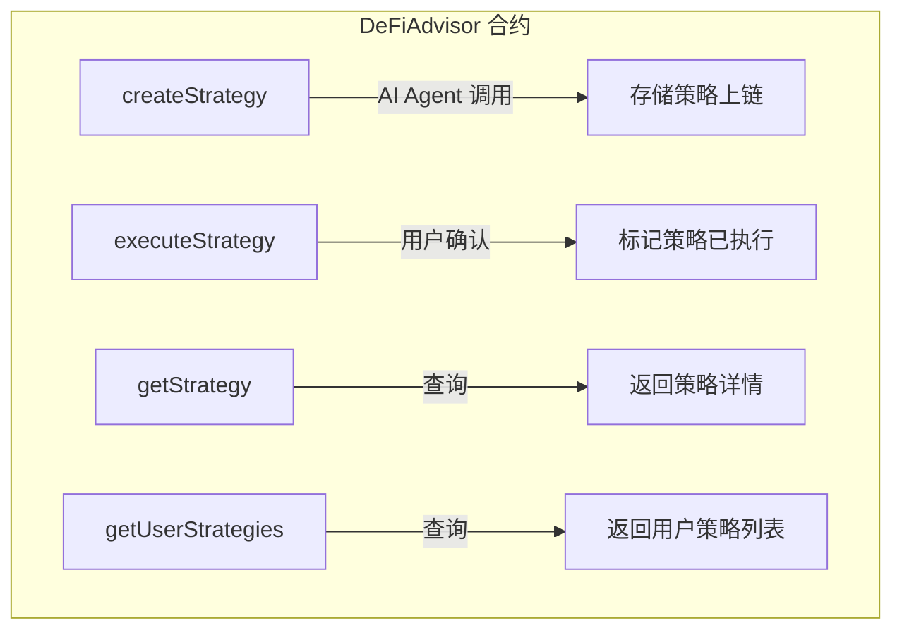
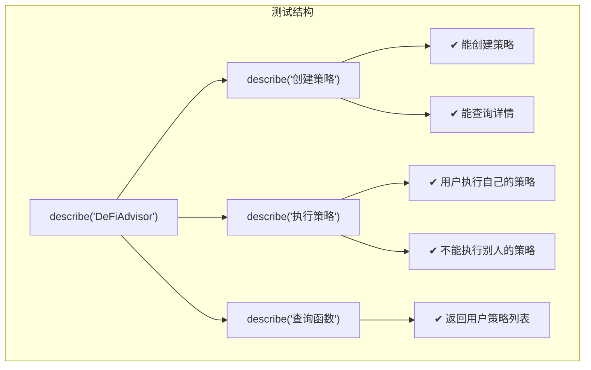

# 2026-06-06 学习日志

## Hardhat 智能合约项目初始化 + DeFiAdvisor 合约开发

### 学习路径：挑战路径（动手写代码，从零搭建合约项目）

---

## 一、今日完成事项


---

## 二、项目结构

```
contracts/
├── contracts/
│   └── DeFiAdvisor.sol      # 核心合约
├── test/
│   └── DeFiAdvisor.test.js   # 测试用例
├── scripts/
│   └── deploy.js             # 部署脚本
├── hardhat.config.js         # Hardhat 配置
├── package.json
├── artifacts/                # 编译产物（自动生成）
├── cache/                    # 编译缓存（自动生成）
└── node_modules/
```

---

## 三、Hardhat 核心知识点

### 3.1 Hardhat 是什么

Hardhat 是以太坊生态最主流的**智能合约开发框架**，类似于 Web2 世界的 webpack + Jest。

核心能力：
- **编译**：将 Solidity 代码编译为 EVM 字节码
- **测试**：内置测试框架，支持 JavaScript/TypeScript 写测试
- **部署**：脚本化部署到任意网络（本地/测试网/主网）
- **调试**：堆栈追踪、console.log 调试

### 3.2 Hardhat vs Foundry 对比

- **Hardhat**：JavaScript/TypeScript 生态，上手快，插件丰富，适合 Hackathon
- **Foundry**：Solidity 原生测试，速度快，适合专业合约开发
- **推荐**：Hackathon 选 Hardhat（生态好），长期项目考虑 Foundry

### 3.3 关键命令

```bash
npx hardhat compile          # 编译合约
npx hardhat test             # 运行测试
npx hardhat run scripts/deploy.js  # 本地部署
npx hardhat node             # 启动本地节点
npx hardhat run scripts/deploy.js --network baseSepolia  # 部署到测试网
```

---

## 四、DeFiAdvisor 合约解析

### 4.1 合约功能



### 4.2 核心数据结构

```solidity
struct Strategy {
    uint256 id;           // 策略 ID
    address user;         // 用户地址
    string strategyType;  // "lending", "liquidity", "staking"
    string tokenPair;     // "USDC-ETH", "ETH-USDT"
    string recommendation; // AI Agent 生成的建议
    uint256 timestamp;    // 创建时间
    bool executed;        // 是否已执行
}
```

### 4.3 事件（Events）

事件是链上日志，前端可以通过监听事件来更新 UI：

```solidity
event StrategyCreated(uint256 indexed id, address indexed user, string strategyType, string tokenPair);
event StrategyExecuted(uint256 indexed id, address indexed user);
```

**关键点**：`indexed` 参数可以被高效过滤查询，最多 3 个 indexed 参数。

### 4.4 修饰器（Modifiers）

```solidity
modifier onlyOwner() {
    require(msg.sender == owner, "Only owner can call");
    _;  // 继续执行原函数
}
```

修饰器是 Solidity 的"守门人"模式，在函数执行前做权限检查。

---

## 五、测试用例解析



**测试要点**：
- 用 `beforeEach` 在每个测试前重新部署合约（隔离测试环境）
- 用 `expect(...).to.emit()` 测试事件是否触发
- 用 `expect(...).to.be.revertedWith()` 测试权限拒绝
- 用 `connect(user1)` 模拟不同用户调用

---

## 六、部署流程

### 6.1 本地部署（开发阶段）

```bash
# 方式一：直接运行脚本（自动使用内置网络）
npx hardhat run scripts/deploy.js

# 方式二：启动本地节点 + 另一个终端部署
npx hardhat node                    # 终端 1
npx hardhat run scripts/deploy.js --network localhost  # 终端 2
```

### 6.2 测试网部署（Base Sepolia）

需要：
1. Base Sepolia 测试 ETH（从水龙头领取）
2. 设置环境变量 `PRIVATE_KEY`

```bash
export PRIVATE_KEY="你的钱包私钥"
npx hardhat run scripts/deploy.js --network baseSepolia
```

### 6.3 部署结果

```
📋 部署者信息:
   地址: 0xf39Fd6e51aad88F6F4ce6aB8827279cffFb92266
   余额: 10000.0 ETH

✅ DeFiAdvisor 已部署!
   合约地址: 0x5FbDB2315678afecb367f032d93F642f64180aa3

🔍 合约验证:
   初始策略数: 0
   合约 owner: 0xf39Fd6e51aad88F6F4ce6aB8827279cffFb92266
```

---

## 七、踩坑记录

### 坑 1：Hardhat v3 vs v2

- `npx hardhat init` 默认装的是 v3，但大多数教程和插件生态基于 v2
- **解决**：显式指定版本 `npm install hardhat@^2.22.0`

### 坑 2：编译器版本匹配

- 合约 `pragma solidity ^0.8.24` 必须和 `hardhat.config.js` 中的 `solidity: "0.8.24"` 一致
- 版本不匹配会导致编译失败

### 坑 3：测试隔离

- 每个测试必须独立，不能依赖前一个测试的状态
- 用 `beforeEach` 重新部署合约，而不是在 `before` 中部署一次

---

## 八、下一步计划


- 接入 ElizaOS，让 AI Agent 能调用 `createStrategy`
- 写前端页面展示策略列表
- 部署到 Base Sepolia 测试网

---

**今日学习时长**：约 2 小时
**今日收获**：从零搭建了 Hardhat 项目，编写了第一个 DeFi 合约，跑通了编译→测试→部署全流程
